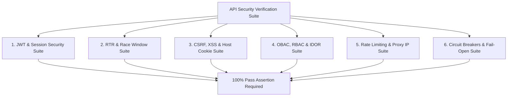

# NAVIX — API Security & Contract Verification Plan

> **Document Type**: Technical Test Architecture & Security Verification Plan  
> **Status**: Official Technical Design Specification (Phase 6B.4 — Final Corrections Pass)  
> **Scope**: Adversarial Security Scenarios, Host Isolation Tests, Race Window Validation, Proposed Performance Targets  
> **Safety Notice**: Design Specification Only — Zero Application Code, PostgreSQL Mutations, or Dependencies Applied.

---

## 1. Verification Strategy & Safety Notice

This specification outlines the future automated test architecture designed to validate NAVIX API contracts, application security controls, and backward compatibility. 

*Safety Notice*: In compliance with Phase 6B.4 constraints, **zero automated tests or scripts are executed during this design phase**. All latency and throughput metrics are explicitly declared as **PROPOSED TARGET BENCHMARK OBJECTIVES**.

---

## 2. Security & Adversarial Test Specifications

### Expanded Test Suite Specifications

#### 1. JWT & Session Security Tests (`test_security_jwt.py`)
- **Algorithm Substitution Attack**: Send JWT signed with `alg: "none"` or `alg: "RS256"` using public key as HMAC secret; assert backend rejects with HTTP 401.
- **Startup Weak-Key Rejection**: Verify backend startup fails if `SECRET_KEY` is under 32 characters or missing from `.env`.
- **Token Expiration Enforcement**: Assert HTTP 401 response for access tokens older than 15 minutes.

#### 2. RTR & Simultaneous Tab Race Window Tests (`test_security_rtr.py`)
- **Simultaneous Tab Race Handling**: Trigger 2 simultaneous `POST /api/v1/auth/refresh` requests using the same refresh token within 500ms; assert BOTH tabs receive valid token pairs without triggering session revocation.
- **Replay Attack Revocation**: Send a refresh token rotated 60 seconds ago ($>30\text{s}$ grace period); assert backend revokes the ENTIRE token family and invalidates active user sessions.

#### 3. CSRF, XSS & Host Cookie Isolation Tests (`test_security_csrf_cookies.py`)
- **Host-Only Prefix Validation**: Verify `Set-Cookie` header in production contains `__Host-` prefix, `HttpOnly`, `Secure`, `SameSite=Lax`, and NO `Domain` attribute.
- **Subdomain Cookie Injection Defense**: Attempt to submit a CSRF token injected via a sibling subdomain cookie; assert backend rejects request via signed session CSRF check.
- **Unsafe Request CSRF Enforcement**: Send state-changing `POST /api/v1/auth/logout` without `X-CSRF-Token` header; assert HTTP 403 Forbidden.

#### 4. OBAC, RBAC & IDOR Prevention Tests (`test_security_idor.py`)
- **IDOR Parameter Tampering**: Traveler A attempts to GET/DELETE `/api/v1/trips/{trip_id_of_user_b}`; assert HTTP 403 Forbidden.
- **Admin Endpoint Escalation**: User with `role = "traveler"` accesses `/api/v1/admin/metrics`; assert HTTP 403 Forbidden.

#### 5. Rate Limiting & Proxy IP Spoofing Tests (`test_security_rate_limiting.py`)
- **IP Spoofing Protection**: Send requests with spoofed `X-Forwarded-For: 1.1.1.1` from an untrusted client IP; assert rate limiter uses actual socket connection IP.
- **NAT IP Multi-User Protection**: Simulate 15 requests from single NAT IP using 3 distinct user session tokens; assert zero false-positive 429 lockouts for legitimate sessions.

#### 6. Circuit Breakers & Fail-Open Fallback Tests (`test_resilience.py`)
- **Redis Fail-Open Fallback**: Simulate total Redis cluster failure; verify rate limiter logs critical warning and fails open, allowing API endpoints to serve requests cleanly.
- **Provider API Circuit Breaker**: Mock 5 consecutive 500 errors from external flight API; verify circuit switches to `OPEN` and returns cached timetable estimates.

---

## 3. Standardized Performance Targets (Proposed Objectives)

All metrics below represent **PROPOSED TARGET BENCHMARK OBJECTIVES** for Phase 6B implementation, not empirical measurement facts:

| Endpoint Path | Operation Category | Target Latency Objective (p95)* | Target Latency Objective (p99)* | Configurable Rate Limit |
| :--- | :--- | :--- | :--- | :--- |
| `/api/v1/locations/search` | Location Autocomplete | $<50\text{ ms}$ | $<100\text{ ms}$ | 60 req / min |
| `/api/v1/routes/search` | Multimodal Graph Search | $<500\text{ ms}$ | $<1,200\text{ ms}$ | 10 req / min |
| `/api/v1/trips/plan` | Joint Whole-Trip Optimization | $<300\text{ ms}$ | $<800\text{ ms}$ | 10 req / min |
| `/api/v1/auth/login` | Credentials Authentication | $<100\text{ ms}$ | $<250\text{ ms}$ | 5 req / min |
| `/api/v1/trips/saved` | Saved Trip Persistence | $<40\text{ ms}$ | $<80\text{ ms}$ | 100 req / min |

*\*Note: Latency metrics represent design target objectives for Phase 6B implementation, not empirically measured runtime benchmarks.*

---

## 4. Deterministic API Regression Scenarios

1. **Scenario 1: Location Discovery with Ambiguous Query**
   - Query `q="Sangli"`. Asserts `LOC_MH_SANGLI` returned as primary settlement match with `coverage_status = "COVERED"`.
2. **Scenario 2: Uncovered Location Fallback**
   - Query `q="Uncovered Remote Village"`. Asserts `coverage_status = "UNCOVERED"` with structured suggestions.
3. **Scenario 3: Route Search Data Coverage Gap**
   - Search route for unsupported date window. Asserts `error_code = "NO_ROUTE_IN_DATA"` with structured failure response.
4. **Scenario 4: Expired Commercial Quote Plan**
   - Retrieve saved trip containing expired flight quote. Asserts `price_evidence_state = "UNCERTAIN_PRICE"` with `is_guaranteed_payable = False` notice.
5. **Scenario 5: Multi-Currency Request Processing**
   - Whole-trip plan request in `USD`. Asserts `currency = "USD"` in breakdown with explicit `INR` conversion rate provenance.
