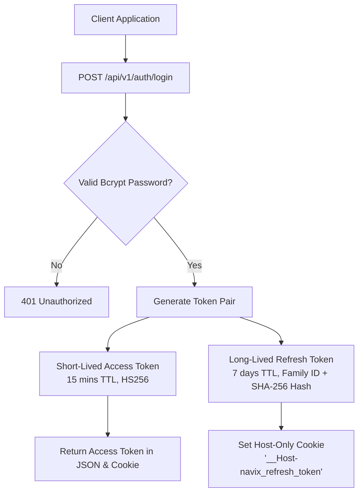
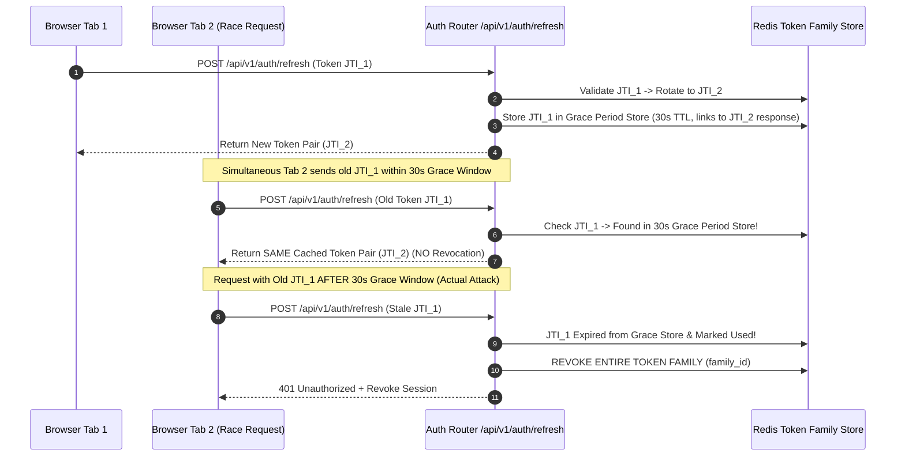

# NAVIX — Authentication & Session Security Architecture Specification

> **Document Type**: Technical Application Security Architecture  
> **Status**: Official Technical Design Specification (Phase 6B.4 — Final Corrections Pass)  
> **Scope**: Production JWT Security, Host-Only Cookie Isolation, Refresh Token Rotation & Race Grace Policy, CSRF/XSS Mitigations  
> **Safety Notice**: Design Specification Only — Zero Application Code, PostgreSQL Mutations, or Dependencies Applied.

---

## 1. Executive Summary & Source Code Audit Findings

A static code audit of `backend/app/core/security.py` and `backend/app/core/config.py` confirms that **Security Hotfix S1 has been verified at the source level**:
- **Zero Fallback Signing Secrets**: Hardcoded fallback JWT secrets were completely removed from `config.py`.
- **Strict Startup Validation**: `Settings.validate_secret_key` enforces an explicitly configured `SECRET_KEY` of at least 32 characters in `.env` and aborts server initialization if missing or weak.
- **Explicit Algorithm Allowlisting**: `ALGORITHM = "HS256"` is enforced; decoding strictly specifies `algorithms=["HS256"]` to prevent `none` algorithm substitution attacks.
- *Verification Status*: Verified via **static source-code inspection**. Runtime behavior under production deployment remains **VERIFICATION-PENDING** until test execution in Phase 6B.5.

---

## 2. JWT & Dual-Token Lifecycle Architecture



### 2.1 Token Specifications & Expiration Policies

1. **Access Token (`access_token`)**:
   - Signature: HMAC-SHA256 (`HS256`) using `SECRET_KEY` (min 32 bytes).
   - Expiration: **15 minutes** (reduced from 7 days to minimize exposure window).
   - Claims: `sub` (User ID), `role` (`TRAVELER` | `ADMIN`), `exp` (UTC epoch), `iat`, `jti` (unique UUID).
2. **Refresh Token (`refresh_token`)**:
   - Signature: HMAC-SHA256 (`HS256`).
   - Expiration: **7 days** (renewable via active use).
   - Claims: `sub`, `jti_hash` (SHA-256 of token ID), `family_id` (rotation family tracker), `device_id`.

---

## 3. Host-Only Cookie Isolation & Environment Behaviors

To prevent security risks associated with shared wildcard domain cookies (`Domain=.navix.travel`), which unnecessarily expose authentication tokens to sibling subdomains, NAVIX adopts a **Host-Only Cookie Isolation Architecture**:

```mermaid
flowchart LR
    ClientApp[Frontend: app.navix.travel] -->|API Proxy Rewrite /api/*| AppBackend[Backend API Proxy]
    AppBackend -->|Host-Only Cookie Transmission| FastApiAPI[FastAPI Backend]
    
    subgraph CookieFlags[Production Cookie Isolation Flags]
        HostPrefix[__Host- Prefix Enforced]
        NoDomain[No Domain Attribute Set (Host-Only)]
        PathRoot[Path = /]
        SecureFlag[Secure = True (HTTPS Only)]
        HttpOnlyFlag[HttpOnly = True]
        SameSiteFlag[SameSite = Lax]
    end
    
    FastApiAPI --- CookieFlags
```

### 3.1 Cookie Domain & Prefix Strategy
1. **Host-Only Cookies (`__Host-`)**:
   In production, cookies use the `__Host-` prefix (`__Host-navix_refresh_token`). Browsers reject `__Host-` cookies if a `Domain` attribute is specified, forcing strict **host-only binding** to the exact origin emitting the cookie.
2. **API Proxying Strategy**:
   The Next.js frontend (`app.navix.travel`) proxies API requests to the backend via rewrite routes (`/api/v1/*`), keeping frontend and API under the exact same origin and enabling pure host-only cookies without cross-subdomain leaks.
3. **Environment Differences**:
   - **Development**: `http://localhost:3000`, `Secure = False`, `SameSite = Lax`, standard cookie names (`navix_refresh_token`).
   - **Production**: `HTTPS`, `Secure = True`, `SameSite = Lax`, `__Host-` prefix enforced (`__Host-navix_refresh_token`).
4. **Mobile & Third-Party Client Compatibility**:
   Mobile and third-party API clients continue using `Authorization: Bearer <token>` headers via dual-transport middleware.

---

## 4. Refresh Token Rotation (RTR) & Simultaneous Tab Grace Window



### 4.1 Rotation & Grace Window Policies
- **Cryptographic Identifier Hashing**: Token identifiers are stored in Redis as SHA-256 hashes (`SHA256(jti)`).
- **30-Second Race-Condition Grace Window**: When a refresh token is rotated, its SHA-256 hash is placed in a temporary Redis grace store for **30 seconds**. If a simultaneous browser tab sends the old token within 30 seconds, the backend returns the *cached new token pair* rather than triggering false-positive session revocation.
- **Replay Attack Detection**: If a rotated token is used *after* the 30-second grace window expires, it is classified as a token theft attempt; the entire `family_id` is immediately revoked across all devices.
- **Logout-This-Device vs. Logout-All**:
  - `/api/v1/auth/logout`: Revokes current token family (`family_id`).
  - `/api/v1/auth/logout-all`: Revokes all active token families associated with `user_id`.

---

## 5. CSRF, XSS & CORS Mitigations

### 5.1 CSRF Defense Strategy
- **Signed Session-Bound CSRF Tokens**: Double-submit cookies alone are insufficient if sibling subdomains are vulnerable. NAVIX uses **HMAC-signed session-bound CSRF tokens** (`HMAC(session_id, SECRET_KEY)`).
- **Origin & Referer Validation**: All unsafe HTTP requests (`POST`, `PUT`, `DELETE`) check `Origin` and `Referer` headers against allowed origin whitelist.
- **Endpoint Coverage**: CSRF validation applies to ALL unsafe browser requests, explicitly including `/api/v1/auth/refresh` and `/api/v1/auth/logout`.
- **CORS Disclosure**: CORS middleware explicitly restricts origins (`ALLOW_ORIGINS = ["https://navix.travel"]`). CORS is defined strictly as an origin-sharing restriction mechanism, **NOT an authorization or CSRF defense**.
