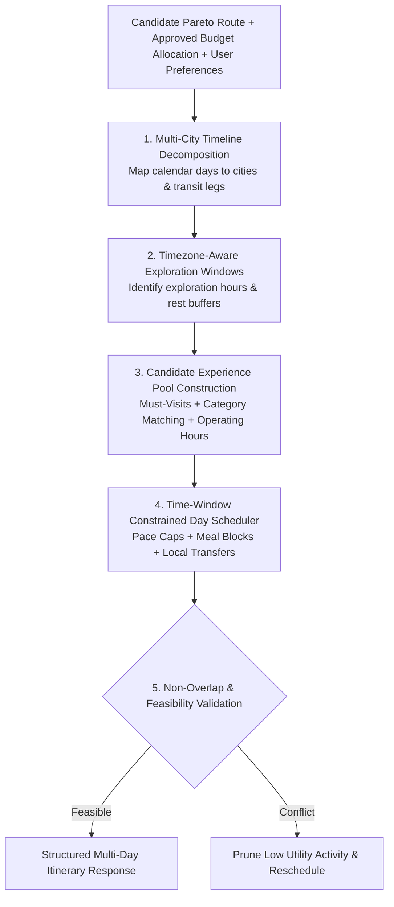

# NAVIX — Auto-Itinerary Architecture & Multi-Day Scheduling Engine (V2)

> **Document Type**: Technical Scheduling Engine Design  
> **Status**: Official Technical Design Specification (Phase 6B.3B — Targeted Corrections Pass)  
> **Scope**: Multi-City Timeline Decomposition, Timezone-Aware Operating Hours, Pace & Fatigue Control, Local Movement Estimation  
> **Safety Notice**: Design Specification Only — Zero Application Code or PostgreSQL Mutations Executed.

---

## 1. Executive Summary & Generalization Scope

The **NAVIX Auto-Itinerary Engine (V2)** constructs minute-by-minute, conflict-free multi-day travel timelines across arbitrary Indian destinations, multi-city itineraries, and variable travel durations (1 to 30 days).



---

## 2. Multi-City Timeline Decomposition & Hotel Stay Distinction

For a trip spanning dates $[D_{\text{start}}, D_{\text{end}}]$ across $K$ destination cities:

1. **City Segment Mapping**:
   The engine maps each day $d \in [1, N_{\text{days}}]$ to a specific city location based on intercity transit arrival and departure timestamps.
2. **Distinction Between Hotel Booking Intervals and Traveler Events**:
   - **Hotel Booking Interval** ($C_{\text{stay}}$): Nightly lodging reservation spanning check-in time (e.g. 12:00 PM on Day 1) to check-out time (e.g. 10:00 AM on Day 2).
   - **Traveler Activity Events**: Physical traveler actions on the timeline (e.g. `CHECK_IN` event: 14:00 – 14:30; `OVERNIGHT_REST` event: 22:00 – 07:30). Hotel room billing is non-overlapping with traveler timeline activity slots.

---

## 3. Timezone-Aware Operating Hours & Closed Day Semantics

Every schedulable activity node in the national catalog contains verified operating parameters:

```python
class ActivityOperatingRules(BaseModel):
    activity_id: str
    name: str
    city_id: str
    latitude: float
    longitude: float
    timezone: str                  # e.g. "Asia/Kolkata"
    opening_time_local: str        # e.g. "09:00"
    closing_time_local: str        # e.g. "18:00"
    closed_days: List[int]         # e.g. [1] for Mondays (ISO weekday 1-7)
    recommended_duration_mins: int # e.g. 90
    preferred_window: str          # "MORNING" | "AFTERNOON" | "EVENING" | "ANYTIME"
    requires_advance_permit: bool  # True for restricted areas (e.g. Rohtang Pass)
    must_visit: bool = False       # Flag for user-requested must-visit items
```

### Scheduling Verification Rules
- **Closed Day Exclusion**: If day $d$'s day of the week matches an element in `closed_days`, the activity is excluded from day $d$'s candidate pool.
- **Strict Boundary Check**: Activity execution $[t_{\text{start}}, t_{\text{end}}]$ must satisfy:
  $$t_{\text{start}} \ge \max(t_{\text{window\_start}}, t_{\text{open\_local}}) \quad \text{AND} \quad t_{\text{end}} \le \min(t_{\text{window\_end}}, t_{\text{close\_local}})$$
- **Must-Visit Scheduling & Warning Semantics**:
  If an activity is marked `must_visit = True`, the scheduler attempts to place it as a high-priority constraint. If it cannot fit due to operating hour closures or transit arrivals, the scheduler does NOT fail silently; it emits an explicit user warning: *"Must-visit attraction 'X' could not be scheduled due to Monday closure."*

---

## 4. Pace, Rest, Meal & Fatigue Management

NAVIX enforces physiological rest and dining constraints to prevent unrealistic schedules.

### 4.1 Travel Pace Tiers

| Pace Tier | Max Acts / Day | Max Active Mins / Day | Exploration Window | Meal Duration | Free Buffer / Day |
| :--- | :--- | :--- | :--- | :--- | :--- |
| **`RELAXED`** | 2 Activities | 240 Mins ($4.0$ hrs) | 10:00 – 17:00 | 90 Mins | $\ge 120\text{ Mins}$ |
| **`BALANCED`** | 3 Activities | 360 Mins ($6.0$ hrs) | 09:00 – 19:00 | 60 Mins | $\ge 60\text{ Mins}$ |
| **`PACKED`** | 4 Activities | 480 Mins ($8.0$ hrs) | 08:30 – 21:00 | 45 Mins | $\ge 30\text{ Mins}$ |

### 4.2 Mandatory Meal & Rest Blocks

1. **Midday Lunch Block**:
   Triggered when timeline cursor reaches $12:00\text{--}14:30$. Duration determined by pace tier ($45\text{--}90\text{ min}$).
2. **Evening Dinner Block**:
   Triggered between $19:30\text{--}21:30$.
3. **Post-Transit Rest Buffer**:
   Mandatory $60\text{ min}$ rest/freshening-up buffer scheduled immediately after checking in at accommodation following long-distance transit.
4. **Overnight Rest Constraint**:
   No non-transit activities may be scheduled between 22:00 and 07:00.

---

## 5. Local Travel Estimation & Planning Speed Disclosures

Transfer time $\Delta t_{\text{local}}(a_i, a_j)$ between consecutive activities $a_i(\text{lat}_1, \text{lon}_1)$ and $a_j(\text{lat}_2, \text{lon}_2)$ is computed using spatial distance profile models:

1. **Short Walking Distance ($\le 1.5\text{ km}$)**:
   $$\text{Travel Minutes} = \text{round}\left( \frac{d_{\text{haversine}}}{4.5\text{ km/h}} \times 60 \right)$$
2. **Intra-City Vehicle Distance ($> 1.5\text{ km}$)**:
   $$\text{Travel Minutes} = \max\left(15, \text{round}\left( \frac{d_{\text{haversine}}}{V_{\text{city}}} \times 60 \right) + 10 \right)$$
   where $V_{\text{city}} = 25\text{ km/h}$ for plains cities and $18\text{ km/h}$ for mountain terrain, with a $+10\text{ min}$ buffer for parking/boarding.

### Speed Baseline Disclosure
Fixed geographic speed baselines ($18\text{--}25\text{ km/h}$) are **estimated planning inputs for initial timeline generation**, NOT verified real-time network reachability guarantees. Live traffic variations are absorbed by free time buffers and contingency funds.
