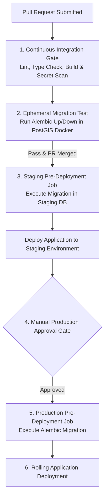

# NAVIX — CI/CD Pipeline & Deployment Strategy Specification

> **Document Type**: Technical Deployment Pipeline & Release Strategy Blueprint  
> **Status**: Official Technical Design Specification (Phase 6B.5 — Final Corrections Pass)  
> **Scope**: GitHub Actions CI/CD Pipeline, Migration Verification Gates, Pre-Deployment Job Guards & Deployment Disclosures  
> **Safety Notice**: Design Specification Only — Zero Application Code, CI/CD Execution, or Cloud Deployment Executed.

---

## 1. Executive Summary & Deployment Disclosures

NAVIX enforces an automated, gate-based **CI/CD Deployment Pipeline** using GitHub Actions.

*Deployment Disclosures*: Zero-downtime rolling deployments and single-command rollbacks are classified as **PROPOSED ARCHITECTURAL TARGET OBJECTIVES**, pending empirical verification during Phase 6B.5 test executions.



---

## 2. Continuous Integration Gates (Pull Request Verification)

Every Pull Request to `main` or `develop` triggers automated verification jobs:

1. **Static Code Analysis & Linting**:
   - Python Backend: `ruff check backend/` and `mypy backend/app`.
   - TypeScript Frontend: `eslint` and `tsc --noEmit`.
2. **Secret Scanning**:
   - `GitGuardian` / `TruffleHog` scan to verify zero committed `.env` files, JWT secrets, or database passwords in commit history.
3. **Frontend Production Build Verification**:
   - `npm run build` in `frontend/` to verify zero Next.js compilation or asset bundler failures.
4. **Isolated Database Migration Test**:
   - Spawns an ephemeral `postgres:18-postgis` container.
   - Executes `alembic upgrade head` followed by `alembic downgrade base` to verify idempotency and autocommit concurrent index block execution.

---

## 3. Pre-Deployment Migration Job Gate Architecture

```mermaid
sequenceDiagram
    autonumber
    participant Pipeline as GitHub Actions CD Runner
    participant Migrator as Pre-Deployment Migration Job Task
    participant DB as Managed PostgreSQL DB
    participant App as ECS Fargate Application Service

    Pipeline->>Migrator: Launch Isolated Pre-Deployment Task (Alembic)
    Migrator->>DB: Set lock_timeout = '5s'; execute alembic upgrade head
    
    alt Migration Successful
        DB-->>Migrator: DDL Applied Cleanly
        Migrator-->>Pipeline: Exit Code 0 (Success)
        Pipeline->>App: Trigger Rolling Deployment of New App Version
    else Migration Failed / Lock Timeout
        DB-->>Migrator: Migration Aborted / Error Emitted
        Migrator-->>Pipeline: Exit Code 1 (Failure)
        Pipeline->>Pipeline: HALT DEPLOYMENT (Application Version Untouched)
    end
```

### 3.1 Anti-Pattern Safeguards
- **NO Startup Migrations**: Application container entrypoints (`docker-entrypoint.sh`) MUST NOT call `alembic upgrade head`. Concurrent DDL execution across multiple tasks causes lock contention and schema corruption.
- **Dedicated Single-Instance Task**: Migrations run as a single-instance task with a 5-second lock timeout.

---

## 4. Rollback & Recovery Protocols

1. **Application-Only Rollback**:
   If the new application version exhibits runtime errors but the database migration was purely additive (Expand stage), roll back ECS container tasks to the previous task definition revision immediately (RTO Target $< 5\text{ mins}$).
2. **Schema Migration Reversion**:
   If a migration must be reverted, execute `alembic downgrade -1` in a dedicated pre-deployment task **before** reverting application container code.
3. **Database Point-In-Time Restoration (PITR)**:
   If unrecoverable data corruption occurs, trigger Point-In-Time Recovery (PITR) in RDS to restore the database to an isolated instance (RPO Target $< 15\text{ mins}$). Database restoration is a recovery procedure, NOT an instantaneous application rollback.
