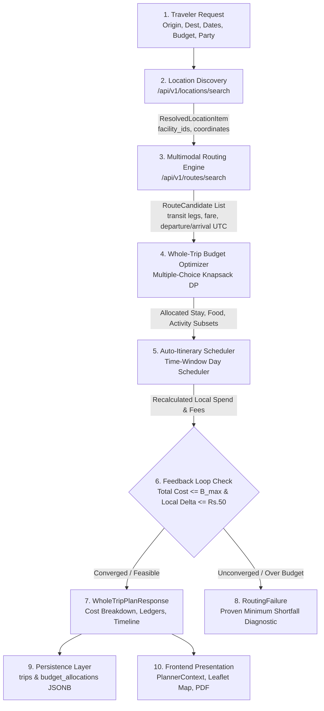

# NAVIX — Cross-Phase Contract & Interface Matrix Specification

> **Document Type**: Technical Interface & Producer-Consumer Contract Specification  
> **Status**: Official Technical Design Specification (Phase 6C)  
> **Scope**: End-to-End Workflow Mapping, Schema Ownership, Interface Type Alignment, & Contract Verification  
> **Safety Notice**: Design Specification Only — Zero Application Code Changes or API Mutations Executed.

---

## 1. Executive Summary & Interface Pipeline

This document establishes the **Cross-Phase Contract Matrix**, mapping data transformation and interface ownership across the end-to-end NAVIX travel planning pipeline:

---

## 2. End-to-End Producer-Consumer Contract Matrix

| Interface Pipeline Stage | Producer Component | Consumer Component | Data Schema / Model | Key Contracts & Data Types | Verification & Alignment Status |
| :--- | :--- | :--- | :--- | :--- | :--- |
| **1. Settlement Resolution** | Next.js Frontend / Client | Location Service (`/api/v1/locations/search`) | `LocationSearchResponse` | `location_id` (`FAC_...`), `coordinates` (`lat`, `lon`), `timezone` (`Asia/Kolkata`), `coverage_status`. | **ALIGNED**: Strict typing across Pydantic v2 and TypeScript interfaces. |
| **2. Multimodal Pathfinding** | Location Service | Routing Engine (`/api/v1/routes/search`) | `RouteSearchRequest` $\rightarrow$ `RouteSearchResponse` | Departure instant (`UTC`), `profile` (`CHEAPEST`, `BALANCED`, `FASTER`), `SearchOutcome`. | **ALIGNED**: Transport-only Pareto routes explicitly passed with departure/arrival timestamps. |
| **3. Joint Budget Optimization** | Routing Engine | Budget Optimizer (`/api/v1/trips/plan`) | `List[RouteCandidate]` $\rightarrow$ `WholeTripCostBreakdown` | Hard budget invariant ($C_{\text{total}} \le B_{\text{max}}$), 7 expense categories, `PartyComposition`. | **ALIGNED**: Monotonic cost scaling with explicit demographic age multipliers. |
| **4. Itinerary Construction** | Budget Optimizer | Itinerary Scheduler | Allocated `SelectedStay`, `SelectedFood`, `SelectedActivity` | Operating hours ($t_{\text{open}}, t_{\text{close}}$), closed days, pace caps, mandatory rest/meal blocks. | **ALIGNED**: Operating hours checked in agency local timezone; traveler events non-overlapping. |
| **5. Local Spend Feedback** | Itinerary Scheduler | Budget Optimizer | `C_local` & `C_fees` recalculation | Iteration cap $K_{\max} = 4$, $\epsilon = \text{Rs. } 50$, state hash $H^{(k)}$, `validated_feasible_incumbent`. | **ALIGNED**: Loop rolls back to feasible incumbent if scheduling causes budget overrun. |
| **6. API Response Generation** | Whole-Trip Engine | API Gateway (`/api/v1/trips/plan`) | `WholeTripPlanResponse` | 4-state `PriceEvidenceState`, `OptimizationOutcome`, `is_guaranteed_payable` boolean. | **ALIGNED**: Price evidence strictly decoupled from budget feasibility status. |
| **7. Database Persistence** | API Gateway | PostgreSQL DB (`trips`, `budget_allocations`) | SQLAlchemy Models + Additive JSONB | Extends `trips` (`party_composition_json`) & `budget_allocations` (`ledger_details_json`). | **ALIGNED**: Additive JSONB fields preserve legacy DB columns and check constraints. |
| **8. Frontend Presentation** | API Gateway | Next.js UI (`PlannerContext.tsx`) | Legacy `DailyItineraryItem` Adapter | Projects structured events to legacy timeline strings; renders Leaflet markers & PDF export. | **ALIGNED**: Backward-compatible adapter ensures zero UI component breakage. |

---

## 3. Schema Ownership & Type Standards

1. **Monetary Representation**: All cost fields are typed as `Decimal` in Python / strings in JSON payloads. Currency defaults to ISO-4217 `"INR"`. Multi-currency inputs (`USD`, `EUR`) include `exchange_rate` and `rate_timestamp_utc`.
2. **Timestamp Standard**: All system timestamps use ISO-8601 UTC format (`YYYY-MM-DDTHH:MM:SSZ`). Local attraction opening hours are represented as timezone-aware strings with `timezone` attributes.
3. **Non-Zero Missing Price Contract**: If an expense category is unpriced, `is_missing = True` and state is `MISSING_DATA`. Missing values MUST NOT be silently treated as ₹0.00 in cost calculations.
