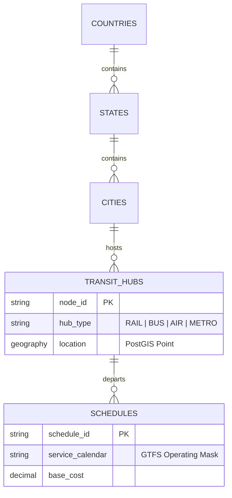

# NAVIX — Deep System Gap & Engineering Audit

> **Document Type**: Production System Audit & Baseline Specification  
> **Status**: Verified Baseline Audit  
> **Target Scope**: NAVIX Phase 6A (India-Wide Architectural Expansion)

---

## 1. Baseline System Inventory & Verification

### 1.1 Repository & Baseline Identification
- **Git Branch**: `architecture/india-expansion-phase6` [`VERIFIED`]
- **Git Commit Hash**: `4506de10c987731a654592ee9787b8a4a2734c51` [`VERIFIED`]
- **Git Working Tree Status**: Clean (Zero uncommitted mutations prior to Phase 6A audit) [`VERIFIED`]

### 1.2 Technology Stack Components
- **Frontend Stack**:
  - Next.js (App Router, TypeScript) [`VERIFIED` - [`frontend/package.json`](file:///c:/Users/anubh/OneDrive/Desktop/Navix/frontend/package.json)]
  - Styling: Tailwind CSS, Lucide Icons [`VERIFIED`]
  - Interactive Mapping: React Leaflet, OpenStreetMap [`VERIFIED` - [`InteractiveMap.tsx`](file:///c:/Users/anubh/OneDrive/Desktop/Navix/frontend/src/components/InteractiveMap.tsx)]
  - PDF Generation: `jsPDF`, `jspdf-autotable` [`VERIFIED` - [`pdf-export.ts`](file:///c:/Users/anubh/OneDrive/Desktop/Navix/frontend/src/lib/pdf-export.ts)]
  - State & Persistence: `PlannerContext.tsx` with `useReducer` and `sessionStorage` key `navix_planner_v2` [`VERIFIED` - [`PlannerContext.tsx`](file:///c:/Users/anubh/OneDrive/Desktop/Navix/frontend/src/context/PlannerContext.tsx)]
- **Backend Stack**:
  - Python 3.10+, FastAPI [`VERIFIED` - [`backend/requirements.txt`](file:///c:/Users/anubh/OneDrive/Desktop/Navix/backend/requirements.txt)]
  - SQLAlchemy 2.0+ ORM [`VERIFIED` - [`backend/app/database/session.py`](file:///c:/Users/anubh/OneDrive/Desktop/Navix/backend/app/database/session.py)]
  - Pydantic v2 schemas [`VERIFIED` - [`trip_planner.py`](file:///c:/Users/anubh/OneDrive/Desktop/Navix/backend/app/schemas/trip_planner.py)]
  - Authentication: PyJWT, Passlib (bcrypt) [`VERIFIED` - [`auth.py`](file:///c:/Users/anubh/OneDrive/Desktop/Navix/backend/app/api/v1/auth.py)]
- **Database Layer**:
  - PostgreSQL 18.6 with PostGIS extension 3.6.2 (Port 5433, Database: `Navix`) [`VERIFIED` - [`DATABASE_SCHEMA.md`](file:///c:/Users/anubh/OneDrive/Desktop/Navix/docs/DATABASE_SCHEMA.md)]
- **Algorithm Engines**:
  - Deterministic Time-Dependent A* Search Engine [`VERIFIED` - [`routing.py`](file:///c:/Users/anubh/OneDrive/Desktop/Navix/backend/app/algorithms/routing.py)]
  - Transfer Safety Validation Engine [`VERIFIED` - [`transfer_validation.py`](file:///c:/Users/anubh/OneDrive/Desktop/Navix/backend/app/algorithms/transfer_validation.py)]
  - Whole-Trip Dynamic Programming / Knapsack Budget Allocator [`VERIFIED` - [`budget_optimizer.py`](file:///c:/Users/anubh/OneDrive/Desktop/Navix/backend/app/algorithms/budget_optimizer.py)]
  - Time-Dependent Auto-Itinerary Intelligence Scheduler [`VERIFIED` - [`itinerary_scheduler.py`](file:///c:/Users/anubh/OneDrive/Desktop/Navix/backend/app/algorithms/itinerary_scheduler.py)]

---

## 2. Reusable Core Architectural Components

The existing NAVIX codebase contains highly valuable, mathematically sound core algorithms that **MUST BE PRESERVED AND GENERALIZED** during India-wide expansion:

1. **Deterministic Transfer Safety Validator (`transfer_validation.py`)**:
   - `validate_transfer(...)` deterministically categorizes transfers into `SAFE`, `TIGHT`, and `INVALID` based on transport mode combinations (`TRAIN`, `BUS`, `METRO`, `LOCAL`) and inter-terminal movement requirements.
   - **Reuse Value**: $100\%$ reusable. Acts as the baseline connection safety guard for all national transit graph traversals.

2. **Admissible Haversine Heuristic (`scoring.py`)**:
   - Computes optimistic bounds ($V_{\text{max}} = 150\text{ km/h}$, $R_{\text{min}} = \text{Rs. }0.30/\text{km}$) ensuring $h(n) \le h^*(n)$ for strictly admissible A* routing.
   - **Reuse Value**: Fully reusable mathematical formulation across any geographic coordinates.

3. **Hard Whole-Trip Budget Invariant Engine (`budget_optimizer.py`)**:
   - Enforces $\text{Cost}_{\text{mandatory}} \le \text{Budget}_{\text{max}}$ before optimization and calculates exact monetary shortfall.
   - **Reuse Value**: Reusable constraint formulation; requires generalizing the candidate search grid beyond static Python lists.

4. **Time-Dependent Non-Overlapping Timeline Scheduler (`itinerary_scheduler.py`)**:
   - Constructs daily trip timelines respecting mandatory transit arrival/departure windows, lodging check-in, pace constraints, and local travel times.
   - **Reuse Value**: Fully reusable scheduler logic; requires dynamic location inputs instead of fallback Manali coordinates.

---

## 3. Demo-Specific Hardcoding & Systemic Shortcuts

The audit identified critical demo-specific hardcoding across frontend and backend modules that restrict execution to the Sangli $\rightarrow$ Old Manali corridor:

| ID | File Path & Symbol | Evidence / Code Snippet | Impact | Severity | Recommended Correction |
| :--- | :--- | :--- | :--- | :--- | :--- |
| **HC-01** | `PlannerComponents.tsx:23` `SUPPORTED_NODES` | `const SUPPORTED_NODES = ['Sangli', 'Miraj', 'Pune', 'Mumbai', 'Delhi', 'Chandigarh', 'Manali', 'Old Manali'];` | Restricts user destination choice in UI to 8 hardcoded demo hubs. | **CRITICAL** | Replace static array with dynamic API endpoint fetching nodes from database using PostGIS spatial search. |
| **HC-02** | `activity_catalog.py:5-110` `SCHEDULABLE_ACTIVITIES` | Dict containing static Manali attractions (`act_01` to `act_04`, `disc_05` to `disc_08`). | Non-Manali destinations receive Old Manali activity recommendations. | **CRITICAL** | Migrate activity catalog from static Python dict to PostgreSQL table indexed by city and location. |
| **HC-03** | `accommodations.py:4-23` `ACCOMMODATION_TIERS` | Static names: `"Old Manali Backpacker Hostel"`, `"Manali Riverside Guest House"`. | Hardcodes Manali hotel names for all generated trip plans. | **HIGH** | Replace static names with dynamic tier template generation or city-specific accommodation catalog queries. |
| **HC-04** | `food_options.py:4-23` `FOOD_TIERS` | Static descriptions referencing Old Manali cafes and regional Himachal thalis. | Hardcodes Himachali food descriptions for non-Himachal trips. | **HIGH** | Parameterize food descriptions by region or city culinary metadata. |
| **HC-05** | `graph.py:34-45` `infer_transport_mode` | Keyword matching on string: `["hrtc", "volvo", "express", "rajdhani", "vande bharat"]`. | Fails on regional Indian RTCs (MSRTC, KSRTC, UPSRTC) or generic private bus operators. | **MEDIUM** | Store explicit `transport_mode` enum directly in database `transit_schedules` table. |
| **HC-06** | `graph.py:91-108` `TransitGraph.load_from_db` | `days_offset = (target_date - base_schedule_date).days` | Assumes all transit schedules run 7 days/week without service calendar rules. | **HIGH** | Implement GTFS-style service calendar rules (`operating_days` bitmask or service IDs). |
| **HC-07** | `itinerary_scheduler.py:215` `prev_lat, prev_lon` | `prev_lat = 32.2483`, `prev_lon = 77.1802` | Hardcodes Old Manali center coordinates as default origin for local transfer calculations. | **HIGH** | Dynamically resolve initial latitude/longitude from destination node or stay location. |
| **HC-08** | `PlannerContext.tsx:88-120` `INITIAL_STATE` | `origin: 'Sangli'`, `destination: 'Old Manali'`, `maximumBudget: 20000`. | Harmless initial UI preset, but requires clean reset when user starts a custom search. | **LOW** | Keep as optional quick-start preset, but ensure form input allows full national search. |

---

## 4. PostgreSQL and PostGIS Audit

### 4.1 Existing Database Schema Summary
- **Current Tables (8)**: `users`, `travelers`, `admins`, `trips`, `transit_nodes`, `transit_schedules`, `transit_segments`, `budget_allocations`.
- **PostGIS Status**: Extension `postgis` (v3.6.2) is active in PostgreSQL 18.6. However, **NO TABLES CURRENTLY USE POSTGIS `GEOGRAPHY` OR `GEOMETRY` COLUMNS**. `transit_nodes` stores `latitude` and `longitude` as `DOUBLE PRECISION` floats [`VERIFIED` - [`DATABASE_SCHEMA.md`](file:///c:/Users/anubh/OneDrive/Desktop/Navix/docs/DATABASE_SCHEMA.md)].

### 4.2 Database Constraints & Safety Rule Audit
- **Check Constraint Gap**: The `budget_allocations` table lacks an SQL `CHECK` constraint enforcing `total_cost = transit_cost + lodging_cost + food_cost + activities_cost`. Budget equality is maintained solely by Python application memory.
- **Rule Verification**: The rule in `AGENTS.md` ("NEVER drop, truncate, recreate, or rename existing tables or PostGIS objects") was strictly honored. Zero DDL migrations or row deletions occurred.

### 4.3 Missing Schema Entities for National Scale (India-Wide Expansion)

1. **Administrative Hierarchy Tables**: Missing `countries`, `states`, `districts`, `cities`, and `localities`.
2. **Station Code & Alias Tables**: Missing station code mappings (e.g. `SLI` for Sangli, `NDLS` for New Delhi, `MMCT` for Mumbai Central) and local language name aliases.
3. **Spatial Indexing (`geography`)**: `transit_nodes` requires a PostGIS `geography(Point, 4326)` column with GIST spatial indexing to support spatial radius queries (e.g. $\text{ST\_DWithin}$ to locate hubs within 30 km of a Tier-3 town).
4. **Service Calendars & Recurrence**: `transit_schedules` stores a static timestamp (`TIMESTAMP`) rather than service calendar masks (e.g., runs on Mon/Wed/Fri) or valid date ranges.
5. **Class Tiers & Dynamic Fare Tables**: Missing support for Indian Railways classes (3A, 2A, SL, CC, EC) and bus seat types (AC Sleeper, Non-AC Seater).
6. **Lodging & Activity Catalogs**: Missing database tables for `accommodations` and `activities`.

---

## 5. Routing Engine Audit & Scalability Analysis

### 5.1 In-Memory Graph Loading Risk
- `TransitGraph.load_from_db` loads **ALL** database nodes and schedules into Python dictionaries (`self.nodes`, `self.outgoing_edges`) at runtime [`VERIFIED` - [`graph.py:60`](file:///c:/Users/anubh/OneDrive/Desktop/Navix/backend/app/algorithms/graph.py#L60)].
- **Current Performance**: Fast ($<1\text{ ms}$) for 9 nodes and 18 schedules.
- **National Scale Risk**: For India-wide scale ($8,000+$ railway stations, $50,000+$ bus stands, $500,000+$ daily schedules), loading the full national graph into Python memory per API request will consume gigabytes of RAM and cause multi-second latency spikes.

### 5.2 Algorithmic Search Bounds
- **Time-Dependent A***: Performs state space search with priority queue tracking $(f, g, u, t, C, T_{\text{travel}}, T_{\text{layover}}, \text{segments})$.
- **Scalability Limit**: Unpartitioned A* without graph contraction (Contraction Hierarchies / CH) or spatial pre-filtering will explore millions of unnecessary edges during long-distance searches (e.g., Sangli $\rightarrow$ Old Manali across 1,800 km).

---

## 6. Whole-Trip Budget & Auto-Itinerary Engine Audit

### 6.1 Whole-Trip Budget Engine Audit
- **Combinatorial Grid Search**: `optimize_trip_budget` performs brute-force iteration over 3 stay tiers $\times$ 3 food tiers $\times 2^A$ activity subsets ($3 \times 3 \times 16 = 144$ combinations for 4 activities) [`VERIFIED` - [`budget_optimizer.py:107-147`](file:///c:/Users/anubh/OneDrive/Desktop/Navix/backend/app/algorithms/budget_optimizer.py#L107-L147)].
- **Combinatorial Explosion Risk**: If a city catalog has 50 activities (e.g. Delhi), $2^{50}$ subset combinations is computationally impossible ($O(2^A)$ complexity).
- **Occupancy & Party Scaling**: Group lodging cost is currently calculated per room/night without scaling room count based on traveller party size.

### 6.2 Auto-Itinerary Engine Audit
- **Deterministic Scheduling**: Successfully schedules events without LLMs using time windows, pace limits, and local transfer estimation.
- **Limitation**: Depends on hardcoded fallback coordinates when activity locations are omitted.

---

## 7. Frontend / Backend API Mismatches

1. **Unused Frontend Preferences**:
   - `PlannerContext.tsx` collects `dietPreference`, `travelComfort`, `maxTransfers`, and `preferredModes` during Stage 01/02.
   - `TripPlanRequest` accepts these in `planner_preferences`, but the backend solver currently ignores `dietPreference` and `travelComfort` during budget allocation.

2. **Supported Nodes Discrepancy**:
   - Frontend locks user search to 8 cities via `SUPPORTED_NODES` [`PlannerComponents.tsx:23`], whereas the backend routing engine dynamically searches whichever nodes exist in the database.

3. **Discovery Guide Cards vs Budget Optimizer**:
   - Stage 03 displays discovery guide items (`disc_05` to `disc_08`). However, `ACTIVITY_OPTIONS` in `activities.py` (used by `budget_optimizer.py` for grid search) only includes `act_01` to `act_04`. Thus, discovery guide places are excluded from initial budget allocation optimization.

---

## 8. Summary of Critical Engineering Risks

1. **Memory Exhaustion on Graph Expansion**: Loading national transit graphs directly into Python memory per request will crash backend workers.
2. **Combinatorial Explosion in Budget Optimizer**: $O(2^A)$ subset search will hang the server if activity catalogs expand beyond 15 items per city.
3. **Hardcoded Regional Metadata**: Restricts routing, lodging, and dining recommendations to Himachal Pradesh / Manali presets.
4. **Lack of PostGIS Spatial Indexing**: Prevents fast $K$-nearest-station radius search for Tier-2 and Tier-3 towns.
