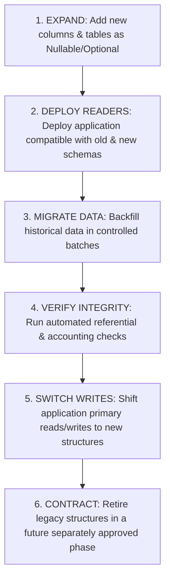

# NAVIX — Database Migration Blueprint & Alembic Architecture (V1)

> **Document Type**: Technical Database Architecture & Migration Blueprint  
> **Status**: Official Technical Design Specification (Phase 6B.5 — Final Corrections Pass)  
> **Scope**: Alembic Autocommit Migration Blocks, Concurrent Index Recovery, Staged Expand-Migrate-Contract Lifecycle & Legacy Preservation  
> **Safety Notice**: Design Specification Only — Zero Application Code, PostgreSQL Mutations, or Alembic Commands Executed.

---

## 1. Executive Summary & Existing Schema Audit

NAVIX relies on PostgreSQL 18 with PostGIS. To evolve the database from the existing V2 structure to the nationwide geographic schema without downtime or data loss, this specification establishes an **Expand-Migrate-Contract Migration Blueprint**.

### Existing V2 Schema Audit
Inspection of `backend/app/models/` confirms eight core V2 database tables:
1. `users`: Core user account table (`user_id`, `email`, `hashed_password`, `role`, `created_at`).
2. `travelers`: Traveler profile extension table (`traveler_id`, `user_id`, `full_name`, `phone_number`).
3. `admins`: Administrative role table (`admin_id`, `user_id`, `department`).
4. `trips`: User trip plan records (`trip_id`, `user_id`, `origin`, `destination`, `departure_date`, `return_date`, `total_budget`, `preferences_json`).
5. `transit_nodes`: V2 transit node table (`node_id`, `node_name`, `city`, `latitude`, `longitude`).
6. `transit_schedules`: Timetable departure records (`schedule_id`, `source_node_id`, `dest_node_id`, `departure_time`, `arrival_time`, `cost`).
7. `transit_segments`: Active route leg instances (`segment_id`, `trip_id`, `schedule_id`).
8. `budget_allocations`: Whole-trip expense breakdown (`allocation_id`, `trip_id`, `transit_cost`, `lodging_cost`, `food_cost`, `activities_cost`, `total_cost`).

### Legacy Constraint Preservation Invariant
All migrations must preserve existing records and enforce the legacy budget accounting invariant:

$$\text{total\_cost} = \text{transit\_cost} + \text{lodging\_cost} + \text{food\_cost} + \text{activities\_cost}$$

---

## 2. PostgreSQL Concurrent Index Creation & Transaction Handling Architecture

### 2.1 Autocommit Block Requirement
PostgreSQL strictly forbids `CREATE INDEX CONCURRENTLY` inside a standard transaction block. In Alembic, concurrent index migrations MUST explicitly disable transaction wrapping:

```python
# Alembic Migration Contract for Concurrent Indexes
from alembic import op

# Explicitly disable transaction block for this migration
revision = '0005_add_concurrent_spatial_indexes'
down_revision = '0004_add_price_evidence_jsonb'
branch_labels = None
depends_on = None

def upgrade() -> None:
    # 1. Disable transaction wrapping in autocommit mode
    context = op.get_context()
    with context.autocommit_block():
        # 2. Cleanup any leftover invalid index from a previous interrupted run
        op.execute("DROP INDEX CONCURRENTLY IF EXISTS idx_facilities_location;")
        
        # 3. Create spatial GiST index concurrently out-of-transaction
        op.execute("""
            CREATE INDEX CONCURRENTLY idx_facilities_location 
            ON transit_facilities USING GIST (location);
        """)

def downgrade() -> None:
    context = op.get_context()
    with context.autocommit_block():
        op.execute("DROP INDEX CONCURRENTLY IF EXISTS idx_facilities_location;")
```

### 2.2 Invalid Index Detection & Recovery Runbook
If an interrupted build or lock contention leaves behind an invalid index (`indisvalid = false` in `pg_index`), PostgreSQL will not use it for queries, but will continue updating it on writes.
- **Detection**: The migration verification harness queries `pg_index`:
  ```sql
  SELECT indexrelid::regclass FROM pg_index WHERE indisvalid = false;
  ```
- **Automated Recovery**: Autocommit migration blocks execute `DROP INDEX CONCURRENTLY IF EXISTS <index_name>` prior to attempting `CREATE INDEX CONCURRENTLY`, ensuring safe, idempotent migration retries.

---

## 3. Staged Expand-Migrate-Contract Migration Lifecycle

To ensure schema compatibility during rolling application deployments:



### Staged Execution Rules
1. **Stage 1 (Expand)**: Add additive JSONB fields (`party_composition_json`, `ledger_details_json`) and national geographic tables.
2. **Stage 2 (Deploy Compatible Readers)**: Deploy application version capable of reading legacy `transit_nodes` while writing to both schemas.
3. **Stage 3 (Batch Data Backfill)**: Execute data migration in controlled batches of 1,000 rows to prevent table lock escalation.
4. **Stage 4 (Integrity Verification)**: Verify total record count and legacy budget equality ($\text{total\_cost} = \sum \text{categories}$).
5. **Stage 5 (Switch Primary Access)**: Direct primary application traffic to national `transit_facilities`.
6. **Stage 6 (Contract - Future Phase)**: Retiring legacy tables is deferred to a future separately approved phase.

---

## 4. Rollback & Disaster Recovery Disclosures

- **Application Rollback vs Database Recovery**: Reverting application code is distinct from reverting database schemas. DDL migrations involving schema drop operations are non-reversible without restoring from backup snapshots.
- **Verification Status**: Zero-downtime migrations and rollback procedures are classified as **PROPOSED ARCHITECTURAL OBJECTIVES**, pending empirical verification during Phase 6B.5 test executions.
