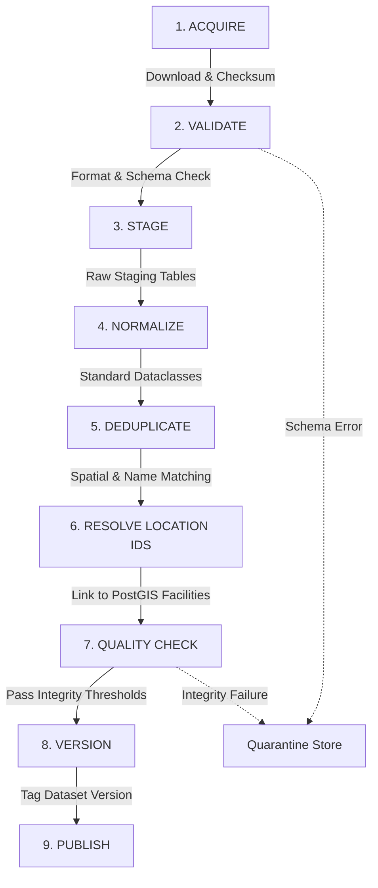
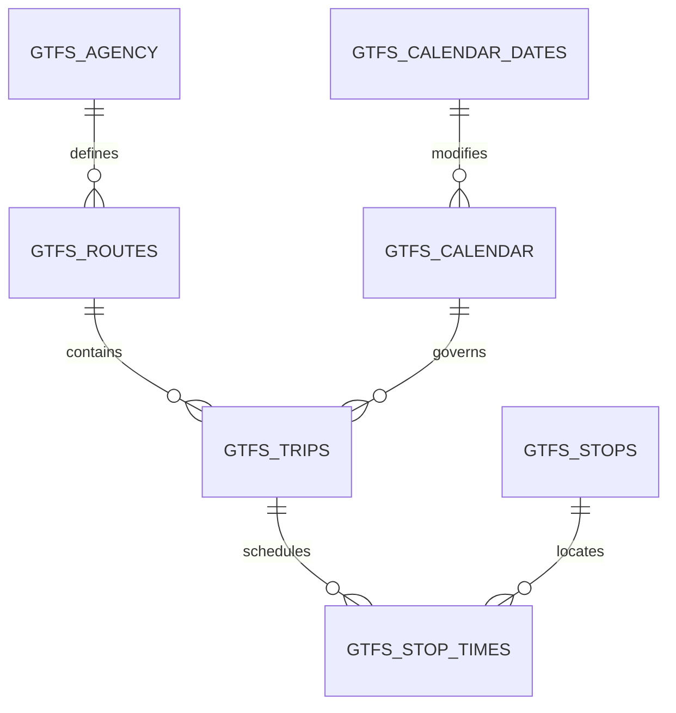

# NAVIX — Data Ingestion Pipeline & GTFS Architecture Specification

> **Document Type**: Ingestion Pipeline & Data Reliability Architecture Design  
> **Status**: Official Technical Design Specification (Phase 6B.2)  
> **Scope**: Multimodal Ingestion Pipeline, GTFS Parsing, Versioning, & Atomic Swaps  
> **Safety Notice**: Design Specification Only — Zero Application Code or PostgreSQL Mutations Executed.

---

## 1. 9-Stage Ingestion Pipeline Lifecycle

To ensure total data reliability and zero operational downtime, all external travel feeds pass through a **9-Stage Atomic Pipeline**:



### Pipeline Stage Specifications
1. **ACQUIRE**: Downloads raw GTFS zip or JSON payload, verifies SHA-256 checksum, logs metadata in `ingestion_runs`.
2. **VALIDATE**: Runs schema validation against feed specifications (e.g. verifying required GTFS header columns). Invalid feeds are quarantined immediately.
3. **STAGE**: Writes raw CSV/JSON records into isolated PostgreSQL staging tables (`staging_gtfs_stops`, `staging_gtfs_trips`, `staging_gtfs_stop_times`).
4. **NORMALIZE**: Translates raw strings into typed NAVIX contracts (`ServiceCalendar`, `StopTime`, `TripInstance`), converting `24:00+` times into integer minute offsets.
5. **DEDUPLICATE**: Clusters duplicate stop/station entries within $200\text{ meters}$ using PostGIS spatial operators ($\text{ST\_DWithin}$).
6. **RESOLVE LOCATION IDS**: Maps feed stops to internal NAVIX `facility_id` primary keys using `provider_mappings`. Unmatched stops trigger automatic facility creation or review queue flagging.
7. **QUALITY CHECK**: Validates feed integrity thresholds:
   - Zero negative durations ($t_{\text{arr}} > t_{\text{dep}}$ mandatory).
   - Zero orphaned trips without calendar rules.
   - At least $95\%$ location resolution success rate.
8. **VERSION**: Assigns a immutable dataset version ID (e.g., `ds_irctc_2026_q4_v1`, `ds_dmrc_2026_10_v2`).
9. **PUBLISH**: Swaps the active `dataset_version` pointer in production tables in a single atomic database transaction (`BEGIN; UPDATE active_dataset_version ...; COMMIT;`).

---

## 2. GTFS Static Ingestion Specification

NAVIX ingests GTFS static archives compliant with GTFS Reference Standards:



### 2.1 File Parsing & Field Mapping Matrix

| GTFS File | Core Fields Processed | Internal Mapping / Action | Handling Rule |
| :--- | :--- | :--- | :--- |
| `agency.txt` | `agency_id`, `agency_name`, `agency_timezone` | `operator_name`, `timezone` | Default timezone fallback to `Asia/Kolkata`. |
| `stops.txt` | `stop_id`, `stop_name`, `stop_lat`, `stop_lon`, `location_type`, `parent_station` | `transit_facilities` / `transit_stops` | Converted to PostGIS `geography(Point, 4326)`. Parent stations mapped to main hub. |
| `routes.txt` | `route_id`, `route_short_name`, `route_type` | `TransportRoute` | `route_type` mapped: `0`=Metro, `1`=Subway, `2`=Rail, `3`=Bus. |
| `trips.txt` | `trip_id`, `service_id`, `route_id`, `trip_headsign` | `TransportService` | Linked to `ServiceCalendar` via `service_id`. |
| `stop_times.txt` | `trip_id`, `arrival_time`, `departure_time`, `stop_id`, `stop_sequence` | `StopTime` | `HH:MM:SS` parsed to minute offsets. Times $> 24:00$ preserved with day-offset flags. |
| `calendar.txt` | `service_id`, `monday`..`sunday`, `start_date`, `end_date` | `ServiceCalendar` | 7-bit operating day mask constructed. |
| `calendar_dates.txt` | `service_id`, `date`, `exception_type` | `ServiceCalendar.added_dates` / `removed_dates` | `exception_type=1` (Added), `exception_type=2` (Removed). |
| `transfers.txt` | `from_stop_id`, `to_stop_id`, `min_transfer_time` | `TransferConnection` | Supplemented by NAVIX's deterministic `transfer_validation.py` engine. |

---

## 3. Handling 24:00+ Times & Service-Day Semantics

GTFS schedules frequently represent overnight transit runs using times past midnight (e.g. departure at `23:45`, arrival at `25:30` meaning `01:30` on the following calendar day).

### Handling Algorithm
```python
def parse_gtfs_time_to_minutes(time_str: str) -> Tuple[int, int]:
    """
    Parses 'HH:MM:SS' GTFS timestamp into (total_minutes_from_midnight, day_offset).
    Example: '25:30:00' -> (1530, 1)
    """
    parts = time_str.strip().split(":")
    hours = int(parts[0])
    minutes = int(parts[1])
    
    day_offset = hours // 24
    normalized_hours = hours % 24
    total_minutes = hours * 60 + minutes
    
    return total_minutes, day_offset
```
- During A* pathfinding, departure and arrival timestamps are computed by adding `total_minutes` to the trip instance's base `service_date` midnight UTC instant.

---

## 4. Alternative Non-GTFS Format Ingestion Adapters

Not all Indian providers supply standard GTFS zips. NAVIX defines alternative ingestion adapters:

1. **Static CSV / Excel Timetable Ingestor**:
   - Used for public Data.gov.in timetable snapshots or State RTC CSV exports. Parses train number, station code, arrival time, departure time, and days of run.
2. **JSON REST API Polling Ingestor**:
   - Used for live commercial APIs (e.g. Amadeus Air, RedBus B2B). Polled responses are converted directly into normalized `TripInstance` and `FareQuote` dataclasses before being stored in Redis cache.

---

## 5. Dataset Versioning, Atomic Swaps, & Quarantine

### 5.1 Dataset Versioning Schema
Every published schedule row stores a `dataset_version_id` string (e.g., `ds_rail_2026_v1`).

```sql
-- Provisional Dataset Version Registry Table
CREATE TABLE IF NOT EXISTS dataset_versions (
    version_id VARCHAR(50) PRIMARY KEY,
    provider_id VARCHAR(50) NOT NULL,
    data_source VARCHAR(100) NOT NULL,
    record_count INT NOT NULL,
    status VARCHAR(20) NOT NULL DEFAULT 'STAGING' CHECK (status IN ('STAGING', 'ACTIVE', 'ARCHIVED', 'QUARANTINED')),
    created_at TIMESTAMP DEFAULT CURRENT_TIMESTAMP,
    activated_at TIMESTAMP
);
```

### 5.2 Atomic Swap Mechanism
When a new GTFS dataset passes all quality checks:
```sql
-- Atomic Swap Transaction
BEGIN;
-- Deactivate current version
UPDATE dataset_versions SET status = 'ARCHIVED' WHERE provider_id = 'GTFS_RAIL' AND status = 'ACTIVE';
-- Activate new version
UPDATE dataset_versions SET status = 'ACTIVE', activated_at = CURRENT_TIMESTAMP WHERE version_id = 'ds_rail_2026_v2';
COMMIT;
```
- Routing queries select schedules matching `status = 'ACTIVE'`, ensuring zero query disruption or partial state reads during ingestion.
