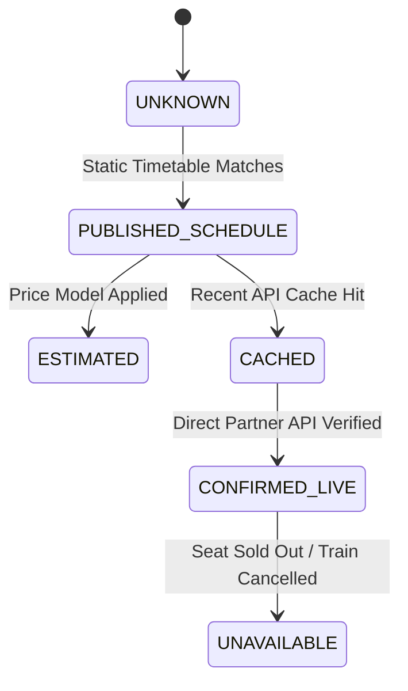

# NAVIX — Travel Data Feasibility & Provider Architecture (Revised Phase 6A)

> **Document Type**: Data Provider Feasibility & Licensing Analysis (Architecture Review & Correction)  
> **Status**: Verified Engineering Audit (Corrected Baseline)  
> **Verification Date**: October 2026

---

## 1. Executive Summary & Verification Principles

The Phase 6A Architecture Review established a strict, evidence-based stance on Indian travel data acquisition:
- **No Faked Real-Time Availability**: Real-time seat availability (`AVAILABLE`, `WL`, `RAC`) for Indian Railways cannot be manufactured or inferred probabilistically.
- **No Assumed National GTFS**: There is **no official, current nationwide Indian Railways GTFS feed** published on Data.gov.in. Public Data.gov.in datasets consist of legacy historical CSV/JSON exports (circa 2014–2017) or static statistical tables.
- **Strict Public API Limits**: Public demo servers (such as OpenStreetMap Nominatim) strictly prohibit heavy production apps (max 1 req/sec limit). Production deployment requires self-hosted instances or commercial API providers.

---

## 2. Comprehensive Data Provider Feasibility Matrix

| Category | Candidate Provider / Dataset | Data Offered | Coverage | Access Mechanism | Licensing & Terms | Rate Limits | Freshness | Feasibility Classification | Official Source & Verification Date |
| :--- | :--- | :--- | :--- | :--- | :--- | :--- | :--- | :--- | :--- |
| **1. Rail Routes & Schedules (Static)** | Community / GitHub IndianRailways Snapshots & CRIS Timetables | Static train schedules, station codes, route sequences | Nationwide Indian Railways (~8,000 stations) | Static JSON / CSV import or CRIS partner feed | Non-official / Public Domain snapshots; Official feed requires CRIS approval | Unlimited offline import; CRIS API rate-limited per contract | Ingested per timetable release (quarterly) | `UNVERIFIED` (Public GTFS) / `PARTNERSHIP REQUIRED` (CRIS API) | [data.gov.in](https://data.gov.in) (Historical), [github.com/datameet](https://github.com/datameet) (Verified Oct 2026) |
| **1. Rail Fares & Availability (Live)** | IRCTC / CRIS Aggregator API | Live seat availability (3A, 2A, SL, CC, 1A), ticket fares, RAC/WL status | Nationwide Indian Railways | Official IRCTC B2B REST API | B2B Commercial License, security audit, bank guarantee & transaction fee agreement | Strict contract-bound rate limits | Real-time (minute-level) | `PARTNERSHIP REQUIRED` | [irctc.co.in](https://www.irctc.co.in) (Verified Oct 2026) |
| **2. Intercity Bus Schedules & Fares** | City/State Transit Portals (Open Transit Data Delhi, BMTC) | Bus routes, stop locations, timetable schedules | Select urban/state corridors (Delhi, Bengaluru, Kerala) | GTFS Static zip file downloads | Open Data License / CC-BY 4.0 | Unlimited static download | Ingested per schedule revision | `VERIFIED PUBLIC ACCESS` (Select Urban RTCs) | [otd.delhi.gov.in](https://otd.delhi.gov.in) (Verified Oct 2026) |
| **2. Intercity Bus (Live / Nationwide)** | RedBus / AbhiBus B2B API | Private bus operators, AC/Sleeper fares, live seat layouts | 100,000+ bus routes in India | B2B Enterprise Partner API | Commercial partnership contract required | Partner-tier rate limits | Real-time | `PARTNERSHIP REQUIRED` | [redbus.in](https://www.redbus.in) (Verified Oct 2026) |
| **3. Flights** | Amadeus Self-Service Flight Offers API | Flight schedules, airline routes, estimated airfares | Commercial Indian airports | REST API (OAuth 2.0) | Amadeus Developer Terms (Free 2,000 req/mo test quota; Production requires agreement) | 10 req/sec (Test) | Live / Cached daily | `VERIFIED RESTRICTED ACCESS` | [developers.amadeus.com](https://developers.amadeus.com) (Verified Oct 2026) |
| **4. Metro Transit** | DMRC (Delhi Metro) & Namma Metro Open Feeds | Metro lines, station coordinates, arrival intervals | Tier-1 Metro cities | Open GTFS static file download | Open License | Unlimited static download | Updated per line expansion | `VERIFIED PUBLIC ACCESS` | [github.com/dmrc](https://github.com) (Verified Oct 2026) |
| **5. Maps & Geocoding (Self-Hosted)** | OpenStreetMap / Nominatim / OSRM | Geocoding, road network routing, hub coordinates | 100% India coverage | Self-hosted Nominatim & OSRM Docker instance | Open Database License (ODbL) | Self-hosted (unlimited) | Daily / Weekly sync | `VERIFIED PUBLIC ACCESS` (Self-Hosted) | [openstreetmap.org](https://www.openstreetmap.org) (Verified Oct 2026) |
| **5. Maps & Geocoding (Public Demo)** | Public Nominatim Demo (`nominatim.openstreetmap.org`) | Forward / reverse geocoding | Global & India | HTTP GET with custom User-Agent | Prohibits bulk geocoding, commercial production apps, & traffic bursting | **Max 1 req/sec strictly enforced** | Real-time | `VERIFIED RESTRICTED ACCESS` | [operations.osmfoundation.org](https://operations.osmfoundation.org/policies/nominatim/) (Verified Oct 2026) |
| **6. Places & Attractions** | OpenTripMap API & Wikidata | Historical sights, nature spots, cultural landmarks, coordinates | 50,000+ Indian attractions | REST API & SPARQL endpoint | CC-BY-SA 4.0 / Open Data | 5,000 free req/day (Non-commercial) | Daily sync | `VERIFIED PUBLIC ACCESS` | [opentripmap.io](https://opentripmap.io) (Verified Oct 2026) |
| **7. Hotels & Accommodations** | Booking.com Demand API / Agoda Affiliate API | Hotel listings, room rates, property coordinates | Major Indian destinations | Affiliate REST API | Approved affiliate business entity required | Partner rate limits | Real-time / Hourly cached | `VERIFIED RESTRICTED ACCESS` | [developers.booking.com](https://developers.booking.com) (Verified Oct 2026) |
| **7. Hotels (Fallback)** | City-Tier Static Price Matrix | Estimated lodging cost per night by city tier & season | Nationwide fallback matrix | Internal PostgreSQL table | Internal Proprietary Algorithm Data | N/A (Internal DB) | Static / Quarterly updated | `CURATED/DEMO ONLY` | NAVIX Internal Data |
| **8. Weather & Seasonality** | Open-Meteo Weather API | Temperature, rainfall forecasts, mountain weather | Global & India lat/long grid | REST API (No API key required) | CC-BY 4.0 (Free for non-commercial; Commercial subscription required) | 10,000 req/day (Non-commercial) | Hourly forecast | `VERIFIED PUBLIC ACCESS` (Non-Commercial) | [open-meteo.com](https://open-meteo.com) (Verified Oct 2026) |

---

## 3. Explicit Data Availability Model

NAVIX strictly categorizes every route segment, fare, and seat availability metric into 6 explicit data states:

### 3.1 Data State Definitions & User-Facing UI Labels

| Data State | System Definition | User-Facing Timeline Label & Wording | Real-Time Booking Claim |
| :--- | :--- | :--- | :--- |
| `CONFIRMED_LIVE` | Live availability & fare verified directly via active provider API connection. | `"CONFIRMED LIVE FARE · Direct Carrier Availability"` | Live seat booking option available via carrier redirect. |
| `PUBLISHED_SCHEDULE` | Route & departure time derived from published timetable schedules; live seats unverified. | `"SCHEDULE VERIFIED · Departure & Route Timetable"` | **No live seat claim.** Displays *"Check live seats on IRCTC / Operator portal"*. |
| `CACHED` | Carrier availability cached from previous API response within valid freshness TTL. | `"CACHED FARE · Updated 15 mins ago"` | Displays timestamped fare with refresh action. |
| `ESTIMATED` | Cost estimated using city-tier cost model or distance-based fare function. | `"ESTIMATED COST · Budget Allocation Range"` | Explicit disclaimer: *"Price estimated for whole-trip budget planning."* |
| `UNAVAILABLE` | Carrier API reported route fully booked, sold out, or service cancelled. | `"SOLD OUT / UNAVAILABLE · Alternative Route Required"` | Route marked inactive; planner suggests alternative schedule leg. |
| `UNKNOWN` | Timetable or fare data absent for requested date/corridor. | `"SCHEDULE UNCERTAIN · Verify Locally"` | Warns user that leg requires manual local inquiry. |

---

## 4. Provider Abstraction Architecture

NAVIX adopts a **Logical Provider Abstraction Layer** using abstract base classes in Python (`RailAdapter`, `BusAdapter`, `GeocodeAdapter`, `LodgingAdapter`). 

### Core Design Rules:
1. **Normalization**: Adapters translate external provider schemas into unified internal dataclasses (`NormalizedSegment`, `NormalizedStation`, `NormalizedStay`).
2. **Data Provenance**: Every normalized row stores `provider_id`, `data_source`, `ingested_at`, and `confidence_score`.
3. **Graceful Fallback**: If a live provider API times out (default: $3.0\text{s}$ timeout), the adapter falls back to `PUBLISHED_SCHEDULE` or `ESTIMATED` state with explicit UI labels.
