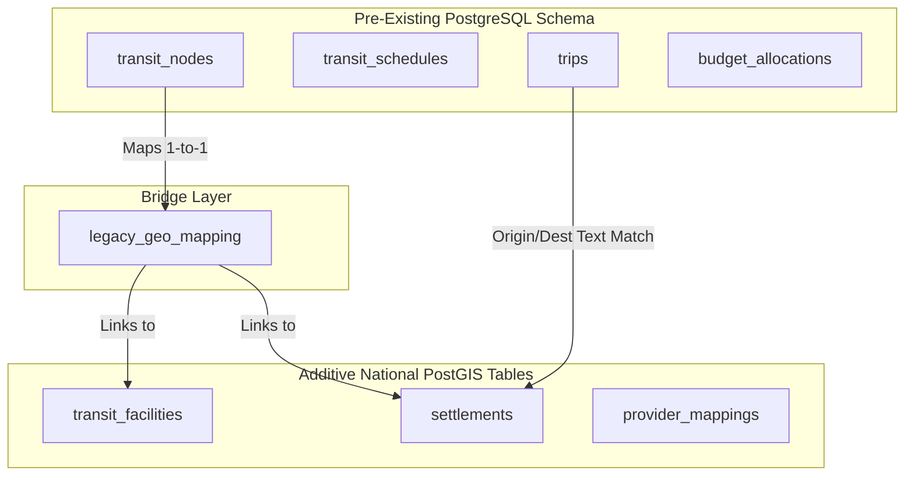
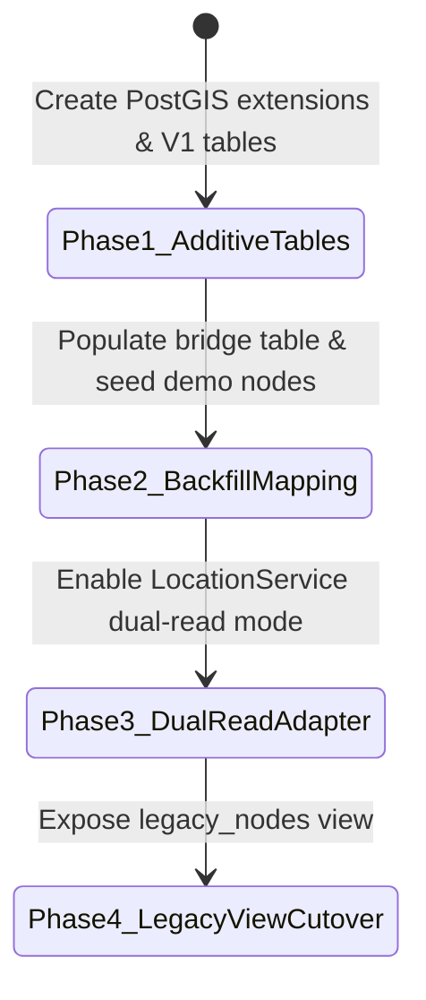

# NAVIX — Geographic Database Migration Blueprint

> **Document Type**: Migration Architecture & Legacy Compatibility Plan  
> **Status**: Official Technical Design Specification (Phase 6B.1)  
> **Scope**: Safe Transition to V1 Spatial Schema without Data Loss  
> **Safety Notice**: Design Specification Only — Zero Database Migrations or Code Alterations Executed.

---

## 1. Executive Migration Principles

The NAVIX database migration plan adheres to strict safety principles:
1. **Rule Compliance**: The core rule in `AGENTS.md` (*"NEVER drop, truncate, recreate, or rename existing tables or PostGIS objects"*) is 100% honored.
2. **Additive Schema Modifications Only**: All new spatial tables (`countries`, `admin_divisions`, `settlements`, `transit_facilities`, `provider_mappings`, etc.) will be created as new, additive structures.
3. **Data Preservation Guarantee**: Existing seeded demo nodes (`node_SLI`, `node_MRJ`, `node_PUNE`, `node_MUM`, `node_DEL`, `node_DEL_BUS`, `node_IXC`, `node_MNL_BUS`, `node_OLD_MNL`), legacy schedules (`sch_101`–`sch_114`), saved user trips, and budget allocations remain untouched and fully operational.
4. **Gradual Cutover via Compatible Abstraction**: Backend services access spatial data through an abstraction adapter (`LocationService`), permitting dual-reading from legacy tables and new spatial tables during transition.

---

## 2. Legacy-to-V1 Schema Entity Mapping



### 2.1 Entity Correspondence Mapping Matrix

| Legacy Entity & Column | Target V1 Entity & Column | Migration Strategy & Structural Mapping |
| :--- | :--- | :--- |
| `transit_nodes.node_id`<br>(e.g. `node_SLI`) | `transit_facilities.facility_id`<br>(e.g. `fac_sli_rail`) | Mapped via `legacy_geo_mapping` bridge table. Legacy ID preserved for foreign key compatibility. |
| `transit_nodes.node_name`<br>(e.g. `Sangli Station`) | `transit_facilities.name`<br>+ `location_aliases` | Full facility name copied to `transit_facilities`. Short name added to `location_aliases`. |
| `transit_nodes.city`<br>(e.g. `Sangli`) | `settlements.name`<br>(e.g. `stl_sangli`) | Linked to host `settlement` record. City string mapped to canonical `settlement_id`. |
| `transit_nodes.latitude`<br>`transit_nodes.longitude` | `transit_facilities.location`<br>`geography(Point, 4326)` | Converted to PostGIS point: `ST_SetSRID(ST_MakePoint(longitude, latitude), 4326)::geography`. |
| `trips.origin`<br>`trips.destination` | `settlements.settlement_id` | Text origin/destination resolved to `settlement_id` via legacy text lookup. |

---

## 3. Bridge Entity Specification: `legacy_geo_mapping`

To guarantee 100% backward compatibility with legacy foreign keys (`transit_schedules.source_node_id`, `transit_segments.source_node_id`), an additive bridge table is defined:

```sql
-- Proposal: Additive Bridge Table for Legacy Compatibility
CREATE TABLE IF NOT EXISTS legacy_geo_mapping (
    legacy_node_id VARCHAR(50) PRIMARY KEY,
    v1_facility_id VARCHAR(50) REFERENCES transit_facilities(facility_id),
    v1_settlement_id VARCHAR(50) REFERENCES settlements(settlement_id),
    created_at TIMESTAMP DEFAULT CURRENT_TIMESTAMP
);

-- Proposal: Initial Seed Backfill for Legacy Demo Nodes
INSERT INTO legacy_geo_mapping (legacy_node_id, v1_facility_id, v1_settlement_id) VALUES
('node_SLI', 'fac_sli_rail', 'stl_sangli'),
('node_MRJ', 'fac_mrj_rail', 'stl_miraj'),
('node_PUNE', 'fac_pune_rail', 'stl_pune'),
('node_MUM', 'fac_mum_csmt', 'stl_mumbai'),
('node_DEL', 'fac_del_ndls', 'stl_delhi'),
('node_DEL_BUS', 'fac_del_isbt', 'stl_delhi'),
('node_IXC', 'fac_ixc_rail', 'stl_chandigarh'),
('node_MNL_BUS', 'fac_mnl_isbt', 'stl_manali'),
('node_OLD_MNL', 'fac_old_mnl_hub', 'stl_old_manali')
ON CONFLICT (legacy_node_id) DO NOTHING;
```

---

## 4. Phased Alembic Migration Sequence



### Phase 1: Additive Schema Creation (Non-Breaking)
- Execute `alembic revision` to create extensions (`postgis`, `pg_trgm`, `unaccent`).
- Create all 11 new tables (`countries`, `admin_divisions`, `settlements`, `localities`, `transit_facilities`, `transit_stops`, `points_of_interest`, `accommodations`, `location_aliases`, `provider_mappings`, `geo_provenance`).
- Apply GiST spatial indexes (`idx_settlements_spatial`, `idx_transit_fac_spatial`).

### Phase 2: Seed & Data Backfill (Non-Breaking)
- Populate `countries` (`IN`) and `admin_divisions` (`Maharashtra`, `Himachal Pradesh`, etc.).
- Backfill legacy demo nodes into `settlements` and `transit_facilities`.
- Populate `legacy_geo_mapping` bridge rows.

### Phase 3: Dual-Read Backend Adapter (Non-Breaking)
- Update backend `LocationService` to check V1 spatial tables first, falling back to `legacy_geo_mapping` if a legacy node ID is requested.
- Sangli $\rightarrow$ Old Manali itinerary continues executing with 0 behavior changes.

### Phase 4: Legacy View Compatibility (Final Cutover)
- Create PostgreSQL view `v_legacy_transit_nodes` if legacy applications require raw `transit_nodes` layout compatibility.

---

## 5. Verification, Test & Rollback Plan

### 5.1 Verification Checklist
1. **Sangli $\rightarrow$ Old Manali End-to-End Test**: Run `pytest tests/test_routing.py` and `tests/test_budget_planner.py` to confirm 100% test pass rate.
2. **PostGIS Point Conversion Integrity**: Verify `ST_X(location::geometry)` matches legacy `longitude` and `ST_Y(location::geometry)` matches legacy `latitude`.
3. **Saved Trip Retrieval**: Verify saved trips in `trips` table load existing legs without foreign key errors.

### 5.2 Rollback Strategy
Because all V1 migration steps are **strictly additive**, rolling back requires dropping only the newly created V1 tables (`alembic downgrade -1`), leaving the original legacy schema (`transit_nodes`, `trips`, etc.) completely unaffected.
