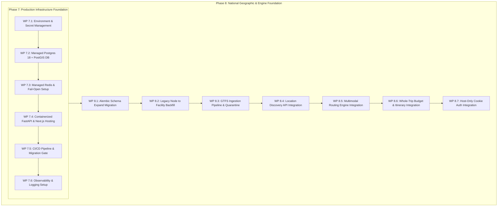

# NAVIX — Implementation Readiness & Sequencing Roadmap (Phases 7 & 8)

> **Document Type**: Technical Implementation Roadmap & Work Package Specification  
> **Status**: Official Technical Design Specification (Phase 6C)  
> **Scope**: Dependency-Ordered Implementation Execution Plan for Phase 7 (Infrastructure) & Phase 8 (National Foundation)  
> **Safety Notice**: Planning Specification Only — Zero Application Code Changes, Cloud Provisioning, or Feature Execution Applied.

---

## 1. Executive Summary & Implementation Sequence

This roadmap defines the dependency-ordered work packages for upcoming **Phase 7 (Production & Staging Infrastructure)** and **Phase 8 (National Geographic & Engine Foundation)**. 

Every work package specifies exact prerequisites, deliverables, and acceptance criteria to ensure controlled, risk-managed execution.

---

## 2. Phase 7 — Production & Staging Infrastructure Foundation

### `WP-7.1`: Environment Contracts & Startup Secret Validation
- **Prerequisites**: Approved Phase 6B.5 and Phase 6C specifications.
- **Deliverables**: Provision `.env.development`, `.env.staging`, and `.env.production` secret validation bindings in `backend/app/core/config.py`.
- **Acceptance Criteria**: Server startup aborts with explicit error if `SECRET_KEY` is missing or $<32$ characters in staging/production environments.

### `WP-7.2`: Managed PostgreSQL 18 + PostGIS Database Setup
- **Prerequisites**: `WP-7.1`.
- **Deliverables**: Provision RDS PostgreSQL 18 instance in `ap-south-1` (Mumbai) with `postgis` extension enabled and PgBouncer transaction pooler sidecar.
- **Acceptance Criteria**: PgBouncer accepts connections with `prepare_threshold = None` in SQLAlchemy engine.

### `WP-7.3`: Managed Redis Cluster & Degraded Policy Setup
- **Prerequisites**: `WP-7.1`.
- **Deliverables**: Provision ElastiCache Redis cluster; configure endpoint-specific fail-closed/fail-open middleware policies.
- **Acceptance Criteria**: Redis failure triggers fail-open in search/planning endpoints and fail-closed in auth/admin endpoints.

### `WP-7.4`: Containerized FastAPI & Next.js App Router Hosting
- **Prerequisites**: `WP-7.2`, `WP-7.3`.
- **Deliverables**: Deploy containerized FastAPI tasks on AWS ECS Fargate; deploy Next.js frontend with route rewrite proxy `/api/v1/*` to backend.
- **Acceptance Criteria**: Frontend and API communicate seamlessly over host-only origin (`app.navix.travel`).

### `WP-7.5`: CI/CD Pipeline & Migration Gate Setup
- **Prerequisites**: `WP-7.4`.
- **Deliverables**: Configure GitHub Actions workflow with static linting, secret scanning, isolated Docker migration test job, and pre-deployment job gate.
- **Acceptance Criteria**: Pull requests build cleanly; pre-deployment migration gate runs Alembic without automatic container startup DDL.

### `WP-7.6`: Observability, Logging & Error Tracking Setup
- **Prerequisites**: `WP-7.5`.
- **Deliverables**: Configure structured JSON logger with `X-Request-ID` correlation IDs, Sentry error tracking, and regex sensitive data masking (`[REDACTED]`).
- **Acceptance Criteria**: Sensitive credentials masked in log streams; errors captured in Sentry.

---

## 3. Phase 8 — National Geographic & Engine Foundation

### `WP-8.1`: Alembic Schema Expand Migration Execution
- **Prerequisites**: Phase 7 complete.
- **Deliverables**: Execute Alembic migration `0002_add_postgis_national_geo.py` creating national PostGIS geographic tables.
- **Acceptance Criteria**: `transit_facilities`, `transit_stops`, `settlements` tables created cleanly with GiST spatial indexes.

### `WP-8.2`: Legacy Node to Facility Data Backfill
- **Prerequisites**: `WP-8.1`.
- **Deliverables**: Execute Alembic data migration `0003_migrate_legacy_transit_nodes.py` backfilling legacy V2 nodes into `transit_facilities` using namespaced IDs (`FAC_IN_IRCTC_...`).
- **Acceptance Criteria**: 100% legacy nodes backfilled; V2 Sangli $\rightarrow$ Old Manali search queries resolve facility records.

### `WP-8.3`: Open GTFS Timetable Ingestion & Quarantine Pipeline
- **Prerequisites**: `WP-8.2`.
- **Deliverables**: Implement GTFS timetable ingestion worker with timezone normalization, WGS 84 coordinate validation, and quarantine handling.
- **Acceptance Criteria**: GTFS stop times $>24:00$ parsed accurately; malformed rows quarantined in `invalid_schedules`.

### `WP-8.4`: Location Discovery API Integration (`/api/v1/locations/*`)
- **Prerequisites**: `WP-8.3`.
- **Deliverables**: Implement `/api/v1/locations/search` endpoint backed by PostGIS spatial queries and `location_aliases`.
- **Acceptance Criteria**: Autocomplete resolves settlements, stations, and airports with `coverage_status` indicators.

### `WP-8.5`: Multimodal Routing Engine Integration (`/api/v1/routes/*`)
- **Prerequisites**: `WP-8.4`.
- **Deliverables**: Integrate date-scoped Multi-Criteria A* / Dijkstra routing engine into FastAPI backend handlers.
- **Acceptance Criteria**: Generates non-dominated candidate routes along Fare, Duration, and Transfer axes.

### `WP-8.6`: Whole-Trip Budget & Itinerary Engine Integration (`/api/v1/trips/plan`)
- **Prerequisites**: `WP-8.5`.
- **Deliverables**: Integrate decoupled 2-stage Whole-Trip Budget Optimizer and Auto-Itinerary Scheduler into `/api/v1/trips/plan`.
- **Acceptance Criteria**: Enforces hard budget invariant post-scheduling ($C_{\text{total}} \le B_{\text{max}}$); emits structured timelines and 4-state price evidence ledgers.

### `WP-8.7`: Production Host-Only Cookie & Auth Upgrade
- **Prerequisites**: `WP-8.6`.
- **Deliverables**: Upgrade auth handlers to issue 15m access tokens, 7d refresh tokens with 30s race window grace period, `__Host-` cookies, and HMAC signed session CSRF tokens.
- **Acceptance Criteria**: Dual-transport cookie/bearer authentication passes all security regression tests.
