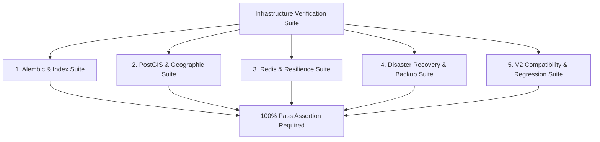

# NAVIX — Infrastructure Verification & Deployment Testing Plan

> **Document Type**: Technical Test Architecture & Infrastructure Verification Blueprint  
> **Status**: Official Technical Design Specification (Phase 6B.5 — Final Corrections Pass)  
> **Scope**: 20 Infrastructure Verification Test Specifications & Proposed Performance Targets  
> **Safety Notice**: Design Specification Only — Zero Application Code, Database Mutations, or Cloud Tests Executed.

---

## 1. Executive Summary & Safety Notice

This specification outlines the future verification plan for validating database migrations, PostGIS queries, cloud hosting resilience, disaster recovery procedures, and infrastructure security controls.

*Safety Notice*: In compliance with Phase 6B.5 constraints, **zero infrastructure provisioning, cloud deployments, or automated test executions are performed during this design phase**. All latency and throughput metrics are explicitly declared as **PROPOSED TARGET BENCHMARK OBJECTIVES**.

---

## 2. Infrastructure Verification Test Specifications

### 20 Standardized Test Specifications

1. **Alembic Migration Correctness (`test_infra_migration_correctness.py`)**: Execute `alembic upgrade head` in isolated PostGIS Docker container. Assert 100% clean execution without DDL errors.
2. **Autocommit Concurrent Index Creation (`test_infra_concurrent_index.py`)**: Verify index migration executes outside transaction blocks (`autocommit_block()`).
3. **Migration Interruption & Retry (`test_infra_migration_retry.py`)**: Interrupt index creation midway; rerun migration; verify idempotent success.
4. **Invalid Index Recovery (`test_infra_invalid_index_cleanup.py`)**: Inject an invalid index (`indisvalid = false`); verify migration executes `DROP INDEX CONCURRENTLY IF EXISTS` before retrying.
5. **Namespaced Identity Backfill (`test_infra_facility_backfill.py`)**: Verify legacy `transit_nodes` backfill into `transit_facilities` using namespaced keys (`FAC_IN_IRCTC_...`).
6. **Foreign Key Integrity (`test_infra_foreign_keys.py`)**: Assert zero orphaned rows across `transit_stops`, `schedules`, and `trips`.
7. **Budget Accounting Integrity (`test_infra_budget_accounting.py`)**: Verify legacy constraint $\text{total\_cost} = \text{transit\_cost} + \text{lodging\_cost} + \text{food\_cost} + \text{activities\_cost}$ across all saved trips.
8. **PostGIS Global WGS 84 Boundaries (`test_infra_postgis_wgs84.py`)**: Verify valid coordinates for Lakshadweep/Andaman islands and remote border points parse cleanly without rectangular bounding box errors.
9. **GTFS Overnight & Timezone Correctness (`test_infra_gtfs_overnight.py`)**: Verify GTFS time `25:30:00` adds +1 day and converts agency local time to exact UTC.
10. **Dataset Partition Swap (`test_infra_partition_swap.py`)**: Verify schedule dataset partition pointer swap executes within 5-second lock timeout.
11. **PgBouncer Prepared Statement Compatibility (`test_infra_pgbouncer_sqlalchemy.py`)**: Verify SQLAlchemy engine with `prepare_threshold = None` executes cleanly over PgBouncer in transaction mode.
12. **Redis Fail-Open Search Degradation (`test_infra_redis_failopen.py`)**: Simulate Redis cluster failure; verify `/api/v1/routes/search` logs a warning and performs bounded local fallback.
13. **Redis Fail-Closed Auth Protection (`test_infra_redis_failclosed.py`)**: Simulate Redis failure; verify `/api/v1/auth/login` fails closed to protect against brute-force attacks.
14. **Rolling Deployment Compatibility (`test_infra_rolling_deploy.py`)**: Verify version N-1 application reads new schema expand columns without crashing.
15. **Container Rollback Execution (`test_infra_container_rollback.py`)**: Simulate task definition rollback in ECS; verify zero downtime for active reads.
16. **Backup Snapshot Restoration (`test_infra_backup_restore.py`)**: Restore database snapshot to isolated instance; verify 100% record match.
17. **PITR Validation Drill (`test_infra_pitr_drill.py`)**: Restore database to a specific UTC timestamp prior to test injection; verify exact point-in-time state.
18. **Secret Key Validation at Startup (`test_infra_secret_validation.py`)**: Attempt application launch with missing/short `SECRET_KEY`; verify immediate startup abort.
19. **High Concurrency Connection Pool Stress (`test_infra_concurrency_stress.py`)**: Simulate 500 concurrent connections to PgBouncer; assert zero connection drop errors.
20. **NAVIX V2 Full Regression Preservation (`test_infra_v2_regression.py`)**: Execute full Sangli $\rightarrow$ Old Manali demo planner flow; assert 100% output equality.

---

## 3. Standardized Infrastructure Performance Targets (Proposed Objectives)

All metrics below represent **PROPOSED TARGET BENCHMARK OBJECTIVES** for Phase 6B implementation, not empirical measurement facts:

| Infrastructure Metric | Target Latency Objective (p95)* | Target Concurrency Objective* | Availability SLA Target |
| :--- | :--- | :--- | :--- |
| **PostgreSQL DB Query Execution** | $<15\text{ ms}$ | 500 Active Connections (PgBouncer) | $99.95\%$ Uptime |
| **PostGIS ST_DWithin Radius Search** | $<10\text{ ms}$ | 200 Concurrent Radius Queries | $99.95\%$ Uptime |
| **Redis Rate Limit Check** | $<2\text{ ms}$ | 2,000 req / sec | $99.90\%$ Uptime |
| **Full Trip Planning End-to-End** | $<300\text{ ms}$ | 50 Concurrent Planning Requests | $99.90\%$ Uptime |

*\*Note: Latency and SLA metrics represent unverified design target objectives for Phase 6B implementation.*
