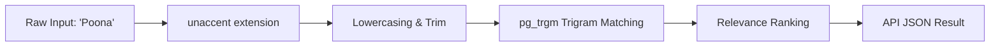

# NAVIX — Location Search Architecture & Coverage Model

> **Document Type**: Technical Search & Location Intelligence Specification  
> **Status**: Official Technical Design Specification (Phase 6B.1)  
> **Scope**: Indian Autocomplete, Alias Disambiguation, & Coverage States  
> **Safety Notice**: Design Specification Only — Zero Application Code or PostgreSQL Mutations Executed.

---

## 1. Search Philosophy & Domain Separation

Indian travellers frequently search using historical names (*Poona*, *Bangalore*), regional language transliterations (*पवना*, *मनाली*), or common typos (*Manaly*, *Sanglee*). Furthermore, a search for a city (*Pune*) must be distinguished from a search for a specific transit hub (*Swargate Bus Stand*) or attraction (*Hadimba Temple*).

NAVIX implements **Domain-Separated Location Search**:
- **Settlement Mode (Default for Origin/Destination inputs)**: Resolves user input to a canonical city, town, or locality (*Sangli*, *Old Manali*).
- **Facility Mode (Mode Filter for Advanced Transit Hubs)**: Resolves input specifically to transit stations (*Miraj Junction*, *Kashmiri Gate ISBT*).
- **POI Mode (Activity Search)**: Resolves input to attractions (*Jogini Waterfall*, *Hadimba Temple*).

---

## 2. Name Normalization & Indexing Strategy

Location search utilizes native PostgreSQL text processing without requiring external search clusters (Elasticsearch/OpenSearch):



### 2.1 Indexing Extensions
1. **`unaccent` Extension**: Strips diacritics and accent marks from inputs.
2. **`pg_trgm` Extension**: Enables GIN trigram indexes (`gin_trgm_ops`) on settlement names, facility names, and alias strings for fuzzy typo-tolerant matching.

### 2.2 SQL Index Definitions (Provisional Migration Proposals)
```sql
-- Proposal: Create pg_trgm and unaccent extensions if missing
CREATE EXTENSION IF NOT EXISTS unaccent;
CREATE EXTENSION IF NOT EXISTS pg_trgm;

-- Proposal: GIN Trigram Indexes for Fast Substring and Fuzzy Matching
CREATE INDEX idx_settlements_name_trgm ON settlements USING gin (name gin_trgm_ops);
CREATE INDEX idx_transit_fac_name_trgm ON transit_facilities USING gin (name gin_trgm_ops);
CREATE INDEX idx_aliases_name_trgm ON location_aliases USING gin (alias_name gin_trgm_ops);
```

---

## 3. Search Ranking & Relevance Scoring

Search queries compute a deterministic **Relevance Score ($S_{\text{rank}}$)** to rank autocomplete results:

$$S_{\text{rank}} = W_{\text{match}} \cdot \text{MatchScore} + W_{\text{pop}} \cdot \text{TierScore} + W_{\text{cov}} \cdot \text{CoverageBonus}$$

### Ranking Weight Rules
1. **Exact Match ($W_{\text{match}} = 100$)**: Exact match on canonical name or primary alias (e.g. `Pune` $\rightarrow$ Score 100).
2. **Prefix Match ($W_{\text{match}} = 80$)**: Canonical name begins with input string (e.g. `Sang` $\rightarrow$ `Sangli` Score 80).
3. **Trigram Fuzzy Match ($W_{\text{match}} = 50 \times \text{similarity}$)**: Similarity score via `similarity(alias_name, query)`.
4. **Population / Hub Priority Tier**:
   - Tier 1 Metro: $+20$ points
   - Tier 2 City: $+15$ points
   - Major Rail Hub / Airport: $+15$ points
5. **Coverage Bonus**: $+10$ points if `coverage_status = 'COVERED'`.

---

## 4. Coverage-State Model

A location can exist in NAVIX's spatial database even if active transit routing algorithms do not yet serve it. Each settlement stores an explicit `coverage_status`:

| Coverage Status | System Definition | User-Facing Autocomplete Badge | Route Planner Behavior |
| :--- | :--- | :--- | :--- |
| **`COVERED`** | Active transit schedules & multi-modal routes verified in database. | `ACTIVE ROUTE COVERAGE` | Full multi-modal routing & whole-trip budget planning available. |
| **`PARTIAL`** | Nearby transit hubs exist, but final leg requires local transfer shuttle. | `LOCAL SHUTTLE REQUIRED` | Routes to nearest rail/bus hub and adds local transfer shuttle buffer. |
| **`UNCOVERED`** | Location registered spatially; no verified transit schedules present in DB. | `LOCATION REGISTERED · NO ROUTE YET` | Displays spatial hub lookup; warns user: *"No verified transit route yet for this destination."* |

---

## 5. Provisional API Endpoint Contracts

### 5.1 `GET /api/v1/locations/autocomplete`

#### Request Query Parameters
- `q`: Search query string (e.g. `Poona`, `Sang`, `Manali`)
- `type`: Optional filter (`SETTLEMENT`, `TRANSIT_FACILITY`, `POI`, `ALL` — Default: `ALL`)
- `limit`: Maximum results (Default: `10`, Max: `25`)

#### Provisional Response Payload (`200 OK`)
```json
{
  "query": "Poona",
  "total_matches": 1,
  "results": [
    {
      "id": "stl_pune",
      "canonical_name": "Pune",
      "matched_name": "Poona",
      "matched_type": "HISTORICAL_ALIAS",
      "entity_type": "SETTLEMENT",
      "settlement_type": "CITY",
      "population_tier": 1,
      "state": "Maharashtra",
      "country_code": "IN",
      "coordinates": {
        "latitude": 18.5204,
        "longitude": 73.8567
      },
      "coverage_status": "COVERED",
      "badge": "ACTIVE ROUTE COVERAGE",
      "relevance_score": 95.0
    }
  ]
}
```

---

### 5.2 `GET /api/v1/locations/nearby`

#### Request Query Parameters
- `latitude`: Float GPS latitude (e.g. `16.8524`)
- `longitude`: Float GPS longitude (e.g. `74.5815`)
- `radius_km`: Search radius in kilometers (Default: `30`)
- `facility_type`: Optional filter (`RAIL_STATION`, `BUS_TERMINAL`, `AIRPORT`, `ALL`)

#### Provisional Response Payload (`200 OK`)
```json
{
  "center_coordinates": {
    "latitude": 16.8524,
    "longitude": 74.5815
  },
  "radius_km": 30.0,
  "total_facilities": 2,
  "facilities": [
    {
      "facility_id": "fac_sli_rail",
      "name": "Sangli Railway Station",
      "facility_type": "RAIL_STATION",
      "distance_km": 0.45,
      "station_code": "SLI",
      "coordinates": {
        "latitude": 16.8524,
        "longitude": 74.5815
      }
    },
    {
      "facility_id": "fac_mrj_rail",
      "name": "Miraj Junction Railway Station",
      "facility_type": "RAIL_STATION",
      "distance_km": 8.2,
      "station_code": "MRJ",
      "coordinates": {
        "latitude": 16.8202,
        "longitude": 74.6468
      }
    }
  ]
}
```
