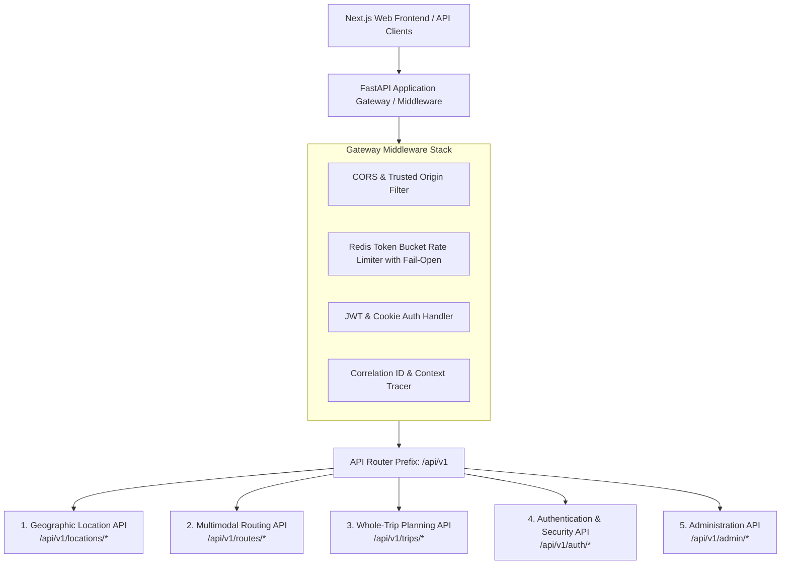
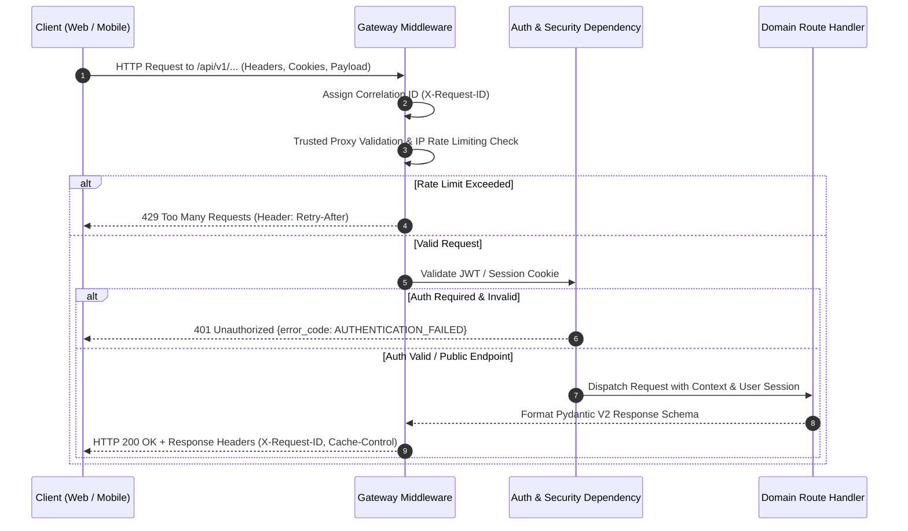

# NAVIX — National API Landscape & Architecture Specification (V1)

> **Document Type**: Technical API Landscape & Architecture Specification  
> **Status**: Official Technical Design Specification (Phase 6B.4 — Final Corrections Pass)  
> **Scope**: RESTful Architecture, Endpoint Hierarchy, Lifecycle Management, & Versioning Policies  
> **Safety Notice**: Design Specification Only — Zero Application Code, PostgreSQL Mutations, or Dependencies Applied.

---

## 1. Executive Summary & Architectural Vision

NAVIX delivers a production-grade, nationwide multimodal travel planning platform. The **National API Architecture** establishes the communication contracts connecting the Next.js web application, third-party travel distribution channels, and external client applications with the FastAPI backend.

---

## 2. API Design Principles & Resource Hierarchy

NAVIX APIs follow strict RESTful resource-oriented design rules:

1. **Standardized Versioned Prefix**: All API paths are prefixed with `/api/v1` (e.g. `/api/v1/locations/search`).
2. **Plural Resource Naming**: Nouns in lower-case kebab-case identify resource collections (`locations`, `routes`, `trips`).
3. **HTTP Verb Semantics**:
   - `GET`: Idempotent resource retrieval. Zero state mutation.
   - `POST`: Non-idempotent resource creation or complex search execution with nested filter payloads.
   - `PUT` / `PATCH`: Idempotent resource replacement or partial state update.
   - `DELETE`: Idempotent resource removal.
4. **Stable Resource Identifiers**: Resources are queried and referenced using immutable primary keys or UUIDs (e.g., `FAC_NDLS`, `LOC_745815`, `TRIP_883a9f`), never mutable human-readable names.
5. **Global Extensibility**: Spatial schemas support ISO-3166 country codes (default `IN`) and IANA timezones (default `Asia/Kolkata`) to preserve international expansion capability.

---

## 3. High-Level Endpoint Map

| Endpoint Path | HTTP Method | Auth Level | Purpose |
| :--- | :--- | :--- | :--- |
| `/api/v1/locations/search` | `GET` | Public | Autocomplete location discovery across cities, stations, hubs & places. |
| `/api/v1/locations/{id}` | `GET` | Public | Resolve granular facility & settlement metadata. |
| `/api/v1/locations/coverage` | `GET` | Public | Query spatial schedule & provider coverage status for a region. |
| `/api/v1/routes/search` | `POST` | Public / User | Execute multi-criteria date-scoped multimodal graph pathfinding. |
| `/api/v1/trips/plan` | `POST` | Public / User | Execute joint route-budget-itinerary whole-trip optimization. |
| `/api/v1/trips/save` | `POST` | Authenticated | Persist complete trip plan to user account. |
| `/api/v1/trips/saved` | `GET` | Authenticated | List saved trip plans for authenticated traveler. |
| `/api/v1/trips/{id}` | `GET` | Auth / Public (Share) | Retrieve saved trip plan by UUID. |
| `/api/v1/trips/{id}` | `DELETE` | Authenticated | Remove saved trip plan (OBAC protected). |
| `/api/v1/trips/{id}/share` | `POST` | Authenticated | Generate public share token / link for a saved trip. |
| `/api/v1/auth/register` | `POST` | Public | Register new traveler account. |
| `/api/v1/auth/login` | `POST` | Public | Authenticate credentials & issue JWT / session cookie. |
| `/api/v1/auth/refresh` | `POST` | Cookie / Bearer | Rotate refresh token & issue fresh access token. |
| `/api/v1/auth/logout` | `POST` | Authenticated | Revoke tokens & clear auth cookies. |
| `/api/v1/auth/me` | `GET` | Authenticated | Get current authenticated user profile. |
| `/api/v1/admin/providers` | `GET` / `POST` | Admin Only | Manage travel provider API feeds & GTFS ingestion pipelines. |
| `/api/v1/admin/metrics` | `GET` | Admin Only | Inspect system health, queue latencies, and circuit breakers. |

---

## 4. Gateway Request Processing Pipeline

Every HTTP request passing through the FastAPI gateway undergoes standardized pipeline processing:

---

## 5. Non-Breaking Additive Evolution Policy

NAVIX guarantees backward compatibility for published API endpoints under major version `/api/v1`:

1. **Additive Schema Modifications Allowed**:
   - Adding new optional request parameters with safe default values.
   - Adding new fields to response payloads.
   - Adding new enum choices to response schemas.
2. **Breaking Changes Prohibited in /api/v1**:
   - Removing or renaming existing request/response fields.
   - Changing field data types or validation constraints (e.g. converting `int` to `string`).
   - Altering response status codes for successful operations.
3. **Deprecation Strategy**:
   If an endpoint or field must be replaced, it will be marked `deprecated: true` in OpenAPI documentation for a minimum 6-month grace period before removal in `/api/v2`. Compatibility status is explicitly declared as **DESIGN-COMPATIBLE** pending empirical verification.
