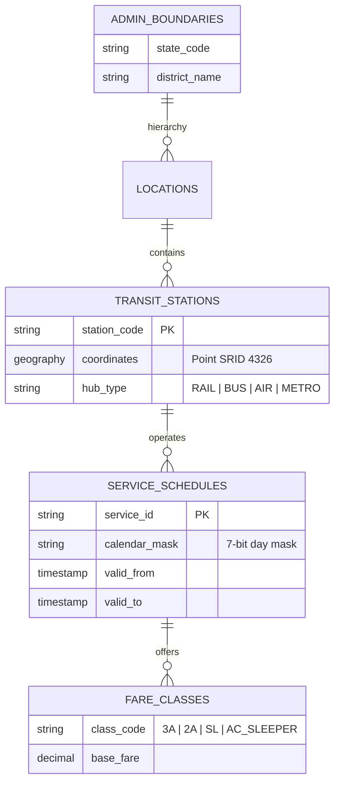

# NAVIX — National Architecture & India-Wide Expansion Requirements

> **Document Type**: Architecture & Requirements Specification  
> **Target Scope**: NAVIX Phase 6A (India-Wide Expansion & Extensible Architecture)

---

## 1. Functional Requirements

### FR-01: Universal Geographic Location Search
- The system **MUST** resolve any Indian origin/destination query—from Tier-1 metropolises (e.g. Mumbai, Delhi, Bengaluru) to Tier-2/Tier-3 towns (e.g. Sangli, Satara, Solapur, Mandi)—to valid nearby transit nodes.
- If a user specifies a small town or village without a direct railway station, the system **MUST** perform PostGIS spatial radius search ($\text{ST\_DWithin}$) to discover candidate origin/destination hubs within a configurable radius (default: $30\text{ km}$).

### FR-02: Multimodal Transport Integration
- The routing engine **MUST** seamlessly connect 5 distinct transit modes:
  1. Long-distance Rail (`TRAIN`)
  2. Interstate & Regional Bus (`BUS`)
  3. Commercial Air (`FLIGHT`)
  4. Urban Rapid Transit (`METRO`)
  5. Local Last-Mile Shuttle / Cab (`LOCAL` / `CAB`)
- All inter-modal transfers **MUST** be validated using deterministic layover safety rules (`SAFE`, `TIGHT`, `INVALID`).

### FR-03: Provider Independence & Multi-Operator Support
- The transit schedule model **MUST** support heterogeneous public and private operators (Indian Railways, State RTCs like MSRTC, HRTC, KSRTC, UPSRTC, and private bus operators) without hardcoding operator names in application logic.

### FR-04: Whole-Trip Hard Budget Constraint Enforcement
- The system **MUST** enforce the total trip budget cap as a strict mathematical invariant:
  $$\text{Total Trip Cost} = C_{\text{transport}} + C_{\text{stay}} + C_{\text{food}} + C_{\text{activities}} + C_{\text{local}} + C_{\text{contingency}} \le \text{User Maximum Budget}$$
- If minimum mandatory travel costs exceed the user budget cap, the engine **MUST** return a structured `BUDGET_TOO_LOW` shortfall error rather than exceeding the budget cap.

### FR-05: Dynamic Multi-Destination & Duration Support
- The planner **MUST** support variable trip durations ($1$ to $30$ days) and multi-destination itineraries across India, dynamically fetching city-specific accommodations, dining, and activity catalogs.

---

## 2. Non-Functional Requirements (NFRs)

### NFR-01: Search Performance & Latency Bounds
- **Route Search Latency**: Multi-modal route search across national graphs **MUST** return in $<500\text{ ms}$ for standard queries and $<1.5\text{ s}$ for complex multi-transfer queries.
- **Budget Optimization Latency**: Whole-trip budget allocation and itinerary generation **MUST** complete in $<200\text{ ms}$.

### NFR-02: Algorithmic Scalability & Memory Efficiency
- Transit graph search **MUST NOT** load unpartitioned national schedules into per-request Python process memory. Graph structures **MUST** use partitioned caching (e.g. Redis graph cache) or database-backed spatial bounding boxes.

### NFR-03: Data Correctness & Determinism
- Core routing, budget allocation, and auto-itinerary scheduling **MUST** remain $100\%$ deterministic. Probabilistic generators or non-deterministic LLMs **MUST NOT** be used for core calculations.

### NFR-04: Security, Secrets & PII Protection
- API endpoints **MUST** enforce JWT token authentication for sensitive user operations. Credentials, database connection strings, and secret keys **MUST** be managed via environment variables (`.env`) and **NEVER** committed to repository source code.

---

## 3. India-Wide Data Architecture Requirements

### 3.1 Geographic Hierarchy & PostGIS Data Model
1. **Administrative Boundary Tables**:
   - `states` (e.g., Maharashtra, Himachal Pradesh, Karnataka)
   - `districts` (e.g., Sangli, Kullu, Pune)
   - `cities` (e.g., Sangli, Manali, New Delhi)
2. **Station & Hub Entity (`transit_nodes` Extension)**:
   - Add `location` column of type `geography(Point, 4326)` with GIST spatial index (`idx_transit_nodes_spatial`).
   - Add `hub_type` enum (`RAIL_STATION`, `BUS_TERMINAL`, `AIRPORT`, `METRO_STATION`, `LOCAL_STAND`).
   - Add `station_code` (e.g., `SLI`, `NDLS`, `PNVL`) and search alias array (`aliases TEXT[]`).

### 3.2 Timetable & Service Calendar Architecture
1. **GTFS-Compliant Recurrence**:
   - Replace static departure/arrival timestamps with GTFS-style service calendars (`operating_days` 7-bit mask representing Mon-Sun, `valid_from_date`, `valid_to_date`).
2. **Fare Class Matrix (`transit_fares`)**:
   - Support tier-based fares per leg:
     - Rail: `1A`, `2A`, `3A`, `SL`, `CC`, `EC`.
     - Bus: `AC_SLEEPER`, `NON_AC_SLEEPER`, `VOLVO_SEATER`, `EXPRESS`.
3. **Price Freshness & Provenance**:
   - Track `price_updated_at` (timestamp) and `data_source` (e.g. `IRCTC_SEED`, `GTFS_FEED`, `PARTNER_API`) to handle stale price data gracefully.

---

## 4. International Extensibility & Future Architecture

1. **Country-Independent Location Schema**:
   - All spatial tables **MUST** include an ISO 3166-1 alpha-2 `country_code` (default: `IN`).
2. **Multi-Currency Support**:
   - Fares, lodging, food, and activity costs **MUST** store an ISO 4217 `currency_code` (default: `INR`) with dynamic exchange rate conversion services for future international expansion.
3. **Time Zone Awareness**:
   - Timestamps **MUST** be stored in UTC (`TIMESTAMP WITH TIME ZONE`) with localized rendering based on target node time zone (default: `Asia/Kolkata` / IST).

---

## 5. Architectural Implementation Roadmap

| Phase | Strategic Target | Key Architectural Artifact |
| :--- | :--- | :--- |
| **Phase 6A** | Baseline System Gap Audit & Requirements | `CURRENT_SYSTEM_GAP_AUDIT.md` `NATIONAL_ARCHITECTURE_REQUIREMENTS.md` |
| **Phase 6B** | PostGIS Schema & Station Alias Migration | Spatial GIST indexing, `geography(Point,4326)` migration, GTFS calendar schemas |
| **Phase 6C** | Scalable Routing Engine & CH Partitioning | Graph contraction/partitioning, spatial hub discovery |
| **Phase 6D** | Dynamic City Catalogs & MILP Optimizer | City-specific lodging/food/activity DB tables, greedy knapsack solver |
| **Phase 6E** | National UX & Travel Command Center | Dynamic autocomplete search, multi-modal national timeline rendering |
