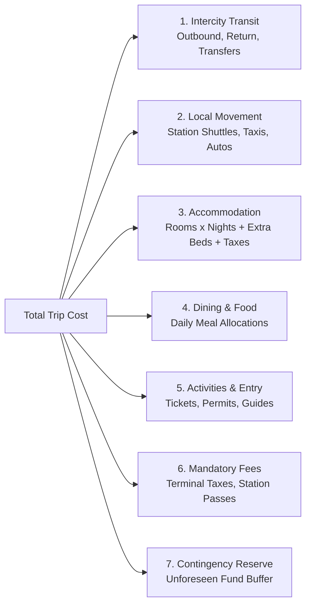

# NAVIX — Canonical National Expense Model & Affordability Specification (V2)

> **Document Type**: Technical Financial Model & Expense Data Specification  
> **Status**: Official Technical Design Specification (Phase 6B.3B — Targeted Corrections Pass)  
> **Scope**: Canonical Whole-Trip Expense Accounting, Provider-Specific Occupancy Rules, Multi-Currency Provenance & Honest Affordability States  
> **Safety Notice**: Design Specification Only — Zero Application Code or Database Mutations Executed.

---

## 1. Canonical National Expense Structure & Ledger Reconciliation

NAVIX enforces a zero-double-counting expense ledger across seven mutually exclusive expense categories:

$$\text{Cost}_{\text{total}} = C_{\text{transit}} + C_{\text{local}} + C_{\text{stay}} + C_{\text{food}} + C_{\text{act}} + C_{\text{fees}} + C_{\text{contingency}}$$



### 1.1 Category Definitions & Non-Overlapping Ledger Rules

Every expense item is assigned a canonical ledger entry ID (`ledger_entry_id = UUID`) to prevent double counting:

1. **Intercity Transit ($C_{\text{transit}}$)**:
   - Includes: Base fares, seat reservations, booking fees, GST/fuel surcharges for train, bus, or flight legs.
   - Billing Scope: Passenger-level billing based on traveler age on service date.
2. **Local Movement ($C_{\text{local}}$)**:
   - Includes: First/last-mile shuttles, station-to-hotel transfers, intra-city metro fares, and activity cabs.
   - Non-Overlapping Rule: If an activity or accommodation rate includes complimentary transfer, $C_{\text{local}}$ for that segment is explicitly ₹0.00 with `is_included_in_parent = True`.
3. **Accommodation ($C_{\text{stay}}$)**:
   - Includes: Room tariffs, extra bed charges, GST/lodging taxes, and mandatory resort/service fees across $N_{\text{nights}}$.
   - Billing Scope: Room-level billing based on provider occupancy limits and extra-bed rules.
4. **Dining & Food ($C_{\text{food}}$)**:
   - Includes: Breakfast, lunch, dinner, and beverage allocations across $N_{\text{days}}$.
   - Billing Scope: Passenger-level billing scaled by age tier.
5. **Activities & Experiences ($C_{\text{act}}$)**:
   - Includes: Entry tickets, monument passes, activity rental fees, and local guide charges.
   - Billing Scope: Passenger-level or group-level billing.
6. **Mandatory Fees & Station Permits ($C_{\text{fees}}$)**:
   - Includes: Eco-permits (e.g. Rohtang Pass permit), airport development fees, station platform passes.
7. **Contingency Buffer ($C_{\text{contingency}}$)**:
   - Explicit unallocated reserve:
     $$C_{\text{contingency}} = \min(0.05 \times B_{\text{max}}, B_{\text{max}} - \text{Subtotal})$$

---

## 2. Provider-Dependent Passenger & Occupancy Policies

### 2.1 Normalized Provider Age & Fare Rules
Demographic fare rules vary by transit provider (e.g. IRCTC Rail vs Indigo Airlines vs RedBus). NAVIX evaluates passenger ages on the **exact date of service departure**:

| Age Definition Scope | Infant Policy (Service Date) | Child Policy (Service Date) | Adult Policy | Senior Policy |
| :--- | :--- | :--- | :--- | :--- |
| **Indian Railways (IRCTC)** | $<5$ years: Free (No seat allocated) | $5\text{--}11$ years: Half fare (unreserved) or Full fare (if berth requested) | $12\text{--}59$ years: Full fare | $60+$ years: Full fare (Concessions per IRCTC rules) |
| **Domestic Airlines (Air)** | $<2$ years: Infant lap fare ($\sim 10\%$ + fees) | $2\text{--}11$ years: Full seat fare | $12\text{--}59$ years: Full fare | $60+$ years: Senior citizen discount if booked in specific class |
| **Intercity Bus (RTC/Private)** | $<3$ years: Free (Lap child) | $3\text{--}10$ years: Half/Full seat fare per RTC rules | $11+$ years: Full seat fare | Standard RTC concessions if applicable |

### 2.2 Property Occupancy & Extra-Bed Calculation
Rather than assuming a rigid universal formula, room allocation applies **provider property rules** with an explicit fallback indicator:

1. **Property Occupancy Rules**:
   - Base Room Capacity: Standard room accommodates up to 2 Adults ($N_{\text{base}} = 2$).
   - Maximum Room Capacity: Up to 3 guests ($N_{\text{max}} = 3$) with an extra-bed charge ($C_{\text{extra\_bed}}$).
2. **Occupancy Allocation Algorithm**:
   - Calculate paying guests requiring beds ($N_{\text{bed\_guests}} = N_{\text{adults}} + N_{\text{seniors}} + N_{\text{children\_requiring\_bed}}$).
   - If property rules are loaded:
     $$N_{\text{rooms}} = \left\lceil \frac{N_{\text{bed\_guests}}}{N_{\text{max}}} \right\rceil$$
     $$N_{\text{extra\_beds}} = \max\left(0, N_{\text{bed\_guests}} - (N_{\text{rooms}} \times N_{\text{base}})\right)$$
   - Fallback Rule (`ESTIMATED_RULE_FALLBACK`):
     If property-specific occupancy rules are unmapped in dataset, estimate $N_{\text{rooms}} = \lceil N_{\text{bed\_guests}} / 2 \rceil$ and flag metadata as `occupancy_confidence = ESTIMATED_RULE_FALLBACK`.

---

## 3. Multi-Currency Accounting & Exchange Rate Provenance

1. **Canonical Base Currency**: All internal optimization computations and budget comparisons are evaluated in **Indian Rupees (`INR`)**.
2. **ISO-4217 Currency Support**: Multi-currency inputs (`USD`, `EUR`, `GBP`, `AED`, `SGD`) are tracked with full conversion provenance:
   - `currency`: ISO-4217 code
   - `foreign_amount`: Amount in original currency
   - `exchange_rate`: Multiplier to INR
   - `rate_timestamp_utc`: Instant rate was fetched
   - `rate_source`: Rate provider (e.g. `RBI_REFERENCE_RATE`, `OPEN_EXCHANGE_RATES`)

---

## 4. Separation of Price Evidence States & Budget Feasibility Outcomes

NAVIX strictly separates **Price Evidence States** (data certainty of input pricing) from **Budget Feasibility Classification** (whether the trip total fits the user budget).

```mermaid
flowchart TD
    SubCosts[Evaluate Sub-Component Price Evidence States] --> EvidenceCheck{All Components QUOTED_PAYABLE?}
    EvidenceCheck -- Yes --> PE1[Price Evidence: QUOTED_PAYABLE\n'Confirmed Live Quote']
    EvidenceCheck -- No --> EvidenceCheck2{Any BOUNDED_ESTIMATE?}
    EvidenceCheck2 -- Yes --> PE2[Price Evidence: BOUNDED_ESTIMATE\n'Estimated Cost Range [Min, Max]']
    EvidenceCheck2 -- No --> PE3[Price Evidence: UNCERTAIN_PRICE / MISSING_DATA\n'Unconfirmed / Incomplete Data']
    
    SubCosts --> FeasCheck{Post-Scheduling Cost vs B_max}
    FeasCheck -- Cost <= 0.85 B_max --> BF1[Budget Feasibility: COMFORTABLE]
    FeasCheck -- 0.85 B_max < Cost <= B_max --> BF2[Budget Feasibility: TIGHT]
    FeasCheck -- Cost > B_max --> BF3[Budget Feasibility: EXCEEDED / INFEASIBLE]
```

### 4.1 Four Orthogonal Price Evidence States

| Price Evidence State | Definition & Prerequisites | Lower / Upper Bounds | System Guarantee Level | Frontend Display Notice |
| :--- | :--- | :--- | :--- | :--- |
| **`QUOTED_PAYABLE`** | Confirmed live commercial quote from B2B API with valid `quote_id` and `valid_until_utc` timestamp. | Single exact fare ($C_{\text{min}} = C_{\text{max}}$). | **Guaranteed Payable** (until quote expiration). | *"Live confirmed carrier rate."* |
| **`BOUNDED_ESTIMATE`** | Price derived from published tariffs or historical seasonal averages. | Explicit bounded range $[C_{\text{min}}, C_{\text{max}}]$. | **Bounded Range Estimate** (Final fare may vary). | *"Estimated tariff range [₹Min - ₹Max]."* |
| **`UNCERTAIN_PRICE`** | Volatile fare or unconfirmed inventory status (e.g. IRCTC Waitlist / RAC). | Expected range $[C_{\text{min}}, C_{\text{max}}]$. | **Indicative Only** (Subject to seat availability). | *"Live seat availability unconfirmed."* |
| **`MISSING_DATA`** | Unquoted or uncalculated expense item (e.g. unpriced local taxi segment). | Unbounded ($C_{\text{min}} = 0$, $C_{\text{max}} = \text{Unknown}$). | **Incomplete Price** (Item missing from total). | *"Excludes unquoted local transfer."* |

### 4.2 Non-Zero Missing Price Rule & Guaranteed Payable Safeguard

- **No Silent Zeroes**: Missing prices MUST NOT be silently treated as ₹0.00 in total cost calculations. If a category price is uncalculated, `is_missing = True`, and the category is flagged as `MISSING_DATA`.
- **Guaranteed Payable Safeguard**:
  A complete trip is labeled **"Guaranteed Payable" ONLY IF ALL material transport and accommodation sub-components are in `QUOTED_PAYABLE` state with confirmed inventory**. If any component is `BOUNDED_ESTIMATE`, `UNCERTAIN_PRICE`, or `MISSING_DATA`, the overall trip is explicitly presented as an **Estimated Cost Range $[C_{\text{min}}, C_{\text{max}}]$**.
