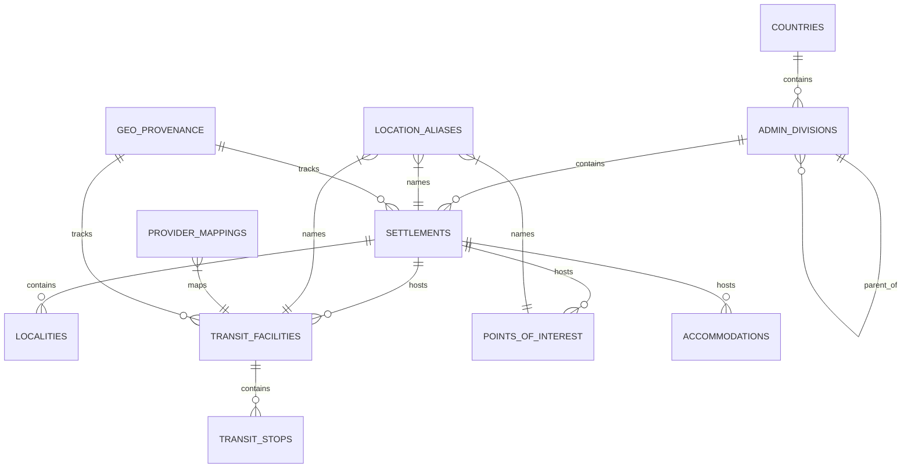

# NAVIX — National Geographic Database & PostGIS Architecture Specification (V1)

> **Document Type**: Production Database & Geospatial Architecture Design  
> **Status**: Official Technical Design Specification (Phase 6B.1)  
> **Scope**: Country-Extensible, India-First Geographic Foundation  
> **Safety Notice**: Design Specification Only — Zero Application Code or PostgreSQL Mutations Executed.

---

## 1. Overview & Architectural Principles

NAVIX requires a production-grade geographic foundation capable of supporting multimodal routing and whole-trip budget planning across **thousands of Indian cities, towns, railway stations, bus terminals, airports, and points of interest**, while maintaining structural extensibility for future international expansion.

### Core Architectural Principles
1. **Strict Identity Separation**: A settlement (e.g. *Pune City*) and a transit facility (e.g. *Pune Junction Railway Station*, *Swargate Bus Stand*, *Pune Airport*) are distinct physical entities with unique internal identifiers. They MUST NOT share an ID merely because they share a common name prefix.
2. **PostGIS First-Class Spatial Support**: Geographic coordinates are represented using PostGIS `geography(Point, 4326)` with GiST spatial indexing to enable sub-millisecond radius searches ($\text{ST\_DWithin}$) and spatial clustering.
3. **Provider-Agnostic Core Model**: External provider identifiers (IRCTC station codes, RedBus stop IDs, OSM node IDs, IATA airport codes) are decoupled from internal entity identities via a dedicated `provider_mappings` registry.
4. **Coverage Independence**: A settlement or attraction can exist in the geographic database even if NAVIX currently has no verified transit schedule serving it. Location existence and transit coverage state are strictly decoupled.
5. **Zero-Downtime Legacy Preservation**: The legacy PostgreSQL tables (`transit_nodes`, `trips`, `budget_allocations`) and seeded demo nodes (`node_SLI`, `node_OLD_MNL`) are preserved without destructive alteration via additive schema mappings.

---

## 2. Logical ER Diagram



---

## 3. Detailed Entity Specifications

### 3.1 `countries`
Stores top-level country metadata following international ISO standards.

| Column | Data Type | Nullable | Constraints / Default | Description |
| :--- | :--- | :--- | :--- | :--- |
| `country_id` | `VARCHAR(10)` | No | `PRIMARY KEY` | Internal ID (e.g. `ctry_in`, `ctry_us`) |
| `iso_code_2` | `VARCHAR(2)` | No | `UNIQUE, CHECK (char_length(iso_code_2) = 2)` | ISO 3166-1 alpha-2 code (`IN`, `US`) |
| `iso_code_3` | `VARCHAR(3)` | No | `UNIQUE, CHECK (char_length(iso_code_3) = 3)` | ISO 3166-1 alpha-3 code (`IND`, `USA`) |
| `name` | `VARCHAR(100)` | No | None | Primary English name (e.g. `India`) |
| `default_currency` | `VARCHAR(3)` | No | `DEFAULT 'INR'` | ISO 4217 currency code (`INR`, `USD`) |
| `default_timezone` | `VARCHAR(50)` | No | `DEFAULT 'Asia/Kolkata'` | IANA timezone identifier |

---

### 3.2 `admin_divisions`
Represents hierarchical administrative boundaries (States, Union Territories, Districts, Sub-districts).

| Column | Data Type | Nullable | Constraints / Default | Description |
| :--- | :--- | :--- | :--- | :--- |
| `division_id` | `VARCHAR(50)` | No | `PRIMARY KEY` | Internal ID (e.g. `div_in_mh`, `div_in_mh_sangli`) |
| `country_id` | `VARCHAR(10)` | No | `FK -> countries(country_id)` | Parent country |
| `parent_division_id` | `VARCHAR(50)` | Yes | `FK -> admin_divisions(division_id)` | Parent admin division (e.g. District -> State) |
| `name` | `VARCHAR(150)` | No | None | Official division name (e.g. `Maharashtra`, `Sangli District`) |
| `division_level` | `VARCHAR(30)` | No | `CHECK (division_level IN ('STATE', 'UT', 'DISTRICT', 'SUB_DISTRICT'))` | Administrative level tier |
| `code` | `VARCHAR(20)` | Yes | None | Official state/district code (e.g. `MH`, `KA`) |
| `boundary_polygon` | `geography(Polygon, 4326)` | Yes | None | Optional spatial boundary polygon |

**Indexes**:
- `idx_admin_div_country` ON (`country_id`)
- `idx_admin_div_parent` ON (`parent_division_id`)
- `idx_admin_div_spatial` USING GiST (`boundary_polygon`)

---

### 3.3 `settlements`
Represents cities, towns, villages, and populated places serving as primary travel origins/destinations.

| Column | Data Type | Nullable | Constraints / Default | Description |
| :--- | :--- | :--- | :--- | :--- |
| `settlement_id` | `VARCHAR(50)` | No | `PRIMARY KEY` | Internal ID (e.g. `stl_sangli`, `stl_manali`, `stl_pune`) |
| `admin_division_id` | `VARCHAR(50)` | No | `FK -> admin_divisions(division_id)` | Parent district/state division |
| `name` | `VARCHAR(150)` | No | None | Primary canonical city/town name |
| `settlement_type` | `VARCHAR(30)` | No | `CHECK (settlement_type IN ('METRO', 'CITY', 'TOWN', 'VILLAGE'))` | Settlement classification |
| `population_tier` | `INT` | Yes | `CHECK (population_tier BETWEEN 1 AND 4)` | Tier 1 (Metro) to Tier 4 (Town) |
| `location` | `geography(Point, 4326)` | No | None | Centroid location point (WGS 84) |
| `timezone` | `VARCHAR(50)` | No | `DEFAULT 'Asia/Kolkata'` | Local IANA timezone |
| `coverage_status` | `VARCHAR(20)` | No | `DEFAULT 'UNCOVERED' CHECK (coverage_status IN ('COVERED', 'UNCOVERED', 'PARTIAL'))` | Routing coverage indicator |

**Indexes**:
- `idx_settlements_admin` ON (`admin_division_id`)
- `idx_settlements_spatial` USING GiST (`location`)
- `idx_settlements_coverage` ON (`coverage_status`)

---

### 3.4 `localities`
Sub-city areas, neighborhoods, or tourist zones (e.g. *Old Manali*, *Kashmiri Gate*, *Connaught Place*).

| Column | Data Type | Nullable | Constraints / Default | Description |
| :--- | :--- | :--- | :--- | :--- |
| `locality_id` | `VARCHAR(50)` | No | `PRIMARY KEY` | Internal ID (e.g. `loc_old_manali`, `loc_c_place`) |
| `settlement_id` | `VARCHAR(50)` | No | `FK -> settlements(settlement_id)` | Parent city/town |
| `name` | `VARCHAR(150)` | No | None | Locality name |
| `location` | `geography(Point, 4326)` | No | None | Center point of locality |
| `pincode` | `VARCHAR(10)` | Yes | None | Postal code (e.g. `175131`) |

**Indexes**:
- `idx_localities_settlement` ON (`settlement_id`)
- `idx_localities_spatial` USING GiST (`location`)

---

### 3.5 `transit_facilities`
Physical transit hubs (Railway Stations, Bus Terminals, Airports, Metro Stations, Multimodal Interchanges).

| Column | Data Type | Nullable | Constraints / Default | Description |
| :--- | :--- | :--- | :--- | :--- |
| `facility_id` | `VARCHAR(50)` | No | `PRIMARY KEY` | Internal ID (e.g. `fac_sli_rail`, `fac_del_isbt`, `fac_ixc_rail`) |
| `settlement_id` | `VARCHAR(50)` | No | `FK -> settlements(settlement_id)` | Primary city served |
| `name` | `VARCHAR(200)` | No | None | Full facility name (e.g. *Sangli Railway Station*) |
| `facility_type` | `VARCHAR(30)` | No | `CHECK (facility_type IN ('RAIL_STATION', 'BUS_TERMINAL', 'AIRPORT', 'METRO_STATION', 'MULTIMODAL_HUB'))` | Category of transit hub |
| `location` | `geography(Point, 4326)` | No | None | Precise physical GPS coordinates |
| `is_multimodal` | `BOOLEAN` | No | `DEFAULT FALSE` | Flag for integrated multi-transit hubs |
| `operating_status` | `VARCHAR(20)` | No | `DEFAULT 'ACTIVE' CHECK (operating_status IN ('ACTIVE', 'TEMPORARY_CLOSED', 'PLANNED'))` | Operational state |

**Indexes**:
- `idx_transit_fac_settlement` ON (`settlement_id`)
- `idx_transit_fac_type` ON (`facility_type`)
- `idx_transit_fac_spatial` USING GiST (`location`)

---

### 3.6 `transit_stops`
Platform, gate, or bay level detail within a physical transit facility.

| Column | Data Type | Nullable | Constraints / Default | Description |
| :--- | :--- | :--- | :--- | :--- |
| `stop_id` | `VARCHAR(50)` | No | `PRIMARY KEY` | Internal ID (e.g. `stop_sli_pf1`, `stop_isbt_bay4`) |
| `facility_id` | `VARCHAR(50)` | No | `FK -> transit_facilities(facility_id)` | Parent facility |
| `stop_name` | `VARCHAR(100)` | No | None | Specific stop descriptor (e.g. *Platform 1*, *Bay 12*) |
| `stop_code` | `VARCHAR(30)` | Yes | None | Platform or gate identifier |
| `location` | `geography(Point, 4326)` | Yes | None | Precise platform GPS offset |

---

### 3.7 `points_of_interest` (Attractions & Landmarks)
Attractions, historical monuments, natural landmarks, and adventure points.

| Column | Data Type | Nullable | Constraints / Default | Description |
| :--- | :--- | :--- | :--- | :--- |
| `poi_id` | `VARCHAR(50)` | No | `PRIMARY KEY` | Internal ID (e.g. `poi_hadimba_manali`, `poi_jogini_trek`) |
| `settlement_id` | `VARCHAR(50)` | No | `FK -> settlements(settlement_id)` | Host city/town |
| `locality_id` | `VARCHAR(50)` | Yes | `FK -> localities(locality_id)` | Specific neighborhood |
| `name` | `VARCHAR(200)` | No | None | Attraction name |
| `category` | `VARCHAR(50)` | No | `CHECK (category IN ('Culture', 'Adventure', 'Nature', 'Heritage', 'Sightseeing', 'Wellness'))` | Primary travel category |
| `location` | `geography(Point, 4326)` | No | None | Precise GPS coordinates |
| `estimated_visit_minutes` | `INT` | No | `DEFAULT 90 CHECK (estimated_visit_minutes > 0)` | Typical visit duration |
| `base_ticket_cost` | `NUMERIC(10, 2)` | No | `DEFAULT 0.00 CHECK (base_ticket_cost >= 0)` | Ticket cost per person (INR) |

**Indexes**:
- `idx_poi_settlement` ON (`settlement_id`)
- `idx_poi_category` ON (`category`)
- `idx_poi_spatial` USING GiST (`location`)

---

### 3.8 `accommodations`
Hotel, hostel, and guest house catalog definitions.

| Column | Data Type | Nullable | Constraints / Default | Description |
| :--- | :--- | :--- | :--- | :--- |
| `accommodation_id` | `VARCHAR(50)` | No | `PRIMARY KEY` | Internal ID (e.g. `acc_manali_hostel_01`) |
| `settlement_id` | `VARCHAR(50)` | No | `FK -> settlements(settlement_id)` | Host city |
| `name` | `VARCHAR(200)` | No | None | Property name |
| `tier` | `VARCHAR(20)` | No | `CHECK (tier IN ('Budget', 'Standard', 'Comfort'))` | Budget optimizer tier |
| `cost_per_night` | `NUMERIC(10, 2)` | No | `CHECK (cost_per_night > 0)` | Base rate per room/night (INR) |
| `location` | `geography(Point, 4326)` | No | None | GPS coordinates |

---

### 3.9 `location_aliases`
Multilingual names, historical names, and common typos/transliterations for search indexing.

| Column | Data Type | Nullable | Constraints / Default | Description |
| :--- | :--- | :--- | :--- | :--- |
| `alias_id` | `BIGSERIAL` | No | `PRIMARY KEY` | Auto-incrementing primary key |
| `entity_type` | `VARCHAR(30)` | No | `CHECK (entity_type IN ('SETTLEMENT', 'TRANSIT_FACILITY', 'POI'))` | Referenced entity type |
| `entity_id` | `VARCHAR(50)` | No | None | Target entity ID (`settlement_id`, `facility_id`, `poi_id`) |
| `alias_name` | `VARCHAR(200)` | No | None | Alias text (e.g. *Poona*, *Bangalore*, *Kulikawn*) |
| `language_code` | `VARCHAR(10)` | No | `DEFAULT 'en'` | ISO 639-1 code (`en`, `hi`, `mr`, `ta`) |
| `alias_type` | `VARCHAR(30)` | No | `CHECK (alias_type IN ('ALTERNATIVE_NAME', 'HISTORICAL', 'TRANSLITERATION', 'COMMON_TYPO'))` | Alias category |

**Indexes**:
- `idx_aliases_lookup` ON (`entity_type`, `entity_id`)
- `idx_aliases_trgm` USING gin (`alias_name` gin_trgm_ops)

---

### 3.10 `provider_mappings`
Maps external provider identifiers (IRCTC codes, GTFS stop IDs, IATA codes) to internal NAVIX facilities.

| Column | Data Type | Nullable | Constraints / Default | Description |
| :--- | :--- | :--- | :--- | :--- |
| `mapping_id` | `BIGSERIAL` | No | `PRIMARY KEY` | Auto-incrementing key |
| `facility_id` | `VARCHAR(50)` | No | `FK -> transit_facilities(facility_id)` | Internal facility ID |
| `provider_name` | `VARCHAR(50)` | No | `CHECK (provider_name IN ('IRCTC', 'GTFS_RAIL', 'GTFS_BUS', 'RED_BUS', 'IATA', 'OSM'))` | External provider source |
| `provider_entity_id` | `VARCHAR(100)` | No | None | External code (e.g. `SLI`, `NDLS`, `DEL`, `stop_10294`) |
| `is_primary` | `BOOLEAN` | No | `DEFAULT TRUE` | Primary provider code indicator |

**Indexes**:
- `idx_provider_map_lookup` ON (`provider_name`, `provider_entity_id`) `UNIQUE`
- `idx_provider_map_facility` ON (`facility_id`)

---

### 3.11 `geo_provenance`
Tracks source origin, licensing, and import audit metadata.

| Column | Data Type | Nullable | Constraints / Default | Description |
| :--- | :--- | :--- | :--- | :--- |
| `provenance_id` | `BIGSERIAL` | No | `PRIMARY KEY` | Auto-incrementing key |
| `entity_type` | `VARCHAR(30)` | No | None | Entity type |
| `entity_id` | `VARCHAR(50)` | No | None | Entity ID |
| `data_source` | `VARCHAR(100)` | No | None | Source (e.g. *Data.gov.in*, *OpenStreetMap*, *Internal Manual*) |
| `license_type` | `VARCHAR(50)` | No | None | License (e.g. *OGDL-India*, *ODbL*, *Proprietary*) |
| `imported_at` | `TIMESTAMP` | No | `DEFAULT CURRENT_TIMESTAMP` | Import timestamp |
| `last_verified_at` | `TIMESTAMP` | Yes | None | Last verified timestamp |
| `confidence_score` | `NUMERIC(3, 2)` | No | `DEFAULT 1.00 CHECK (confidence_score BETWEEN 0.00 AND 1.00)` | Data accuracy confidence |

---

## 4. PostGIS Spatial Strategy & Query Proposals

NAVIX uses **PostGIS 3.6** with `geography(Point, 4326)` for all spatial points:
- **SRID 4326 (WGS 84)**: Standard global latitude/longitude CRS.
- **Geography vs Geometry**: `geography` performs geodesic calculations directly on the ellipsoidal curvature of the Earth in meters, eliminating arbitrary planar map projection distortion over large distances across India (e.g., Sangli to Manali across 1,800 km).

### Illustrative SQL Query Proposals (Read-Only Design Proposals)

#### Proposal 1: Railway stations within a 30 km radius of a settlement
```sql
-- Proposal: Spatial radius search using ST_DWithin (30,000 meters)
SELECT 
    tf.facility_id,
    tf.name AS station_name,
    tf.facility_type,
    ST_Distance(tf.location, s.location) / 1000.0 AS distance_km
FROM transit_facilities tf
JOIN settlements s ON s.settlement_id = 'stl_sangli'
WHERE tf.facility_type = 'RAIL_STATION'
  AND ST_DWithin(tf.location, s.location, 30000)
ORDER BY distance_km ASC;
```

#### Proposal 2: Nearest bus terminal to a given GPS coordinate
```sql
-- Proposal: K-Nearest Neighbor (KNN) spatial search using PostGIS <-> distance operator
SELECT 
    tf.facility_id,
    tf.name AS bus_terminal_name,
    ST_Distance(tf.location, ST_MakePoint(77.1887, 32.2396)::geography) / 1000.0 AS distance_km
FROM transit_facilities tf
WHERE tf.facility_type = 'BUS_TERMINAL'
ORDER BY tf.location <-> ST_MakePoint(77.1887, 32.2396)::geography
LIMIT 1;
```

#### Proposal 3: Attractions (POIs) near a destination settlement by category
```sql
-- Proposal: POIs within 15 km of Old Manali locality matching category
SELECT 
    p.poi_id,
    p.name AS attraction_name,
    p.category,
    p.base_ticket_cost,
    ST_Distance(p.location, l.location) / 1000.0 AS distance_km
FROM points_of_interest p
JOIN localities l ON l.locality_id = 'loc_old_manali'
WHERE p.category IN ('Culture', 'Adventure')
  AND ST_DWithin(p.location, l.location, 15000)
ORDER BY distance_km ASC;
```

#### Proposal 4: Transport facilities serving a specific settlement
```sql
-- Proposal: Relational facility query per settlement ID
SELECT 
    tf.facility_id,
    tf.name,
    tf.facility_type,
    pm.provider_entity_id AS irctc_or_gtfs_code
FROM transit_facilities tf
LEFT JOIN provider_mappings pm ON pm.facility_id = tf.facility_id AND pm.is_primary = TRUE
WHERE tf.settlement_id = 'stl_pune'
ORDER BY tf.facility_type, tf.name;
```

#### Proposal 5: Locations inside an administrative boundary polygon
```sql
-- Proposal: Containment query using ST_Contains
SELECT 
    s.settlement_id,
    s.name AS city_name,
    s.settlement_type
FROM settlements s
JOIN admin_divisions ad ON ad.division_id = 'div_in_mh_sangli'
WHERE ad.boundary_polygon IS NOT NULL
  AND ST_Contains(ad.boundary_polygon::geometry, s.location::geometry);
```

---

## 5. Architectural Trade-offs & Design Justifications

1. **`geography(Point, 4326)` vs `geometry(Point, 3857)`**:
   - *Decision*: Adopted `geography(Point, 4326)`.
   - *Justification*: `geography` calculates true geodesic distances in meters across India's high-latitude spans (e.g. Himachal Pradesh at 32°N vs Maharashtra at 16°N) without requiring custom EPSG projection conversions per state.
2. **Normalized Alias Table vs PostGIS HSTORE/JSONB**:
   - *Decision*: Relational `location_aliases` with PostgreSQL `pg_trgm` GIN indexing.
   - *Justification*: Provides explicit language codes, typo classification, and clean SQL joins for multi-lingual search ranking without unindexed JSON scanning penalties.
3. **Decoupled Coverage Status**:
   - *Decision*: Settlements store `coverage_status` (`COVERED`, `UNCOVERED`, `PARTIAL`).
   - *Justification*: Allows NAVIX to store 50,000+ Indian settlements for geocoding and search while explicitly signaling when a corridor lacks active transit routing data.
