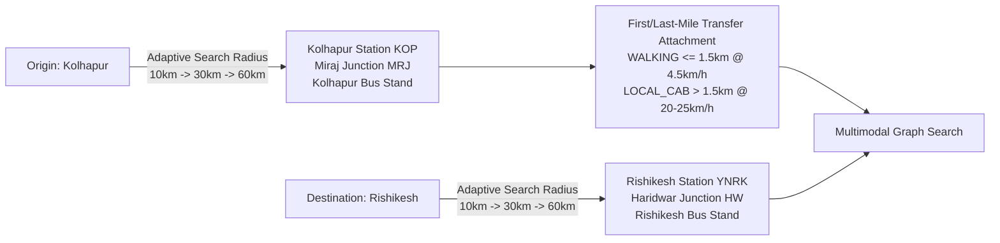
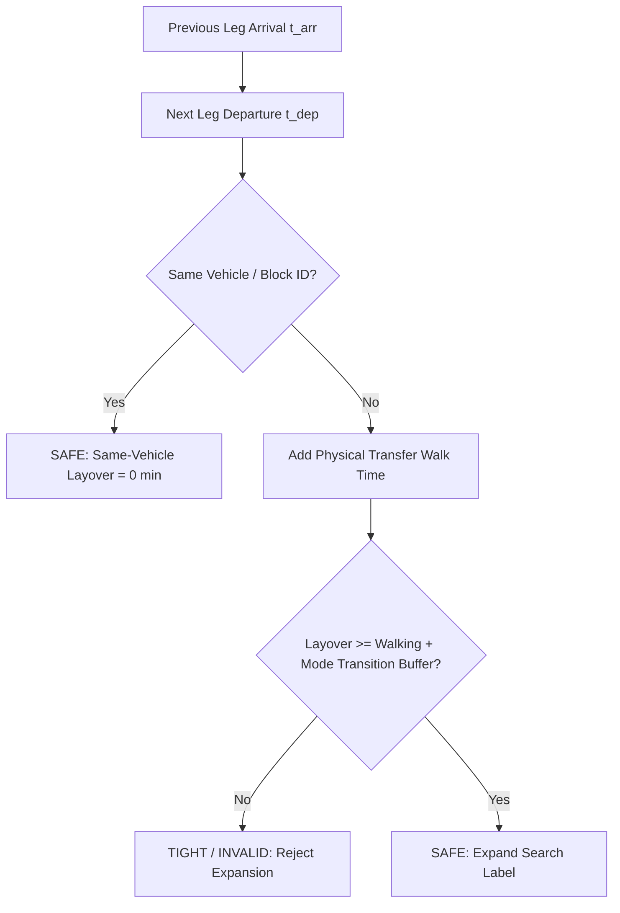
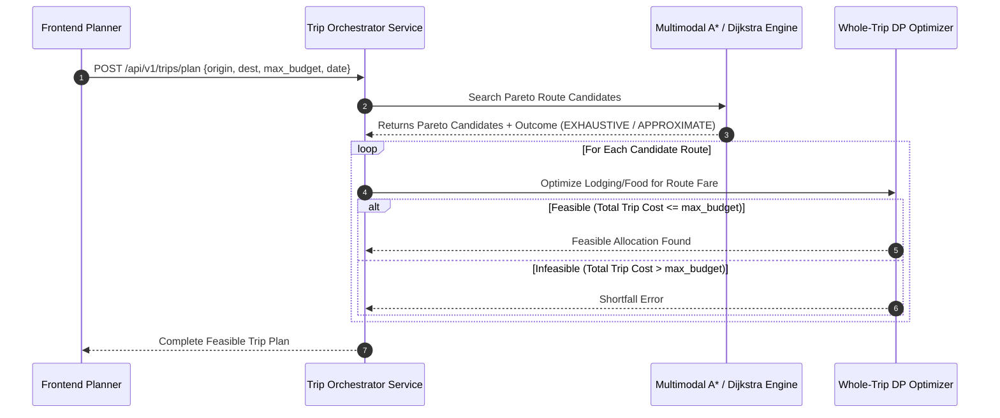

# NAVIX — National Multimodal Routing Architecture Specification

> **Document Type**: Technical Algorithm & Routing Engine Design  
> **Status**: Official Technical Design Specification (Phase 6B.3A — Targeted Architecture Corrections Pass)  
> **Scope**: Scalable Time-Dependent Multimodal Pathfinding for India & Extensible National Corridors  
> **Safety Notice**: Design Specification Only — Zero Application Code or PostgreSQL Mutations Executed.

---

## 1. Executive Summary & Routing Philosophy

NAVIX solves multi-modal, budget-constrained travel pathfinding across Tier-1, Tier-2, and Tier-3 Indian cities (e.g., *Sangli $\rightarrow$ Old Manali*, *Kolhapur $\rightarrow$ Rishikesh*). As the platform scales nationally, the routing engine transitions from loading static demo schedules into memory to a **Date-Scoped, Multi-Criteria Pareto Time-Dependent Multimodal Routing Architecture**.

```mermaid
flowchart TD
    A[User Search Request\n'Kolhapur' to 'Rishikesh'] --> B[Spatial Endpoint Resolution\nAdaptive Radius 10km -> 30km -> 60km]
    B --> C[Origin/Destination Facilities & Stops\nRail, Bus, Air Hubs, Stations]
    C --> D[Date-Scoped Horizon & Adaptive Subgraph\n[dep_time - 6h, dep_time + 48h]]
    D --> E[Time-Dependent Multimodal Graph]
    E --> F[Multi-Criteria Pareto Label-Setting Search\n(Cost, Elapsed Time, Transfers)]
    F --> G[In-Search Transfer Safety Validation\n(Physical Distance, Mode Transitions, Check-in)]
    G --> H[Pareto Route Candidates & Outcome Attribution\n(EXHAUSTIVE / APPROXIMATE / TRUNCATED)]
    H --> I[Budget Optimizer Integration\nSelect Feasible Whole-Trip Route]
```

### Core Architecture Principles
1. **Universal Settlement-to-Settlement Search**: Accepts any valid origin/destination settlement pair (*Kolhapur $\rightarrow$ Rishikesh*, *Nagpur $\rightarrow$ Manali*, *Bengaluru $\rightarrow$ Goa*) without hardcoding city-to-station lookup arrays.
2. **Supported Search Horizon Graph Retrieval**: Retrieves complete schedule graphs relative to a defined departure date window $[\text{dep\_time} - 6\text{h}, \text{dep\_time} + 48\text{h}]$. Bounding boxes serve strictly as initial search spatial optimization hints, with adaptive spatial fallback ($30\text{ km} \rightarrow 60\text{ km} \rightarrow 120\text{ km}$) to guarantee graph retrieval completeness.
3. **Multi-Criteria Pareto Frontier**: Generates non-dominated route alternatives along three criteria: **Fare Cost (INR)**, **Elapsed Travel Time (mins)**, and **Transfer Count**.
4. **Decoupled Data Contracts**: Pathfinding core algorithms consume normalized `TripInstance` and `TransferRule` dataclasses; zero provider-specific SDK or feed parsing logic leaks into the search loop.

---

## 2. Refinement of Phase 6B.2 Data Contracts & System Semantics

To reconcile Phase 6B.2 data contracts with multi-criteria pathfinding requirements:

1. **Orthogonal 4-Dimension Availability Separation**:
   Instead of a single flat `AvailabilityState` enum, availability is deconstructed into 4 orthogonal dimensions while retaining full backward compatibility:
   - `PriceCertainty`: `FINAL_BOOKABLE`, `INDICATIVE_ESTIMATE`, `DYNAMIC_UNCONFIRMED`.
   - `InventoryAvailability`: `SEATS_AVAILABLE` (with count), `WAITLIST`, `RAC`, `SOLD_OUT`, `UNCHECKED_SCHEDULE`.
   - `SourceAuthority`: `OFFICIAL_CARRIER_API`, `AGGREGATOR_FEED`, `COMMUNITY_GTFS`, `SYNTHETIC_MODEL`.
   - `Freshness`: `LIVE_REALTIME`, `CACHED_VALID`, `STALE_FALLBACK`.
   
   *Legacy Projection*: Legacy `AvailabilityState` (`CONFIRMED_LIVE`, `PUBLISHED_SCHEDULE`, `CACHED`, `ESTIMATED`, `UNAVAILABLE`) is derived via deterministic mapping rules for frontend components.

2. **GTFS Timezone & Service-Day Semantics**:
   - Timetables specify times in agency-local timezones (e.g., `Asia/Kolkata` IST, UTC+5:30). All edge traversal comparisons are evaluated in UTC.
   - Times exceeding 24:00:00 (e.g. `25:30:00`) parse to `day_offset = time // 86400`, `actual_date = service_date + day_offset`, `seconds_into_day = time % 86400`.
   - Active trip dates are resolved by combining `calendar.txt` (day-of-week mask) with `calendar_dates.txt` (`exception_type = 1` for ADD, `exception_type = 2` for REMOVE).
   - Stop pickup/drop-off restrictions (`pickup_type`, `drop_off_type` in `stop_times.txt`) are strictly checked: segments with `pickup_type = 1` or `drop_off_type = 1` cannot serve as transfer origins or destinations.
   - Headway frequency service (`frequencies.txt`) expands dynamically into time-dependent departure edges.
   - Stay-onboard continuations (`block_id`) permit same-vehicle transfers with zero layover ($\Delta t_{\text{min}} = 0$) and zero transfer penalty count.

3. **Canonical Transport Mode IDs & Stop Identifiers**:
   - Enforce exact canonical mode string IDs across system boundaries: `TRAIN`, `INTERCITY_BUS`, `FLIGHT`, `METRO`, `LOCAL_BUS`, `CAB`, `WALKING`.
   - Distinguish physical facility identity (`facility_id`, e.g. `FAC_NDLS`) from platform/bay identity (`stop_id`, e.g. `STOP_NDLS_P3`).

---

## 3. Adaptive Endpoint Resolution & First/Last-Mile Feasibility

Users specify origin and destination settlements (*Kolhapur*, *Rishikesh*). The routing engine resolves these settlements to transit facilities and attaches geographically realistic first/last-mile local transit legs:



### Resolution & First/Last-Mile Rules
1. **Adaptive Radius Facility Discovery**:
   - Search initial $10\text{ km}$ radius for transit facilities. If zero facilities are found, expand to $30\text{ km}$, then $60\text{ km}$.
2. **First/Last-Mile Local Transit Modes**:
   - `WALKING`: Permitted for distances $\le 1.5\text{ km}$ at average speed $4.5\text{ km/h}$ ($13.33\text{ min/km}$), cost = ₹0.00.
   - `LOCAL_CAB` / `AUTO_SHUTTLE`: Attached for distances $> 1.5\text{ km}$ up to $60\text{ km}$. Modeled speed $20\text{--}25\text{ km/h}$, base fare (₹50 + ₹15/km), and attached minimum transfer buffer of $15\text{ min}$.
3. **No Imaginary Hub Connections**: Facilities are linked to candidate long-distance routes only if verified local transfers or published schedules exist.

---

## 4. Time-Dependent Multimodal Graph Architecture

The routing graph is a **Time-Dependent Directed Multigraph** $G = (V, E(t))$.

### 4.1 Node Types ($V$)
- **Facility Nodes ($V_{\text{fac}}$)**: Physical hubs (e.g., *Miraj Junction*, *Kashmiri Gate ISBT*, *IGI Airport T3*).
- **Platform/Stop Nodes ($V_{\text{stop}}$)**: Specific platforms or bays within multimodal hubs (e.g., *New Delhi Platform 3*).

### 4.2 Edge Types ($E(t)$)
1. **Scheduled Transit Edges ($E_{\text{transit}}$)**: Date-specific trips materialized from GTFS or live feeds.
   - Attributes: `trip_instance_id`, `transport_mode`, $t_{\text{dep\_utc}}$, $t_{\text{arr\_utc}}$, `cost`, `currency`, `provider_id`, `pickup_type`, `drop_off_type`, `block_id`.
2. **Transfer Edges ($E_{\text{transfer}}$)**: Walking or inter-terminal connections between hubs/platforms.
   - Attributes: `transfer_type` (`SAME_PLATFORM`, `INTER_TERMINAL`, `LOCAL_SHUTTLE`), `walking_minutes`, `min_buffer_minutes`.

---

## 5. Multi-Criteria Pareto Search Algorithm & Dominance Formalization

### 5.1 Heuristic Admissibility & Zero-Heuristic Fallback

#### Mathematical Correction of Universal Admissibility Claims
Previous proposals claimed global constants $V_{\max} = 150\text{ km/h}$ and $R_{\min} = ₹0.30/\text{km}$ were universally admissible heuristics. **This claim is mathematically invalid** because commercial domestic flights operate at $800\text{--}900\text{ km/h}$ (causing time heuristics based on $150\text{ km/h}$ to overestimate actual travel time, violating $h(n) \le h^*(n)$), and unreserved passenger rail or promotional fares can fall below ₹0.30/km.

#### Criterion-Specific Admissible Bounds
For a target node $t$, the spatial Haversine distance is $d(n, t)$.
1. **Time Heuristic ($h_{\text{time}}(n)$)**:
   $$h_{\text{time}}(n) = \frac{d(n, t)}{V_{\max, \text{network}}}$$
   where $V_{\max, \text{network}} = 900\text{ km/h}$ (maximum commercial air velocity in the network). If flights are excluded from search mode preferences, $V_{\max, \text{network}} = 160\text{ km/h}$ (high-speed rail upper bound).
2. **Cost Heuristic ($h_{\text{cost}}(n)$)**:
   $$h_{\text{cost}}(n) = d(n, t) \times R_{\min, \text{network}}$$
   where $R_{\min, \text{network}} = 0.0\text{ INR/km}$, guaranteeing absolute admissibility ($h_{\text{cost}}(n) \le h^*_{\text{cost}}(n)$) regardless of unreserved or promotional transit fares.
3. **Transfer Heuristic ($h_{\text{transfers}}(n)$)**:
   $$h_{\text{transfers}}(n) = 0$$

#### Zero-Heuristic Dijkstra Fallback ($h(n) = 0.0$)
When spatial coordinates are missing, or when searching complex non-Euclidean multimodal networks, the algorithm automatically falls back to **Zero-Heuristic Multi-Criteria Dijkstra Search ($h(n) = 0.0$)**. This fallback guarantees provably exact Pareto frontiers without relying on spatial velocity assumptions.

### 5.2 Multi-Criteria Dominance & Continuation Feasibility Formalization

Let a search label at node $u$ be $L = (C, T_{\text{arr}}, N_{\text{trans}}, m_{\text{last}}, \text{trip\_id})$.

1. **Strict Pareto Dominance**:
   Label $L_1$ strictly dominates $L_2$ at node $u$ iff:
   $$C(L_1) \le C(L_2) \quad \wedge \quad T_{\text{arr}}(L_1) \le T_{\text{arr}}(L_2) \quad \wedge \quad N_{\text{trans}}(L_1) \le N_{\text{trans}}(L_2)$$
   with at least one strict inequality ($<$). If $L_1$ strictly dominates $L_2$, $L_2$ is immediately pruned.

2. **Resource-Compatible Dominance (Budget Constraint)**:
   Any label $L$ exceeding the transport budget cap is pruned immediately during expansion:
   $$C(L) > \text{max\_transport\_budget} \implies \text{Prune } L$$

3. **Timetable Continuation Feasibility**:
   When evaluating whether $L_1$ dominates $L_2$, arrival time alone is insufficient if different incoming transport modes ($m_{\text{last}}$) impose different mandatory layover buffers before candidate outgoing mode $m_{\text{next}}$. $L_1$ guarantees continuation feasibility over $L_2$ for outgoing mode $m_{\text{next}}$ iff:
   $$T_{\text{arr}}(L_1) + \Delta t_{\text{min}}(m_{\text{last}}(L_1), m_{\text{next}}) \le T_{\text{arr}}(L_2) + \Delta t_{\text{min}}(m_{\text{last}}(L_2), m_{\text{next}})$$

4. **Equivalent-Label Deduplication**:
   If $L_1$ and $L_2$ have identical cost $C$, arrival time $T_{\text{arr}}$, transfer count $N_{\text{trans}}$, and outgoing mode buffer requirements, retain only $L_1$ and drop $L_2$.

---

## 6. In-Search Transfer Safety Validation Framework

Layover transfer constraints are applied **during search expansion** within the main search loop, rather than as a post-filtering pass.



### In-Search Transfer Buffer Matrix ($\Delta t_{\text{min}}$)

| Previous Mode | Next Mode | Transfer Category | Required Minimum Buffer ($\Delta t_{\text{min}}$) |
| :--- | :--- | :--- | :--- |
| Any (`block_id` match) | Any (`block_id` match) | Same Vehicle Continuation | $0\text{ minutes}$ |
| `LOCAL` | `LOCAL` | Same Hub Shuttle | $15\text{ minutes}$ |
| `TRAIN` | `TRAIN` | Same Station Platform | $20\text{ minutes}$ |
| `BUS` | `BUS` | Same Bus Terminal | $20\text{ minutes}$ |
| `TRAIN` | `BUS` | Inter-Modal Terminal (e.g. NDLS to Kashmiri Gate) | $45\text{ minutes}$ |
| Surface (`TRAIN`/`BUS`/`CAB`) | `FLIGHT` | Airport Security & Flight Check-in | $120\text{ minutes}$ |
| `FLIGHT` | Surface (`TRAIN`/`BUS`/`CAB`) | Airport Baggage Claim & Exit | $90\text{ minutes}$ |
| `FLIGHT` | `FLIGHT` | Domestic Flight Connection | $90\text{ minutes}$ |

---

## 7. Search Completeness & Pareto Outcome Categorization

The search engine explicitly reports search completeness in `RouteSearchResponse` using 4 outcome categories:

| Search Outcome | Definition & Guarantee |
| :--- | :--- |
| `EXHAUSTIVE_SEARCH` | Search queue was fully explored within search horizon; returned candidates are **provably exact Pareto optimal**. |
| `APPROXIMATE_SEARCH` | Search completed using admissible heuristics ($h_{\text{time}} > 0$); returned candidates are heuristic Pareto optimal. |
| `TRUNCATED_SEARCH` | Search reached queue size limit, max transfer depth, or timeout; returned candidates represent a valid non-dominated subset. |
| `INSUFFICIENT_DATA` | Data gaps or schedule absence prevented graph connectivity between origin and destination endpoints. |

---

## 8. Joint Routing-to-Budget Engine Boundary

The routing engine passes all non-dominated Pareto candidate routes to the budget orchestrator:


