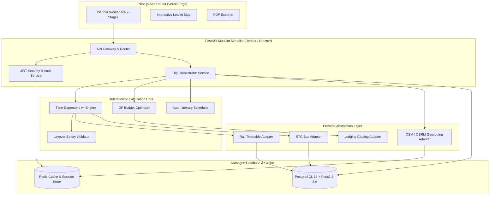

# NAVIX — Phase 6A Architecture Synthesis & Final Findings

> **Document Type**: Phase 6A Final Architecture Review & Synthesis  
> **Status**: Comprehensive Engineering Audit Complete (Corrected Baseline)  
> **Verification Date**: October 2026  
> **Cross-References**:  
> - Audit Documents: [`docs/CURRENT_SYSTEM_GAP_AUDIT.md`](file:///c:/Users/anubh/OneDrive/Desktop/Navix/docs/CURRENT_SYSTEM_GAP_AUDIT.md), [`docs/NATIONAL_ARCHITECTURE_REQUIREMENTS.md`](file:///c:/Users/anubh/OneDrive/Desktop/Navix/docs/NATIONAL_ARCHITECTURE_REQUIREMENTS.md)  
> - Provider & Security Audit: [`docs/DATA_PROVIDER_FEASIBILITY.md`](file:///c:/Users/anubh/OneDrive/Desktop/Navix/docs/DATA_PROVIDER_FEASIBILITY.md), [`docs/PRODUCTION_READINESS_AUDIT.md`](file:///c:/Users/anubh/OneDrive/Desktop/Navix/docs/PRODUCTION_READINESS_AUDIT.md)

---

## 1. Executive Synthesis & Architectural Corrections

The Phase 6A Architecture Review reconciled theoretical assumptions against verified technical reality:

1. **No Faked Availability**: Real-time seat status (`AVAILABLE`, `WL`, `RAC`) for Indian Railways cannot be manufactured probabilistically. Systems must strictly use 6 explicit data states (`CONFIRMED_LIVE`, `PUBLISHED_SCHEDULE`, `CACHED`, `ESTIMATED`, `UNAVAILABLE`, `UNKNOWN`).
2. **Indian Transit Data Reality**: There is **no official, live nationwide Indian Railways GTFS feed** on Data.gov.in. Public datasets are historical snapshots (2014–2017) or community dumps. Baseline routing relies on imported timetable snapshots, with live seat lookups deferred to accredited IRCTC B2B partner APIs.
3. **Public API Rate Limit Rules**: Public Nominatim demo endpoints (`nominatim.openstreetmap.org`) strictly cap requests to **max 1 req/sec**. Production routing requires self-hosted OSRM & Nominatim instances or commercial API keys (MapmyIndia / Mapbox).
4. **Release-Blocking Security Defect (P0)**: Hardcoded JWT secret fallback in [`backend/app/core/security.py:13`](file:///c:/Users/anubh/OneDrive/Desktop/Navix/backend/app/core/security.py#L13) allows JWT forgery if `.env` secret is omitted. This must be eliminated prior to any release.
5. **Algorithmic Baseline**: The core deterministic A* routing, layover safety validator (`transfer_validation.py`), whole-trip DP budget optimizer (`budget_optimizer.py`), and auto-itinerary scheduler (`itinerary_scheduler.py`) are mathematically sound and **$100\%$ reusable**.

---

## 2. Recommended India-Wide System Architecture

### 2.1 Architectural Module Boundaries
1. **Place & Hub Registry (`app/services/location_service.py`)**: PostGIS spatial radius search ($\text{ST\_DWithin}$), station code lookups, and city alias resolution.
2. **Multimodal Provider Adapters (`app/adapters/`)**: Abstract interfaces (`RailAdapter`, `BusAdapter`, `GeocodeAdapter`, `LodgingAdapter`) wrapping normalized datasets with explicit 6-state availability metadata.
3. **Deterministic Routing Engine (`app/algorithms/routing.py`)**: Admissible time-dependent A* pathfinding over PostGIS station queries with deterministic transfer safety validation.
4. **Whole-Trip Budget Optimizer (`app/algorithms/budget_optimizer.py`)**: Enforces hard total budget cap ($\text{Total Cost} \le \text{Budget}_{\text{max}}$); computes knapsack preference utility over candidate lodging, dining, and activity vectors.
5. **Auto-Itinerary Scheduler (`app/algorithms/itinerary_scheduler.py`)**: Time-dependent non-overlapping timeline scheduler.

---

## 3. Prioritized Risk Register

| Priority | Risk Description | Source Evidence | Impact | Mitigation Strategy | Target Phase | Dependencies |
| :--- | :--- | :--- | :--- | :--- | :--- | :--- |
| **P0** | **Hardcoded Fallback JWT Secret Key** | [`security.py:13`](file:///c:/Users/anubh/OneDrive/Desktop/Navix/backend/app/core/security.py#L13) | Allows JWT forgery in production if `.env` secret is omitted. | Remove fallback string; throw startup `RuntimeError` if `SECRET_KEY` missing. | Phase 6B | Secret configuration |
| **P0** | **In-Memory National Graph Loading** | [`graph.py:60`](file:///c:/Users/anubh/OneDrive/Desktop/Navix/backend/app/algorithms/graph.py#L60) | Memory exhaustion and high query latency on national schedule graphs. | Implement database-backed spatial bounding queries and Redis graph caching. | Phase 6B | PostGIS GIST index |
| **P0** | **Combinatorial Explosion in Budget Grid Search** | [`budget_optimizer.py:107`](file:///c:/Users/anubh/OneDrive/Desktop/Navix/backend/app/algorithms/budget_optimizer.py#L107) | $O(2^A)$ activity subset search hangs server on larger catalogs ($A > 15$). | Replace brute-force subset loop with Greedy Knapsack / bounded DP. | Phase 6B | Activity catalog schema |
| **P1** | **Frontend Hardcoded Supported Nodes** | [`PlannerComponents.tsx:23`](file:///c:/Users/anubh/OneDrive/Desktop/Navix/frontend/src/components/PlannerComponents.tsx#L23) | Locks user UI input to 8 hardcoded demo cities. | Replace static array with dynamic PostGIS spatial autocomplete endpoint. | Phase 6C | Location API endpoint |
| **P1** | **JWT Token Storage in `localStorage`** | [`auth.ts`](file:///c:/Users/anubh/OneDrive/Desktop/Navix/frontend/src/services/auth.ts) | Access tokens vulnerable to XSS theft. | Transition token storage to HTTP-Only `SameSite=Lax` cookies + `X-CSRF-Token` header. | Phase 6C | FastAPI Auth router |
| **P2** | **Lack of PostGIS Spatial Indexing** | [`DATABASE_SCHEMA.md`](file:///c:/Users/anubh/OneDrive/Desktop/Navix/docs/DATABASE_SCHEMA.md) | Slow $K$-nearest-station queries for Tier-2/Tier-3 towns. | Add `geography(Point,4326)` column & GIST spatial index (`idx_nodes_spatial`). | Phase 6B | Alembic migrations |

---

## 4. Phase 6B Design Sequence

Phase 6B will establish the complete technical architecture specifications divided into 5 reviewable parts:
- **Part 1: National Geographic & Spatial Schema Specification**: Database ER diagrams for `states`, `districts`, `cities`, and PostGIS `geography` spatial indexes on `transit_nodes`.
- **Part 2: Provider Abstraction & Data Normalization Contracts**: Python interface specifications (`RailAdapter`, `BusAdapter`, `GeocodeAdapter`) and GTFS ingestion pipelines.
- **Part 3: Scalable Routing & Budget Optimizer Redesign**: Bounded graph search algorithms, benchmark targets, and Greedy Knapsack budget allocation specifications.
- **Part 4: API Payload Contracts & Auth Security Architecture**: Pydantic v2 schemas for national location search, HTTP-Only cookie auth flows, and rate-limiting rules.
- **Part 5: Alembic Migration Roadmap & Infrastructure Specification**: Additive DDL migration scripts, zero-downtime deployment plan, and CI/CD GitHub Actions workflows.
