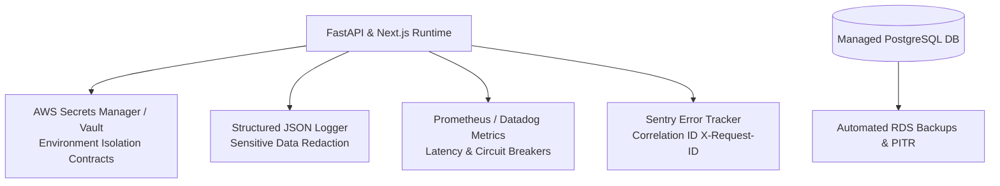

# NAVIX — Production Operations, Security & Environment Isolation Specification

> **Document Type**: Technical Production Operations & Security Infrastructure Blueprint  
> **Status**: Official Technical Design Specification (Phase 6B.5 — Final Corrections Pass)  
> **Scope**: Secrets Management, Environment Isolation, Log Sanitization, Observability & Target RTO/RPO Disclosures  
> **Safety Notice**: Design Specification Only — Zero Application Code, PostgreSQL Mutations, or Infrastructure Provisioning Applied.

---

## 1. Executive Summary & Operational Vision

The **Production Operations & Security Architecture** governs environment isolation, secrets management, observability, sensitive data redaction, and disaster recovery for NAVIX.



---

## 2. Environment Contracts & Secrets Management

NAVIX strictly separates configuration across three environment tiers:

| Environment | Config Contract File | Database Target | Secret Storage Mechanism | Startup Failure Behavior |
| :--- | :--- | :--- | :--- | :--- |
| **Development** | `.env.development` | Local Docker PostgreSQL (`localhost:5433`) | Local `.env` file (Git ignored) | Logs warning if default keys used. |
| **Staging** | `.env.staging` | Managed Staging DB | Staging Secrets Manager / Environment Variables | **ABORTS STARTUP** if `SECRET_KEY` missing or $<32$ chars. |
| **Production** | `.env.production` | Managed Production DB | Production Secrets Manager | **ABORTS STARTUP** if any secret missing or insecure. |

### Startup Secret Validation Contract
In `backend/app/core/config.py`, FastAPI enforces explicit secret validation:
```python
# Verified Security Hotfix S1 Validation Contract
if not self.SECRET_KEY or len(self.SECRET_KEY.strip()) < 32:
    raise ValueError(
        "CRITICAL STARTUP FAILURE: SECRET_KEY environment variable is missing or insecure. "
        "Must be an explicitly configured string of at least 32 characters."
    )
```

---

## 3. Observability, Structured Logging & Data Masking

### 3.1 Structured JSON Logging & Request Correlation
All log entries are formatted as structured JSON containing the request correlation ID (`X-Request-ID`):
```json
{
  "timestamp_utc": "2026-10-09T14:45:00.123Z",
  "level": "INFO",
  "service": "navix-backend",
  "request_id": "req_8f3a92b1",
  "user_id": "usr_99201",
  "endpoint": "/api/v1/trips/plan",
  "status_code": 200,
  "execution_time_ms": 142.5
}
```

### 3.2 Sensitive Data Redaction Rules
Loggers enforce automatic regex masking (`[REDACTED]`) on sensitive fields prior to writing to stdout:
- Password fields (`password`, `hashed_password`).
- Tokens (`access_token`, `refresh_token`, `jwt`, `authorization`).
- Payment / PII details (`card_number`, `cvv`, `passport_number`).
- Secret keys (`SECRET_KEY`, `DB_PASSWORD`).

---

## 4. Disaster Recovery & Backup Operational Objectives

All backup and disaster recovery metrics below represent **PROPOSED TARGET OPERATIONAL OBJECTIVES**, subject to empirical validation during future disaster recovery exercises:

1. **Automated Database Backups**:
   - Daily snapshot backups executed automatically during low-traffic windows (03:00 IST).
   - Retained for **30 days**.
2. **Point-In-Time Recovery (PITR)**:
   - PostgreSQL Write-Ahead Logs (WAL) continuously archived to S3.
   - Enables restoring database state to any exact second within the last **7 days**.
3. **Disaster Recovery Target Metrics**:
   - **Recovery Time Objective Target (RTO Target)**: $< 1.0\text{ hour}$ (time to restore database and application services).
   - **Recovery Point Objective Target (RPO Target)**: $< 15.0\text{ minutes}$ (maximum potential data loss in disaster).
