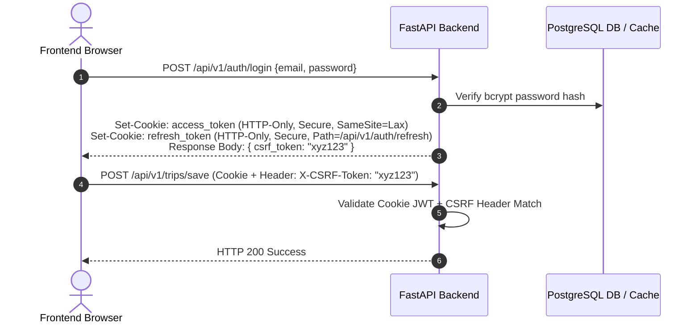
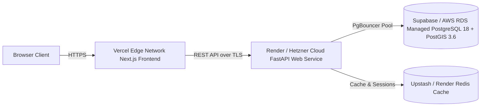

# NAVIX — Production Readiness & Security Audit (Revised Phase 6A)

> **Document Type**: Security & Infrastructure Production Assessment (Architecture Review & Correction)  
> **Status**: Verified Engineering Audit (Corrected Baseline)  
> **Verification Date**: October 2026

---

## 1. Security Defect Audit & Release Blockers

An empirical audit of the backend authentication codebase ([`backend/app/core/security.py`](file:///c:/Users/anubh/OneDrive/Desktop/Navix/backend/app/core/security.py), [`backend/app/main.py`](file:///c:/Users/anubh/OneDrive/Desktop/Navix/backend/app/main.py)) confirmed the following security findings:

### 1.1 Release-Blocking Security Defect (P0)
- **Exact File & Line**: [`backend/app/core/security.py:13`](file:///c:/Users/anubh/OneDrive/Desktop/Navix/backend/app/core/security.py#L13)
- **Verified Code**:
  ```python
  SECRET_KEY = settings.SECRET_KEY if hasattr(settings, "SECRET_KEY") else "NAVIX_SECRET_KEY_2026_UNIVERSAL_STRONG"
  ```
- **Vulnerability**: If `SECRET_KEY` is omitted from `.env` in any environment, FastAPI silently defaults to a static, hardcoded string. An attacker aware of this open-source string can forge valid JWT access tokens for any user or admin account.
- **Classification**: **RELEASE-BLOCKING DEFECT (P0)**.
- **Remediation**: Remove the string fallback entirely. Throw an explicit `RuntimeError` at application startup if `SECRET_KEY` is missing or less than 32 characters long.

### 1.2 Additional Security Vulnerabilities & Remediation Architecture

| Security Domain | Current Codebase Implementation | Verified Vulnerability / Gap | Severity | Recommended Production Architecture |
| :--- | :--- | :--- | :--- | :--- |
| **Token Storage (Frontend)** | JWT stored in `localStorage` ([`auth.ts`](file:///c:/Users/anubh/OneDrive/Desktop/Navix/frontend/src/services/auth.ts)) | Vulnerable to token theft via Cross-Site Scripting (XSS). | **HIGH** | Transition access tokens to HTTP-Only `SameSite=Lax` cookies with a custom `X-CSRF-Token` header for mutation endpoints. |
| **Token Expiry & Revocation** | 7-day token expiry (`ACCESS_TOKEN_EXPIRE_MINUTES = 10080`) without refresh token flow ([`security.py:15`](file:///c:/Users/anubh/OneDrive/Desktop/Navix/backend/app/core/security.py#L15)) | Stolen tokens remain valid for 7 days with no backend revocation capability. | **HIGH** | Implement short-lived access tokens (15–30 min) + HTTP-Only refresh tokens with a database/Redis revocation table. |
| **Rate Limiting** | No rate-limiting middleware configured in `main.py` ([`main.py`](file:///c:/Users/anubh/OneDrive/Desktop/Navix/backend/app/main.py)) | Vulnerable to credential stuffing on `/auth/login` and DoS on `/routes/search`. | **HIGH** | Add `slowapi` rate-limiting middleware (e.g., 5 login attempts/min, 30 search requests/min per IP). |
| **CORS Configuration** | `allow_origins = [settings.FRONTEND_ORIGIN, "http://localhost:3000"]` ([`main.py:15`](file:///c:/Users/anubh/OneDrive/Desktop/Navix/backend/app/main.py#L15)) | Allows local dev origins in production if unhandled. | **MEDIUM** | Enforce strict environment checks: disable `localhost:3000` origins when `ENVIRONMENT=production`. |
| **Input Schema Bounds** | Pydantic schemas validate data types ([`trip_planner.py`](file:///c:/Users/anubh/OneDrive/Desktop/Navix/backend/app/schemas/trip_planner.py)) | Missing max-length constraints on text inputs and date range bounds on search payloads. | **MEDIUM** | Enforce string max-length constraints (`max_length=100`) and cap trip duration inputs to $\le 30$ days. |

---

## 2. HTTP-Only Cookie & Session Migration Strategy

To eliminate XSS risks without introducing CSRF vulnerabilities, NAVIX defines the following authentication architecture:



### Operational Trade-offs & Choices:
- **`SameSite=Lax` vs `SameSite=Strict`**: `SameSite=Lax` is selected over `Strict` to allow top-level navigation links from marketing pages or email links to retain authenticated user state without dropping session cookies.
- **CSRF Defense**: Combine HTTP-Only cookies with a **Double-Submit CSRF Cookie / Header Pattern** (`X-CSRF-Token`), ensuring cross-origin requests cannot execute state-changing actions.

---

## 3. Revised Infrastructure Architecture & Cost Model

The previous $\$15\text{--}\$35/\text{month}$ hosting estimate represented a minimal dev/staging baseline. A production-ready India-wide deployment requires accounting for compute, managed PostgreSQL/PostGIS, Redis, bandwidth, map tiles, and automated backups:



### 3.1 Real Production Cost Estimate

| Component | Target Provider | Production Specs | Monthly Cost Estimate (USD) |
| :--- | :--- | :--- | :--- |
| **Frontend CDN** | Vercel Pro | Global Edge Network, SSR, Analytics | $\$20.00$ |
| **Backend API** | Render / Hetzner Cloud VPS | 2 CPU / 4 GB RAM containerized Uvicorn ASGI workers | $\$25.00 - \$45.00$ |
| **Managed DB (PostgreSQL + PostGIS)** | Supabase Pro / AWS RDS (Mumbai `ap-south-1`) | PostgreSQL 18 + PostGIS 3.6, PgBouncer pooling, daily WAL backups | $\$25.00 - \$60.00$ |
| **Redis Cache** | Upstash Redis / Render | Redis 7+, GTFS cache, rate limiting | $\$10.00 - \$20.00$ |
| **Geocoding & Maps** | Self-Hosted OSRM or MapmyIndia Tier | Road distance matrix & station geocoding | $\$0.00 - \$25.00$ |
| **Logging & Monitoring** | Sentry + Better Stack | Exception tracking & uptime monitoring | $\$0.00 - \$15.00$ |
| **Total Production Cost Range** | — | — | **$\mathbf{\$80.00 - \$185.00 / \text{month}}$** |

---

## 4. Database Migration Safety & Alembic Rules

1. **Alembic Adoption**: Initialize Alembic (`alembic init backend/alembic`) targeting SQLAlchemy `Base.metadata`.
2. **Environment Separation**: Maintain strict separation between `Navix_Dev`, `Navix_Staging`, and `Navix_Prod` database instances.
3. **Additive Schema Modifications Only**: All migration scripts **MUST BE ADDITIVE** (e.g. adding new tables like `countries`, `states`, or adding PostGIS `geography` columns).
4. **Zero Legacy Table Mutations**: Existing tables (`users`, `travelers`, `admins`, `trips`, `transit_nodes`, `transit_schedules`, `transit_segments`, `budget_allocations`) **MUST NOT** be dropped or renamed.
5. **Saved Trip Preservation**: Existing saved trip records in `trips` and `budget_allocations` remain 100% backward compatible.
