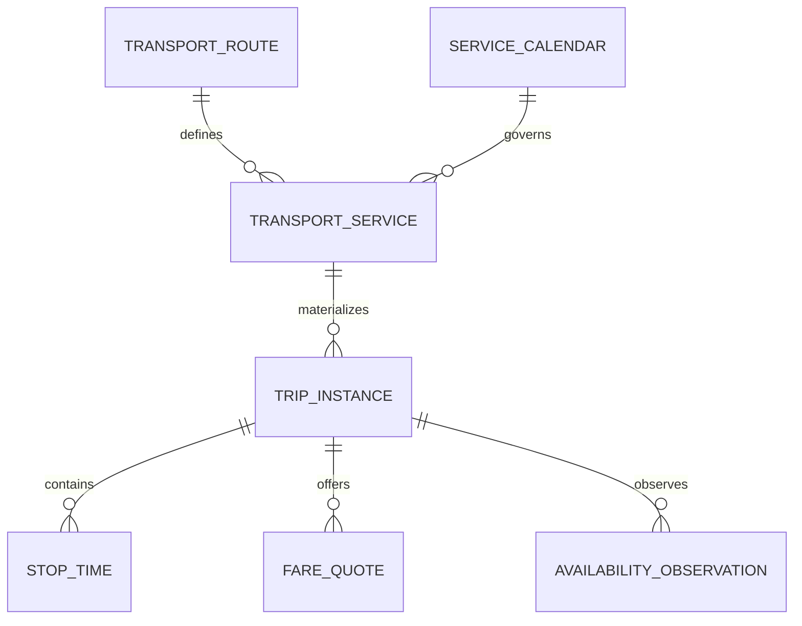

# NAVIX — Travel Provider Interfaces & Normalized Data Contracts (V1)

> **Document Type**: Technical Interface & Schema Specification  
> **Status**: Official Technical Design Specification (Phase 6B.2)  
> **Scope**: Multimodal Travel Provider Protocols & Normalized Data Contracts  
> **Safety Notice**: Design Specification Only — Zero Application Code or PostgreSQL Mutations Executed.

---

## 1. Overview & Architectural Principles

The NAVIX provider integration layer decouples core pathfinding and budget optimization algorithms from external data formats (GTFS, NeTEx, vendor REST APIs, static CSV/JSON dumps).

### Core Design Guarantees
1. **Algorithm Independence**: A*, transfer validation, DP budget allocation, and auto-itinerary scheduling operate strictly on normalized NAVIX dataclasses. They contain zero provider-specific SDK dependencies or JSON parsing logic.
2. **Batch vs Real-Time Separation**: Provider protocols cleanly separate bulk offline schedule ingestion (`IngestionProviderProtocol`) from real-time dynamic queries (`LiveQueryProviderProtocol`).
3. **Explicit 24:00+ Time Semantics**: Timetable stop times exceeding 24:00 (e.g. `25:30` for an overnight train arriving at 01:30 the next calendar day) are handled deterministically without datetime rollover errors.
4. **Strict Currency & Numeric Precision**: Fares and monetary amounts use Python `Decimal` / SQL `NUMERIC(10,2)` with ISO 4217 currency codes. No floating-point currency representation is permitted.

---

## 2. Logical Provider Interface Protocols

```mermaid
classDiagram
    class BaseProviderProtocol {
        +str provider_id
        +str provider_name
        +List~TransportMode~ supported_modes
        +health_check() ProviderHealthStatus
    }

    class RailProviderProtocol {
        +get_published_schedules(origin_facility_id, dest_facility_id, service_date) List~TripInstance~
        +get_live_availability(trip_instance_id, travel_class) AvailabilityObservation
    }

    class BusProviderProtocol {
        +get_published_schedules(origin_facility_id, dest_facility_id, service_date) List~TripInstance~
        +get_live_availability(trip_instance_id, seat_type) AvailabilityObservation
    }

    class FlightProviderProtocol {
        +search_flight_offers(origin_iata, dest_iata, departure_date, passengers) List~FareQuote~
    }

    class UrbanTransitProviderProtocol {
        +get_metro_schedules(origin_stop_id, dest_stop_id, departure_time) List~TripInstance~
    }

    class GeocodingProviderProtocol {
        +geocode(query_string, country_code) List~GeocodedLocation~
        +reverse_geocode(latitude, longitude) GeocodedLocation
    }

    class RoadRoutingProviderProtocol {
        +get_road_distance_matrix(origins, destinations, mode) DistanceMatrixResult
    }

    class PlacesProviderProtocol {
        +search_attractions(settlement_id, category, radius_meters) List~NormalizedPOI~
    }

    class AccommodationProviderProtocol {
        +search_lodging_rates(settlement_id, checkin_date, checkout_date, guests) List~NormalizedAccommodation~
    }

    class PricingProviderProtocol {
        +evaluate_cost_range(entity_type, tier, city_population_tier) EstimatedPriceRange
    }

    BaseProviderProtocol <|-- RailProviderProtocol
    BaseProviderProtocol <|-- BusProviderProtocol
    BaseProviderProtocol <|-- FlightProviderProtocol
    BaseProviderProtocol <|-- UrbanTransitProviderProtocol
    BaseProviderProtocol <|-- GeocodingProviderProtocol
    BaseProviderProtocol <|-- RoadRoutingProviderProtocol
    BaseProviderProtocol <|-- PlacesProviderProtocol
    BaseProviderProtocol <|-- AccommodationProviderProtocol
    BaseProviderProtocol <|-- PricingProviderProtocol
```



### 2.1 Provider Interface Specifications

```python
# Provisional Typed Python Protocol Definitions (Architecture Contract Only)
from typing import Protocol, List, Optional, Dict, Any
from datetime import date, datetime
from decimal import Decimal
from enum import Enum

class TransportMode(str, Enum):
    TRAIN = "TRAIN"
    BUS = "BUS"
    FLIGHT = "FLIGHT"
    METRO = "METRO"
    LOCAL = "LOCAL"

class AvailabilityState(str, Enum):
    CONFIRMED_LIVE = "CONFIRMED_LIVE"
    PUBLISHED_SCHEDULE = "PUBLISHED_SCHEDULE"
    CACHED = "CACHED"
    ESTIMATED = "ESTIMATED"
    UNAVAILABLE = "UNAVAILABLE"
    UNKNOWN = "UNKNOWN"

class BaseProviderProtocol(Protocol):
    provider_id: str
    provider_name: str
    supported_modes: List[TransportMode]
    
    def health_check(self) -> Dict[str, Any]:
        ...

class RailProviderProtocol(BaseProviderProtocol, Protocol):
    def get_published_schedules(
        self,
        origin_facility_id: str,
        dest_facility_id: str,
        service_date: date
    ) -> List["TripInstance"]:
        """Fetches normalized date-specific trip instances for rail corridors."""
        ...

    def get_live_availability(
        self,
        trip_instance_id: str,
        travel_class: str
    ) -> "AvailabilityObservation":
        """Queries direct partner API for live seat status (e.g. 3A, 2A, SL)."""
        ...
```

---

## 3. Normalized Transport Data Contracts

### 3.1 Recurring Scheduled Service vs. Date-Specific Journey Instance
NAVIX cleanly separates **recurring timetable rules** from **concrete date instances**:
- **`TransportService`**: The master recurring timetable rule (e.g. *Goa Express Train #12780*, operating on Mon/Wed/Fri from Miraj Junction to Hazrat Nizamuddin).
- **`TripInstance`**: The concrete real-world journey on a specific calendar date (e.g. *Goa Express #12780 departing Miraj on 2026-12-12 at 16:45*).



---

### 3.2 Core Contract Data Structures

#### Contract 1: `ServiceCalendar`
Defines 7-day recurring operation masks and date exception rules.
```python
class ServiceCalendar:
    service_id: str
    monday: bool
    tuesday: bool
    wednesday: bool
    thursday: bool
    friday: bool
    saturday: bool
    sunday: bool
    start_date: date
    end_date: date
    added_dates: List[date]      # GTFS calendar_dates exception (type 1)
    removed_dates: List[date]    # GTFS calendar_dates exception (type 2)
```

#### Contract 2: `StopTime`
Represents scheduled stop times, supporting 24:00+ overnight offsets.
```python
class StopTime:
    stop_id: str
    facility_id: str
    facility_name: str
    stop_sequence: int
    arrival_time_mins: int       # Minutes from midnight (e.g., 1530 = 25:30 / 01:30 next day)
    departure_time_mins: int     # Minutes from midnight
    pickup_type: int             # 0 = Regular, 1 = No pickup
    drop_off_type: int           # 0 = Regular, 1 = No drop-off
```

#### Contract 3: `TripInstance`
Concrete journey instance evaluated by the time-dependent A* engine.
```python
class TripInstance:
    trip_instance_id: str
    service_id: str
    route_id: str
    provider_id: str
    operator_name: str
    transport_mode: TransportMode
    origin_facility_id: str
    origin_facility_name: str
    dest_facility_id: str
    dest_facility_name: str
    departure_time_utc: datetime
    arrival_time_utc: datetime
    departure_local_time: str    # e.g., "16:45"
    arrival_local_time: str      # e.g., "15:30 (+1 day)"
    duration_minutes: int
    base_fare_inr: Decimal
    available_classes: List[str]  # e.g., ["3A", "2A", "SL"]
    availability_state: AvailabilityState
```

#### Contract 4: `FareQuote`
Normalized pricing contract for multi-currency transport, lodging, and activity options.
```python
class FareQuote:
    quote_id: str
    provider_id: str
    currency: str                # ISO 4217 (default 'INR')
    base_fare: Decimal
    tax_and_fees: Decimal
    total_fare: Decimal
    passenger_count: int
    travel_class: str            # e.g., '3A', 'AC_SLEEPER', 'ECONOMY'
    fare_basis: Optional[str]
    is_refundable: Optional[bool]
    valid_until: Optional[datetime]
    pricing_state: AvailabilityState
```

#### Contract 5: `AvailabilityObservation`
Live seat/room availability observation metadata.
```python
class AvailabilityObservation:
    observation_id: str
    provider_id: str
    trip_instance_id: str
    travel_class: str
    status_code: str             # e.g., 'AVAILABLE-0042', 'WL-12', 'RAC-04', 'SOLD_OUT'
    numeric_available_seats: Optional[int]
    observed_at_utc: datetime
    availability_state: AvailabilityState
    user_facing_notice: str
```

---

## 4. Error Handling & Exception Contracts

Provider failures must never raise raw HTTP or JSON parsing exceptions to internal algorithms. All adapters implement unified error handling:

```python
class ProviderException(Exception):
    def __init__(self, provider_id: str, error_code: str, message: str, retryable: bool = False):
        self.provider_id = provider_id
        self.error_code = error_code
        self.message = message
        self.retryable = retryable
        super().__init__(f"[{provider_id}] {error_code}: {message}")

class ProviderTimeoutException(ProviderException):
    """Raised when external provider exceeds connection/read timeout."""
    pass

class ProviderRateLimitException(ProviderException):
    """Raised when external provider returns HTTP 429 Too Many Requests."""
    pass

class ProviderDataFormatException(ProviderException):
    """Raised when GTFS feed or API response violates expected schema contracts."""
    pass
```
