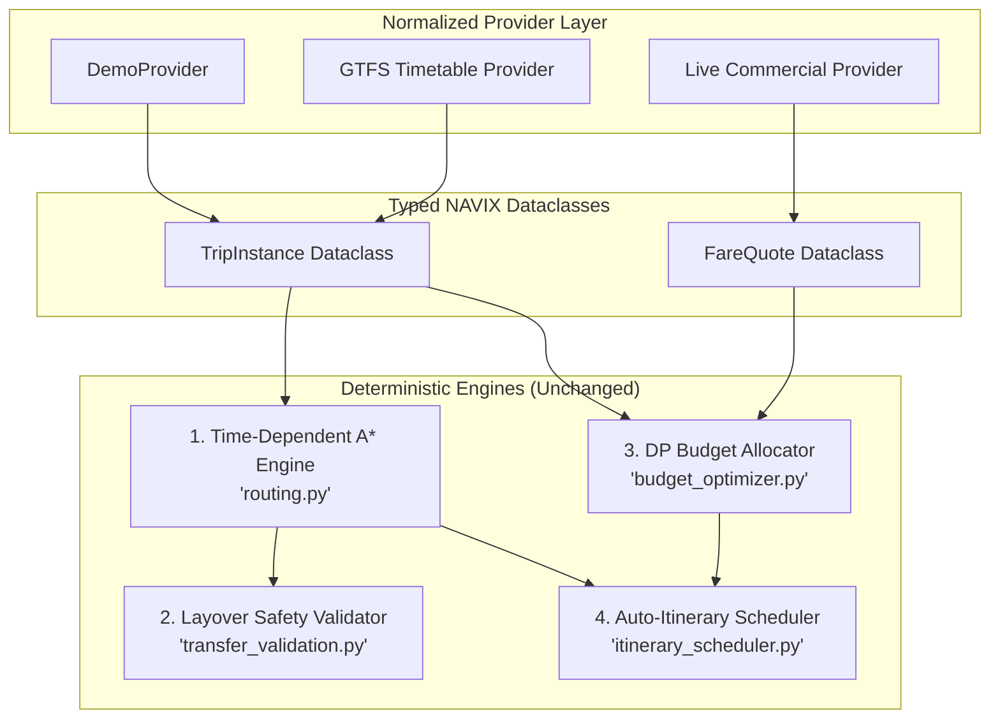
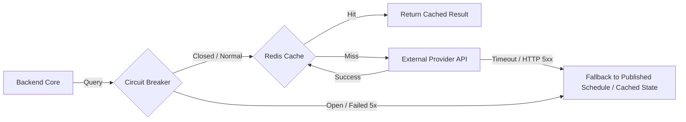

# NAVIX — Provider Integration Architecture & Phase 6B.1 Refinements (V1)

> **Document Type**: Architectural Decisions & Algorithm Integration Plan  
> **Status**: Official Technical Design Specification (Phase 6B.2)  
> **Scope**: Architectural Decisions, Phase 6B.1 Refinements, & Algorithm Integration  
> **Safety Notice**: Design Specification Only — Zero Application Code or PostgreSQL Mutations Executed.

---

## 1. Phase 6B.1 Architectural Refinements

Based on Phase 6B.2 integration analysis, five specific refinements are made to the Phase 6B.1 geographic design:

### Refinement A: Referentially Safe Identity for Aliases & Provenance
- *Phase 6B.1 Issue*: `location_aliases` and `geo_provenance` used polymorphic string fields (`entity_type` + `entity_id`), which lack native PostgreSQL foreign key constraint enforcement.
- *Refinement Decision*: To guarantee database referential integrity without broken foreign key references, Phase 6B.1's polymorphic tables are refined to use **dedicated, nullable foreign key columns** with an explicit check constraint:
```sql
-- Refined Schema Proposal for location_aliases (Referentially Safe)
ALTER TABLE location_aliases
    ADD COLUMN settlement_id VARCHAR(50) REFERENCES settlements(settlement_id) ON DELETE CASCADE,
    ADD COLUMN facility_id VARCHAR(50) REFERENCES transit_facilities(facility_id) ON DELETE CASCADE,
    ADD COLUMN poi_id VARCHAR(50) REFERENCES points_of_interest(poi_id) ON DELETE CASCADE,
    ADD CONSTRAINT chk_single_entity_ref CHECK (
        (CASE WHEN settlement_id IS NOT NULL THEN 1 ELSE 0 END +
         CASE WHEN facility_id IS NOT NULL THEN 1 ELSE 0 END +
         CASE WHEN poi_id IS NOT NULL THEN 1 ELSE 0 END) = 1
    );
```

### Refinement B: Multi-Settlement Facility Serving Relationships
- *Phase 6B.1 Issue*: `transit_facilities` stored a single `settlement_id` foreign key. However, major transit facilities frequently serve multiple adjacent settlements (e.g. *Chandigarh Airport (IXC)* serving Chandigarh, Mohali, and Panchkula; *Miraj Junction (MRJ)* serving Miraj and Sangli).
- *Refinement Decision*: Introduce a **Many-to-Many Junction Table `settlement_facilities`**:
```sql
-- Refined Junction Table Proposal for Multi-Settlement Serving Relationships
CREATE TABLE IF NOT EXISTS settlement_facilities (
    settlement_id VARCHAR(50) REFERENCES settlements(settlement_id),
    facility_id VARCHAR(50) REFERENCES transit_facilities(facility_id),
    is_primary_hub BOOLEAN DEFAULT FALSE,
    transfer_shuttle_mins INT DEFAULT 15,
    PRIMARY KEY (settlement_id, facility_id)
);
```

### Refinement C: Geographic Existence vs Date-Specific Transport Coverage
- *Refinement*: Decouple location autocomplete search from timetable route execution. Location search queries the spatial database (`settlements`, `transit_facilities`), returning all valid Indian places regardless of coverage. The routing engine then checks `TripInstance` availability for the requested trip date, returning clear 6-state availability feedback if active schedules are absent.

### Refinement D: Performance Benchmark Standards
- *Refinement*: Establish explicit performance targets for Phase 6B implementation:
  - Autocomplete location query: $<50\text{ ms}$ (p95) using GIN trigram indexes (`idx_settlements_name_trgm`).
  - Proximity hub search ($\text{ST\_DWithin} \le 30\text{ km}$): $<25\text{ ms}$ (p95) using GiST spatial index.
  - Multi-modal A* search ($10,000$ edges): $<500\text{ ms}$ (p95).

### Refinement E: Reference Catalog Prices vs Dynamic Fares
- *Refinement*: Catalog tables (`points_of_interest.base_ticket_cost`, `accommodations.cost_per_night`) serve as static baseline estimates for initial whole-trip budget planning. Live booking prices fetched from external commercial APIs override reference catalog rates when live availability is in `CONFIRMED_LIVE` state.

---

## 2. Architecture Integration with Existing Core Engines

The provider integration layer feeds normalized data directly into NAVIX's core calculation engines without altering their deterministic mathematical contracts:



1. **Time-Dependent A* Routing Engine (`routing.py`)**:
   - Consumes normalized `TripInstance` dataclasses. Graph construction loads active date-specific instances from `transit_schedules` or GTFS tables without changing algorithm execution.
2. **Layover Safety Validator (`transfer_validation.py`)**:
   - `validate_transfer(...)` evaluates connections using normalized `TransportMode` enums and stop arrival/departure timestamps. $100\%$ algorithm reuse.
3. **Whole-Trip Budget Optimizer (`budget_optimizer.py`)**:
   - Consumes `total_transport_cost` derived from `TripInstance` base fares and evaluates candidate lodging/food vectors under the hard budget cap ($\text{Cost}_{\text{mandatory}} \le \text{Budget}_{\text{max}}$).
4. **Auto-Itinerary Intelligence Scheduler (`itinerary_scheduler.py`)**:
   - Schedules daily timeline events around transit arrival/departure blocks, stay check-in, pace limits, and local transfer times.

---

## 3. Preserving Sangli $\rightarrow$ Old Manali Demo Compatibility (`DemoProvider`)

To ensure complete backward compatibility with existing unit tests ([`backend/tests/test_routing.py`](file:///c:/Users/anubh/OneDrive/Desktop/Navix/backend/tests/test_routing.py), [`backend/tests/test_budget_planner.py`](file:///c:/Users/anubh/OneDrive/Desktop/Navix/backend/tests/test_budget_planner.py)) and the primary demo corridor (Sangli $\rightarrow$ Miraj $\rightarrow$ Delhi $\rightarrow$ Manali $\rightarrow$ Old Manali):

- **`DemoProvider` Adapter**: Implements `RailProviderProtocol` and `BusProviderProtocol`, returning the pre-existing 9 nodes (`node_SLI` to `node_OLD_MNL`) and 18 schedules (`sch_101` to `sch_114`).
- **Seamless Test Execution**: Running `pytest` automatically invokes `DemoProvider`, ensuring all 62 baseline tests pass without requiring external network calls or database mutations.

---

## 4. Reliability, Caching, & Circuit Breaker Architecture



1. **Circuit Breaker Pattern**: If an external provider API fails 5 consecutive times or times out ($>3.0\text{s}$), the circuit breaker opens for 60 seconds, routing requests directly to cached GTFS static schedules.
2. **Exponential Backoff**: Transient API network errors retry up to 3 times with exponential jitter ($0.5\text{s}$, $1.0\text{s}$, $2.0\text{s}$).
3. **Redis Caching Strategy**:
   - Geocoding results (`OSM / OSRM`): TTL 7 days.
   - Timetable instances (`GTFS`): TTL 24 hours.
   - Live availability / fares (`Amadeus / Booking.com`): TTL 15 minutes.

---

## 5. Testing Architecture & Contract Validation

1. **Mock Provider Fixtures**: All provider tests use deterministic JSON fixtures (`tests/fixtures/provider_gtfs_sample.json`, `tests/fixtures/provider_amadeus_sample.json`). **Zero paid API keys or live network requests are required to run the test suite.**
2. **Contract Testing**: `test_provider_contracts.py` validates that all provider adapters emit compliant `TripInstance`, `FareQuote`, and `AvailabilityObservation` dataclasses.
3. **Overnight GTFS Test Cases**: `test_gtfs_overnight.py` validates that stop times exceeding 24:00 (`25:30`) correctly parse to next-day minute offsets ($1530\text{ mins}$) without datetime errors.
4. **Idempotency & Rollback Tests**: Tests verify that GTFS dataset import failures roll back staging transactions cleanly without corrupting active production schedules.

---

## 6. Phase 6B Implementation Sequence

| Phase | Module / Artifact | Core Deliverable |
| :--- | :--- | :--- |
| **Phase 6B.1** | Geographic & Spatial Schema | `NATIONAL_GEO_SCHEMA_V1.md`, `LOCATION_SEARCH_AND_COVERAGE.md`, `GEO_MIGRATION_BLUEPRINT.md` |
| **Phase 6B.2** | Provider Architecture & Ingestion | `PROVIDER_CONTRACTS_V1.md`, `DATA_INGESTION_ARCHITECTURE.md`, `SOURCE_TRUST_AND_COVERAGE.md`, `PROVIDER_INTEGRATION_DECISIONS.md` |
| **Phase 6B.3** | Spatial & Provider API Contracts | OpenAPI specifications for `/api/v1/locations` and `/api/v1/providers` endpoints |
| **Phase 6B.4** | Security & Migration Architecture | HTTP-Only cookie auth contracts, Alembic migration scripts, and CI/CD workflow designs |
