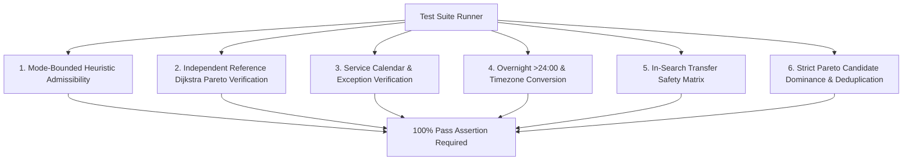

# NAVIX — Routing Engine Benchmark & Verification Plan

> **Document Type**: Technical Test Architecture & Benchmark Specification  
> **Status**: Official Technical Design Specification (Phase 6B.3A — Targeted Architecture Corrections Pass)  
> **Scope**: Correctness Test Suites, Benchmark Workloads, Reference Algorithms & Verification Criteria  
> **Safety Notice**: Design Specification Only — Zero Application Code or PostgreSQL Mutations Executed.

---

## 1. Standardized Benchmark Workload Tiers (Proposed Target Objectives)

To evaluate routing engine performance objectively without confusing planned performance goals with empirical runtime measurements, all figures below are explicitly defined as **PROPOSED TARGET OBJECTIVES**:

| Workload Tier | Scope & Nodes | Edge Count (Schedules) | Target Latency Objective (p95)* | Target Memory Footprint* | Target Search Mode |
| :--- | :--- | :--- | :--- | :--- | :--- |
| **Tier 1: Small (Demo Graph)** | 9 Nodes (Sangli $\rightarrow$ Old Manali) | 18 Schedules | $<10\text{ ms}$ | $<5\text{ MB}$ | Zero-Heuristic Dijkstra Baseline |
| **Tier 2: Medium (Regional)** | ~500 Facilities (Maharashtra & Himachal) | ~5,000 Schedules | $<100\text{ ms}$ | $<25\text{ MB}$ | Multi-Criteria A* / Dijkstra |
| **Tier 3: Large (Multi-Region)** | ~2,500 Facilities (Western, Northern & Central India) | ~50,000 Schedules | $<500\text{ ms}$ | $<100\text{ MB}$ | Multi-Criteria A* with Bounding |
| **Tier 4: Stress (National)** | ~8,000 Rail Stations + 50,000 Bus Stops | ~500,000 Schedules | $<1,500\text{ ms}$ | $<250\text{ MB}$ | Multi-Criteria A* / Subgraph CSA |

*\*Note: Latency and memory metrics represent design target objectives for Phase 6B implementation, not empirically measured runtime benchmarks.*

---

## 2. Correctness & Verification Test Suites



### Test Suite Specifications

#### 1. Mode-Bounded Heuristic Admissibility Verification (`test_heuristic_admissibility.py`)
- *Objective*: Verify that $h(u, \text{target}) \le h^*(u, \text{target})$ across 1,000 random facility pairs using mode-partitioned velocity bounds ($V_{\max, \text{air}} = 900\text{ km/h}$, $R_{\min} = 0.0$).
- *Assertion*: `compute_heuristic_score(u, target)` must never exceed actual shortest path score.

#### 2. Independent Reference Dijkstra Equivalence (`test_dijkstra_equivalence.py`)
- *Objective*: Compare candidate Pareto set $P_{\text{A*}}$ against an independent, zero-heuristic Multi-Criteria Dijkstra reference implementation ($P_{\text{ref}}$) on Tier 1 and Tier 2 graphs.
- *Precision & Recall Assertions*:
  $$\text{Precision} = \frac{|P_{\text{A*}} \cap P_{\text{ref}}|}{|P_{\text{A*}}|} = 1.0, \quad \text{Recall} = \frac{|P_{\text{A*}} \cap P_{\text{ref}}|}{|P_{\text{ref}}|} = 1.0$$

#### 3. Service Calendar Exceptions (`test_calendar_exceptions.py`)
- *Objective*: Verify that trips operating only on specific days or with GTFS `calendar_dates.txt` removals (`exception_type = 2`) are excluded on non-operating dates.

#### 4. Overnight >24:00 Timestamp Parsing (`test_overnight_timestamps.py`)
- *Objective*: Verify that GTFS stop times exceeding 24:00 (e.g. `25:30:00`) parse to $1530\text{ minutes}$, correctly incrementing the departure date by 1 day and handling agency local timezone offsets to UTC.

#### 5. In-Search Transfer Safety (`test_transfer_validation.py`)
- *Objective*: Verify that layovers failing mode transition buffers (e.g., $120\text{ min}$ for flights, $45\text{ min}$ for rail-to-bus, $20\text{ min}$ for rail-to-rail) are rejected during label expansion.

#### 6. Pareto Candidate Generation & Dominance (`test_pareto_candidates.py`)
- *Objective*: Verify that returned route candidates (`CHEAPEST`, `FASTER`, `BALANCED`) are non-dominated along cost, travel time, and transfer count axes, and that budget-exceeding candidates are pruned.

---

## 3. Reference Algorithm Verification Harness & Selection Rules

### 3.1 Design-Level Benchmark Harness Contract
```python
from typing import Dict, Any, List, Tuple

class RoutingBenchmarkHarness:
    def execute_benchmark_run(
        self,
        graph_tier: str,
        query_pairs: List[Tuple[str, str]],
        algorithm: str = "A_STAR"
    ) -> Dict[str, Any]:
        """Runs benchmark workload against reference Dijkstra and target pathfinding algorithms."""
        ...
```

### 3.2 Algorithm Selection Decision Rules
1. **Primary Engine**: Date-bounded Multi-Criteria A* with Pareto Dominance Pruning.
2. **Fallback / Benchmark Reference**: Zero-Heuristic Multi-Criteria Dijkstra ($h(n) = 0.0$).
3. **Threshold for Connection Scan Algorithm (CSA)**:
   If Tier 4 stress testing on national schedule graphs yields p95 latency $> 1,500\text{ ms}$, NAVIX will implement CSA for pure rail/bus timetable sub-routing, integrating A* for first/last-mile local transfers.
