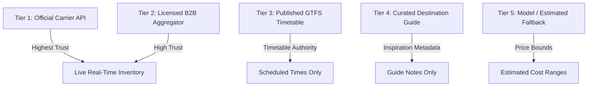
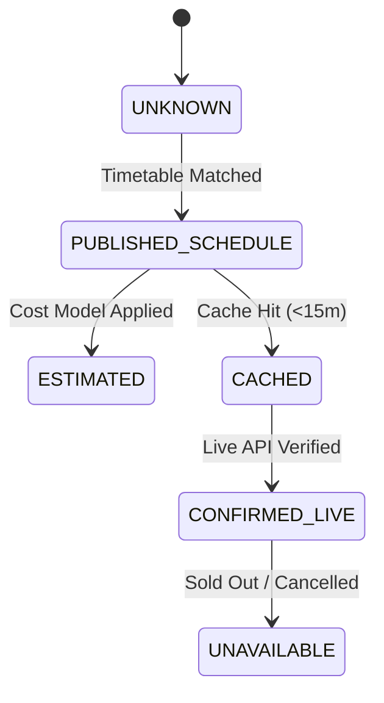

# NAVIX — Data Trust, Freshness, & Coverage Semantics Specification

> **Document Type**: Data Governance & Credibility Architecture Design  
> **Status**: Official Technical Design Specification (Phase 6B.2)  
> **Scope**: Source Authority Tiers, Availability States, Pricing Contracts, & Coverage Matrix  
> **Safety Notice**: Design Specification Only — Zero Application Code or PostgreSQL Mutations Executed.

---

## 1. Source Credibility & Authority Hierarchy

NAVIX strictly distinguishes data credibility across 5 **Source Authority Tiers**:



### Authority Tier Definitions
- **Tier 1 (Official Carrier API)**: Direct API integration with carrier (e.g. DMRC Metro, Air India API). Highest authority for live seats and fares.
- **Tier 2 (Licensed B2B Aggregator)**: Commercial partner feeds (e.g. Amadeus Air, Booking.com Affiliate API, RedBus B2B API).
- **Tier 3 (Published Timetable Feed)**: Official static GTFS/CSV timetables. Authoritative for departure/arrival times; seat availability unverified.
- **Tier 4 (Curated Guide Metadata)**: Destination guide entries (e.g. OpenTripMap POIs, curated cafe guides).
- **Tier 5 (Model Estimated Fallback)**: Algorithmic cost bounds (e.g. distance-based local taxi fares, city-tier dining bounds).

---

## 2. Explicit 6-State Availability & UI Disclosure Matrix

To ensure absolute data honesty, NAVIX mandates explicit 6-state availability tracking across all backend schemas and frontend timeline UI components:



### 2.1 State Definitions & UI Presentation Rules

| Availability State | Backend Condition | Frontend UI Badge & Presentation | Real-Time Booking Claim |
| :--- | :--- | :--- | :--- |
| **`CONFIRMED_LIVE`** | Live seats & fare verified via direct carrier API. | `CONFIRMED LIVE FARE` (Emerald Badge) | Direct live booking redirect active. |
| **`PUBLISHED_SCHEDULE`** | Departure/arrival derived from timetable; seats unverified. | `SCHEDULE VERIFIED` (Teal Badge) | **No live seat claim.** Prompt: *"Check live seats on carrier portal"*. |
| **`CACHED`** | Fare/availability cached from previous API query within TTL. | `CACHED FARE (12m ago)` (Sky Blue Badge) | Refresh CTA button displayed. |
| **`ESTIMATED`** | Fare calculated via distance formula or city-tier matrix. | `ESTIMATED BUDGET RANGE` (Sand Badge) | Disclaimer: *"Price estimated for whole-trip budget planning."* |
| **`UNAVAILABLE`** | Carrier API reported route sold out or service cancelled. | `SOLD OUT / UNAVAILABLE` (Red Badge) | Leg marked inactive; alternative route suggested. |
| **`UNKNOWN`** | Timetable or fare data absent for requested corridor/date. | `SCHEDULE UNCERTAIN` (Muted Gray Badge) | Disclaimer: *"Verify schedule locally at transit station."* |

---

## 3. Normalized Pricing Contract Specification

Monetary values in NAVIX are represented using Python `Decimal` / SQL `NUMERIC(10,2)` with ISO 4217 currency codes. Floating-point currency calculations are strictly prohibited.

### 3.1 Multi-Currency & Charge Decomposition Schema
```python
# Multi-Currency Fare Deconstruction Contract
class NormalizedPriceContract:
    currency: str                 # ISO 4217 code (default 'INR')
    base_amount: Decimal          # Net fare or room rate
    tax_amount: Decimal           # Mandatory taxes (e.g. GST)
    fee_amount: Decimal           # Mandatory service/booking fees
    total_amount: Decimal         # base_amount + tax_amount + fee_amount
    
    # Pricing Scope Flags
    price_scope: str              # 'PER_PERSON' | 'PER_ROOM' | 'PER_VEHICLE' | 'PER_PARTY'
    billing_unit: str             # 'PER_TRIP' | 'PER_DAY' | 'PER_NIGHT' | 'PER_ENTRY'
    
    # Confidence & Source
    pricing_state: AvailabilityState
    price_source_tier: str        # 'TIER_1_CARRIER' .. 'TIER_5_MODEL'
    quote_valid_until: Optional[datetime]
```

### 3.2 Accommodation Pricing Specifics
Accommodation pricing explicitly records room count and occupancy scaling:
- `total_stay_cost` = `cost_per_room_night` $\times$ `required_rooms` $\times$ `nights`.
- `required_rooms` = $\lceil \text{travellers} / 2.0 \rceil$ (Default double occupancy assumption).

---

## 4. Granular Coverage Capability Model

NAVIX evaluates coverage dynamically across 5 dimensions: **Geography**, **Transport Mode**, **Date Bounds**, **Pricing State**, and **Availability State**.

```json
{
  "origin_settlement": "stl_sangli",
  "destination_settlement": "stl_manali",
  "requested_date": "2026-12-12",
  "coverage_report": {
    "geographic_resolution": {
      "origin_resolved": true,
      "destination_resolved": true,
      "origin_nearby_hubs": ["fac_sli_rail", "fac_mrj_rail"],
      "dest_nearby_hubs": ["fac_mnl_isbt"]
    },
    "transport_modes_available": {
      "TRAIN": {"status": "PUBLISHED_SCHEDULE", "provider": "GTFS_RAIL"},
      "BUS": {"status": "PUBLISHED_SCHEDULE", "provider": "GTFS_BUS"},
      "FLIGHT": {"status": "UNAVAILABLE", "reason": "No commercial airport in Manali"},
      "METRO": {"status": "NOT_APPLICABLE"}
    },
    "pricing_coverage": {
      "transport_pricing": "PUBLISHED_SCHEDULE",
      "lodging_pricing": "ESTIMATED",
      "dining_pricing": "ESTIMATED",
      "activity_pricing": "PUBLISHED_SCHEDULE"
    },
    "overall_plan_feasibility": "FEASIBLE"
  }
}
```

---

## 5. Licensing Safeguards & Compliance

1. **Attribution Tracking**: Every schedule row stores `data_source` and `attribution_text` (e.g. *"Contains public transit data from Open Transit Data Delhi under CC-BY 4.0"*).
2. **Commercial Redistribution Restrictions**: Datasets with non-commercial restriction flags (`is_commercial_allowed = FALSE`) are restricted to internal pathfinding algorithms and are NEVER re-exposed as bulk raw downloadable endpoints.
3. **Auto-Purge & Retention Policy**: Cached commercial API quotes (e.g. Amadeus Air quotes) are automatically purged from Redis after 60 minutes to comply with provider terms.
